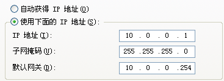

阶段一：网络基础、交换路由技术、高级网络技术。
阶段二：Linux安全运维、项目综合实战，
阶段三：前端、数据库、后台代码安全，python安全应用开发、代码审计。
阶段四：导论、情报收集、弱口令、常见漏洞攻防、渗透测试、提权与后渗透等…

## 一、简单局域网的构成

局域网（Local Area Network，LAN）是指在某一区域内由多台计算机互联成的计算机组。一般是方圆几千米以内。局域网可以实现文件管理、应用软件共享、打印机共享、工作组内的日程安排、电子邮件和传真通信服务等功能。局域网是封闭型的，可以由办公室内的两台计算机组成，也可以由一个公司内的上千台计算机组成。

交换机是组成局域网的重要设备，但是交换机并不能让设备上网，路由器可以实现设备上网。
局域网:一般称为内网。
简单局域网的构成:交换机、网线、PC。
交换机：用来组建内网的局域网设备。

## 二、IP地址

id地址就是一个唯一标识。是一段网络编码(二进制)由32位组成

```shell
11010010.01001001.10001100.00000110        转换为点分十进制如下:
210.73.140.4                                     点分十进制
```

IP地址形式：x.x.x.x 范围：0-255

```shell
如：
正确：10.1.1.1   192.168.1.1
错误：300.1.1.1
```

## 三、子网掩码

局域网通信规则：在同一个局域网中所有的IP必须在同一网段中才可以互为通信。
IP地址构成：网络位+主机位(网络位相同的IP地址，为同一网段)
子网掩码如何确定网络位：与255对应的数字为网络位，与0对应的数字为主机位。

```shell
255.0.0.0
255.255.0.0
255.255.255.0
```


```shell
网络位：10.0.0
主机位：.1
属于网段：10.0.0.0
广播地址：10.0.0.255
网段可用的IP地址范围：10.0.0.1-10.0.0.254
本地回环地址：127.0.0.1
```

注意：一个IP地址必须配套一个子网掩码。
总结：当主机位全部置0代表网段，主机位全部置255代表该网段的广播地址。

```sh
192.168.1.101
192.168.1是网段
101主机位
主机位0  255  不能用  
当主机位写成0  就变成网段  10.1.1.0  255.255.255.0
最后一位255  变成该网段广播地址  这个网段所有人
```


## 四、IP地址详解

国际标准组织ISO定义地址分类：五大类（是以IP地址的第一位进行区分的）
A类：1-126 默认子网掩码：255.0.0.0
B类：128-191 默认子网掩码255.255.0.0
C类：192-223 默认子网掩码：255.255.255.0
D类：224-239 组播地址
E类：240-254 科研使用

```shell
如：
10.0.0.1  属于A类
192.168.1.1 属于C类


10.1.1.255 -> 255.255.0.0 这个ip是可以用的
10.1.255.255 这个不能用
```

## 五、网关

网关：一个网络的出口，Gateway=GW，一般网关是在路由器上
路由器：可用连接外网的设备。

网关的配置全球默认配置可用IP范围的第一个或者最后一个：

```shell
192.168.0.1
192.168.0.254
```



```shell
PC向外发包：
1、首先判断目标IP地址与自己是否在同一网段。
2、如在同一网段，则直接发出去，而不找网关。
3、如不在同一网段，则直接发包给网关。
```

## 六、DNS

DNS：Domain Name Service 域名服务器
域名系统(Domain Name System,DNS)是Internet上解决网上机器命名的一种系统。就像拜访朋友要先知道别人家怎么走一样，Internet上当一台主机要访问另外一台主机时，必须首先获知其地址，TCP/IP中的IP地址是由四段以“.”分开的数字组成，记起来总是不如名字那么方便，所以，就采用了域名系统来管理名字和IP的对应关系。
作用：通过域名解析真实网络IP地址

先从本地查找，找不到再用网络DNS解析

## 七、配置IP地址


## 八、网络测试命令

1、查看IP：

```shell
ipconfig   # 查看IP地址基本信息
ipconfig /all  # 查看IP地址详细信息
```


2、PING命令：

```shell
ping www.baidu.com            # 测试网络连通性
ping -l 2000 www.baidu.com    # 每次都发2000个字节 在局域网内最大阈值为65500字节
ping -t www.baidu.com         # 一直ping
ping -n 数字 www.baidu.com         # 修改ping包数量
```


3、手工解析域名

```shell
nslookup www.jd.com
```

