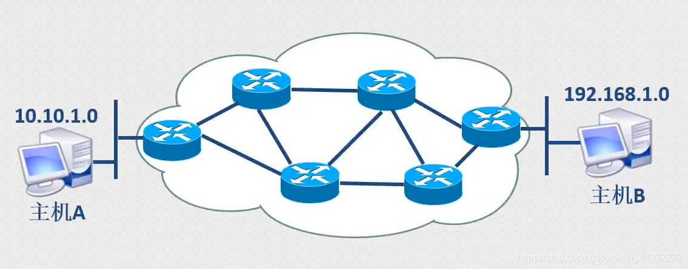
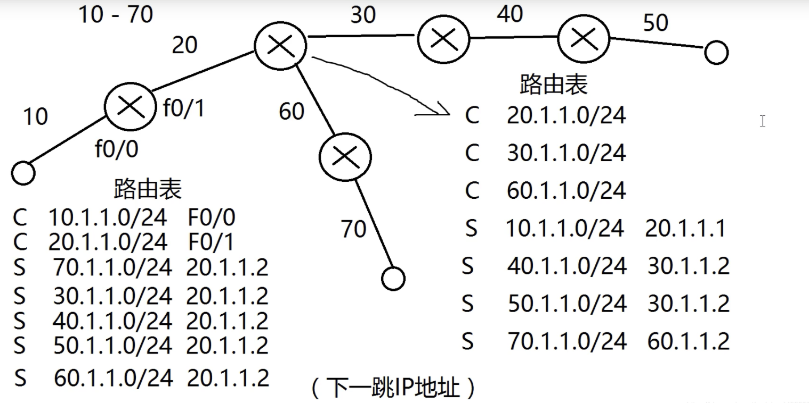
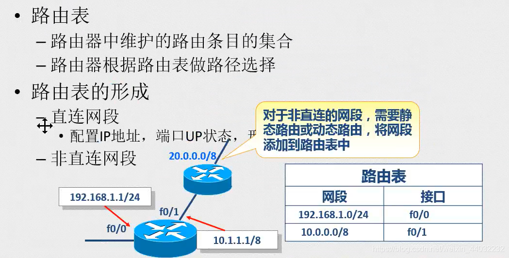
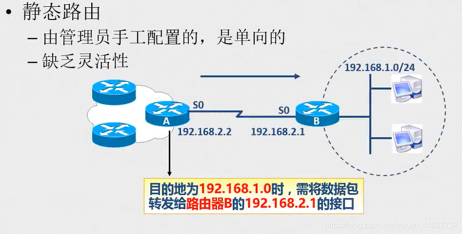
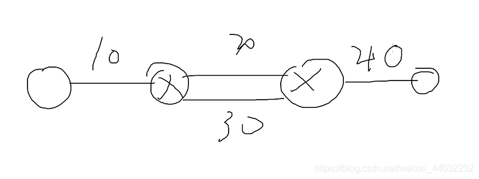
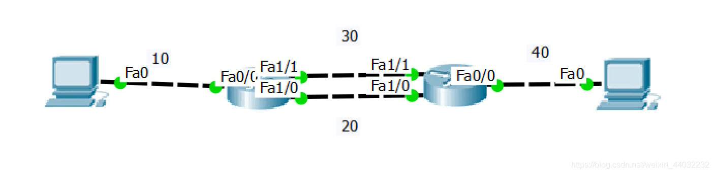
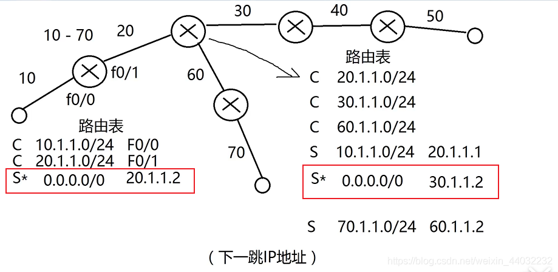

# 路由原理

## 一、路由概述

**跨越从源主机到目标主机的一个互联网络来转发数据包的过程。**


## 二、路由表配置及优化

网络拓扑图
**10网段想要PING通70网段**


路由器网段规划，左1右2，上1下2；

下一跳IP地址：要想把数据包送到70网段，要往20.1.1.2跳
路由表的形成：

路由表中的每个路由条目开头字母代表的含义：

1. C 直连路由，（插好网线，开启接口）自动连接；
2. S 静态路由，（手工配置）;
3. S* 默认路由，（匹配全网段）；
   

浮动路由，一个坏了会启用另一个
目标IP相同，管理距离值不同，优先级低的会隐藏起来，当优先级高的故障时，会启用另一个优先级低的；


管理距离值(A值)：

1. c 0
2. s 1
3. s* 无穷大

路由表中的优先级：管理距离值越大，优先级越低 ；

路由表优化，相同的目标IP用默认路由代替；


交换机与路由器对比


配置命令：
**静态路由**

```bash
conf t 
ip router 目标网段 子网掩码  下一跳IP
ip router 70.0.0.0 255.255.255.0 20.1.1.2
123
```

**默认路由**

```bash
conf t 
ip router 0.0.0.0  0.0.0.0  下一跳IP
ip router 0.0.0.0  0.0.0.0  20.1.1.2
123
```

**浮动路由**
在静态路由或动态路由后加空格+数字（正整数）

```bash
conf t 
ip router 0.0.0.0  0.0.0.0  下一跳IP  正整数
ip router 0.0.0.0  0.0.0.0  20.1.1.2  3
123
```

## 三、路由原理

路由器的工作原理：
1）一个帧到达路由器，路由器首先检查目标MAC是否是自己，如果不是则丢弃，如果是则解封装并将IP包送到路由器内部。

2）路由器检查IP包头中的目标IP，并匹配路由表，如果匹配失败则丢弃，并向源IP回馈错误信息，如匹配成功则将IP包路由到出接口。

3）封装帧，首先将出接口MAC地址作为源MAC封装好，然后检查ARP缓存表，检查是否有下一跳MAC地址，如有，将提取并作为目标MAC地址封装到帧中，如没有，则发送ARP广播请求下一跳的MAC，并获取到对方的MAC地址，在记录到缓存，并封装帧，最后将帧发送出去。