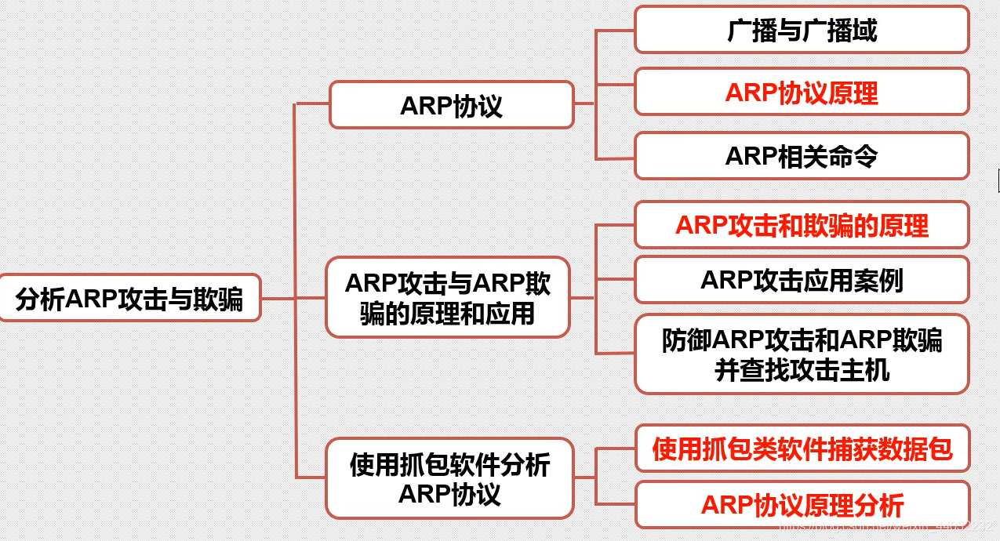
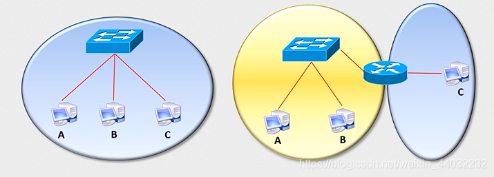
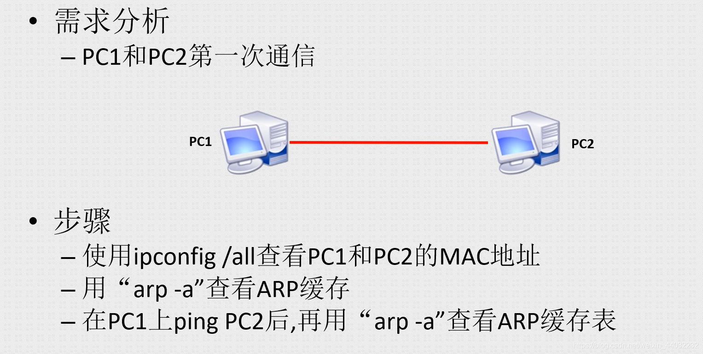
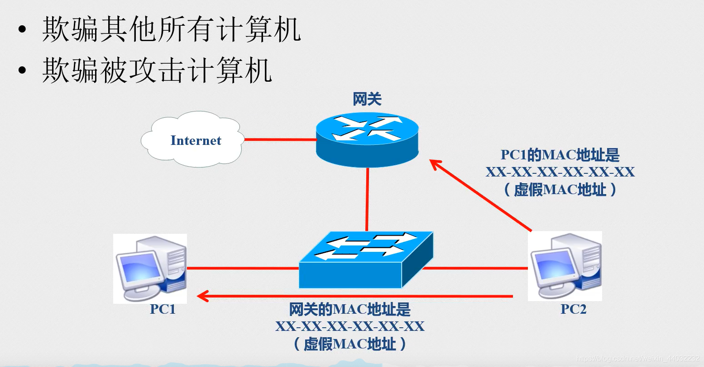

# ARP协议

## 一、架构图



## 二、广播/广播域

路由器可以隔离广播域

广播：将广播地址作为目的地址的数据帧
广播域：网络中能接收到同一个广播所有节点的集合

MAC地址广播：
广播地址为：FF-FF-FF-FF-FF-FF

IP广播地址：
1、255.255.255.255
2、广播IP地址为IP地址网段的广播地址，如192.168.1.255/24

## 三、ARP协议概述

- Address Resolution Protocol,地址解析协议
- 将一个已知的IP地址解析成MAC地址

## 四、ARP原理演示


会看到缓存列表中有PC2的MAC地址

## 五、ARP攻击/欺骗原理

原理：
1）发送ARP广播请求

```bash
ARP报文内容：
-	我是10.1.1.1 我的MAC是AA
-	谁是10.1.1.3  你的MAC是？
123
```

2）接受ARP单播应答

在ARP缓存中谁后到就用谁的
ARP攻击：伪造虚假的ARP报文，和MAC地址，实现断网；
**ARP单播应答攻击实现原理：**

主机A ----- IP 192.168.1.1 ----- MAC mac-a
主机B ----- IP 192.168.1.2 ----- MAC mac-b
主机C ----- IP 192.168.1.3 ----- MAC mac-c(虚假的地址) 中间人
网关 ----- IP 192.168.1.254
主机A与主机B的通信：

> 当判断目标IP与自己在同一网段时，会直接发送ARP广播报文去请求它的MAC地址，如果判断不在同一网段，发送ARP广播报文，请求网关的MAC地址。

1. 主机A发送ARP报文谁是192.168.1.2啊，请把你的MAC地址告诉我?
2. 主机B回复主机A，我是192.168.1.2啊，我的MAC地址是mac-b
3. 此时主机C通过hack手段伪造了一个ARP报文，也回复主机A，我是192.168.1.2，我的MAC地址是mac-ee(该MAC地址是伪造的，跟本没有此MAC地址)。可以一直发送虚假的报文。
4. 主机A同时收到两个主机的回复，都说是自己是192.168.1.2，那么到底信谁的呢？？？ARP的缓存表是基于内存的，后收到的信息会将之前的记录更新掉，也就是后收到谁的消息就信任谁。
5. 因为目标的MAC地址是中间人伪造的，所以主机A发送的数据全部发送给了MAC地址为mac-ee的虚假主机，也就实现了中断主机A与主机B的通信。
6. 当主机A想上网访问百度时，会发送ARP广播报文请求网关的MAC地址，将数据帧发送给路由器，此时如果中间人伪装成网关发送虚假的MAC地址，那么我们上网请求的数据就永远发送不到正确的网关那里，实现断网。

**ARP广播攻击原理：**

1. 中间人发送ARP广播报文，谁是192.168.1.10(伪造的IP，根本不存在)啊？我的IP是192.168.1.254(网关IP) ，MAC地址是mac-ee。
2. 此时局域网内的所有人都会收到中间人发送的ARP广播报文，一看找的IP不是自己会将消息丢弃，但是它会将发送人的IP和MAC更新到自己的缓存中，由于中间人伪造的虚假IP是网关IP，MAC地址是不存在的，此时局域网内所有主机都被攻击了，局域网内的主机以后访问网页，找的目标MAC都是一个不存在的MAC地址导致所有主机都无法上网。

ARP欺骗
目的：截获数据
欺骗和攻击的原理相同，都是发送虚假的ARP报文(单播/广播)来实现的攻击和欺骗，如虚假的报文中的MAC是伪造的不存在的，实现ARP攻击，结果为中断通信/断网，如果虚假的报文中MAC地址是攻击者自身的MAC地址。实现ARP欺骗，结果可以监听/窃取/篡改/控制流量，不中断通信。

## 六、ARP防御

### 1、静态ARP绑定

手工绑定网关IP+MAC地址
电脑和路由器手工双向绑定
windows客户机上：
arp -s 10.1.1.254 00-01-2c-a0-e1-09
arp -a 查看ARP缓存表

### 2、ARP防火墙

自动绑定静态ARP，主动防御，不断向网关发送报文证明自己的身份

### 3、硬件级ARP防御

交换机支持“端口”做动态ARP绑定 (配合DHCP服务)
或做静态ARP绑定

如：

```powershell
conf t
ip dhcp snooping 开启DHCP监听功能
int range f0/1-48
swicth(config-if-range)
```