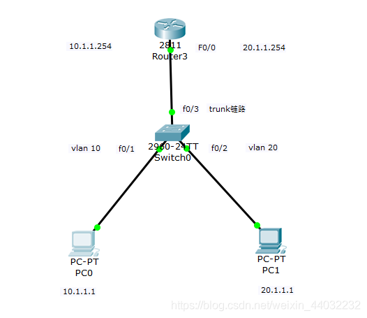
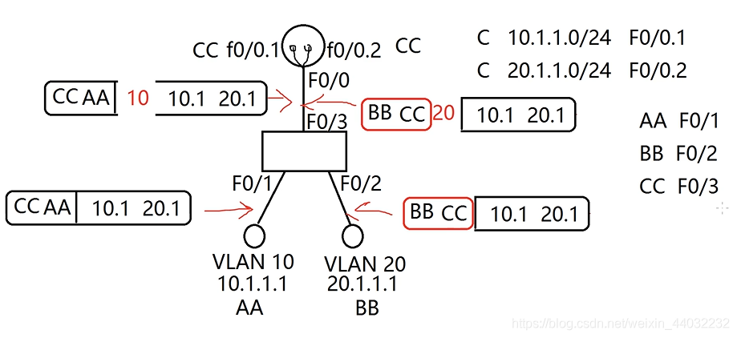
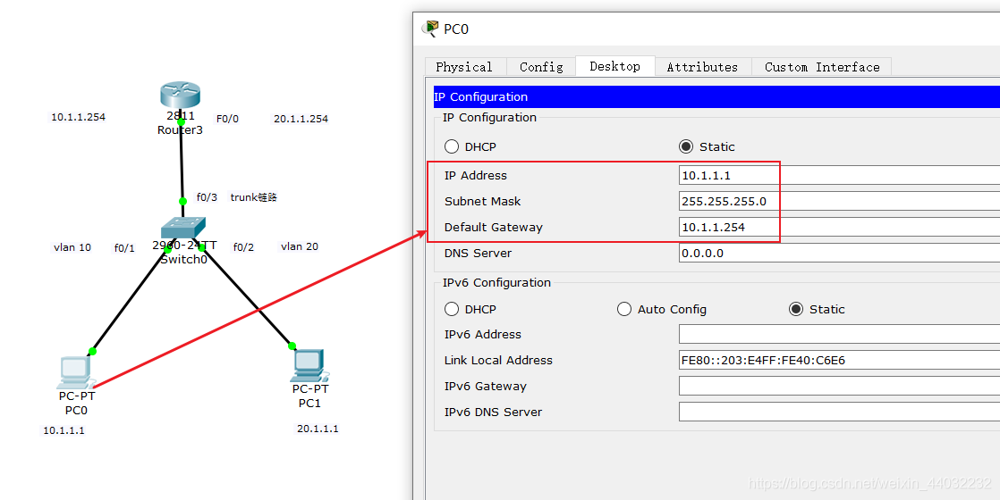
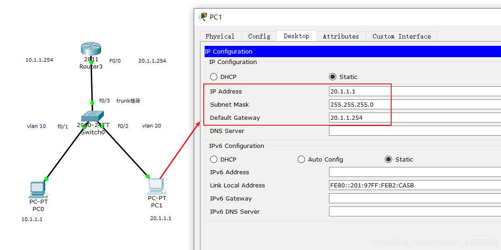
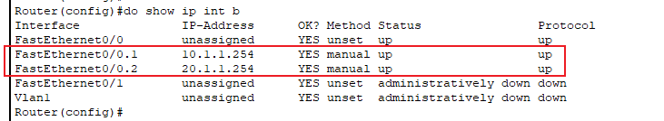
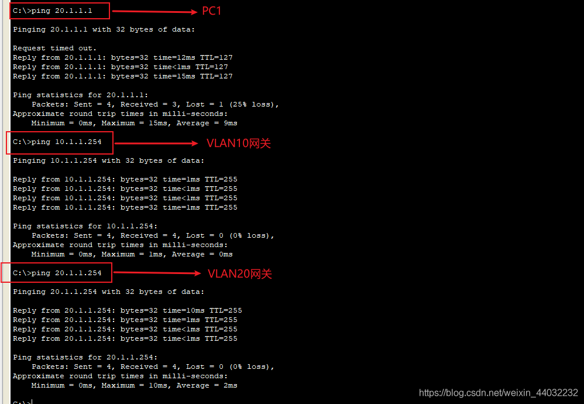

# 单臂路由实现原理

## 一、概述

单臂路由（router-on-a-stick）是指在路由器的一个接口上通过配置子接口（或“逻辑接口”，并不存在真正物理接口）的方式，`实现原来相互隔离的不同VLAN（虚拟局域网）之间的互联互通。`

**单臂路由的子接口**
路由器的物理接口可以被划分成多个逻辑接口，这些被划分后的逻辑接口被形象的称为子接口。值得注意的是这些逻辑子接口不能被单独的开启或关闭，也就是说，当物理接口被开启或关闭时，所有的该接口的子接口也随之被开启或关闭。

**优缺点**
VLAN能有效分割局域网，实现各网络区域之间的访问控制。但现实中，往往需要配置某些VLAN之间的互联互通。比如，你的公司划分为领导层、销售部、财务部、人力部、科技部、审计部，并为不同部门配置了不同的VLAN，部门之间不能相互访问，有效保证了各部门的信息安全。但经常出现领导层需要跨越VLAN访问其他各个部门，这个功能就由单臂路由来实现。

- 优点：实现不同vlan之间的通信，有助理解、学习VLAN原理和子接口概念。
- 缺点：容易成为网络单点故障，配置稍有复杂，现实意义不大。

## 二、单臂路由配置

**实验背景**

实现PC0与PC1不同VLAN之间互相通信



### 1）客户机配置IP

直通线连接所有设备，并由上图所示配置客户机IP，并手工开启路由器F0/0端口

```bash
Router>en
Router#conf t
Enter configuration commands, one per line.  End with CNTL/Z.
Router(config)#
Router(config)#int f0/0
Router(config-if)#no sh
Router(config)#do show ip int b        查看端口状态
Interface              IP-Address      OK? Method Status                Protocol 
FigabitEthernet0/0     unassigned      YES unset  up                    up 
FigabitEthernet0/1     unassigned      YES unset  administratively down down 
Vlan1                  unassigned      YES unset  administratively down down
1234567891011
```

要想不同网段的PC通信，必须使用网关。
**PC0配置**

**PC1配置**


### 2）创建VLAN

**VLAN 10(IT部)，20(财务部)**

```bash
Switch>en
Switch#conf t
Enter configuration commands, one per line.  End with CNTL/Z.
Switch(config)#
Switch(config)#vlan 10
Switch(config-vlan)#name IT    给vlan端口命名为IT
Switch(config-vlan)#exit
Switch(config)#vlan 20
Switch(config-vlan)#name CW     给vlan端口命名为CW
Switch(config-vlan)#exit
Switch(config)#

Switch(config)#do show vlan b         查看vlan列表

VLAN Name                             Status    Ports
---- -------------------------------- --------- -------------------------------
1    default                          active    Fa0/1, Fa0/2, Fa0/3, Fa0/4
                                                Fa0/5, Fa0/6, Fa0/7, Fa0/8
                                                Fa0/9, Fa0/10, Fa0/11, Fa0/12
                                                Fa0/13, Fa0/14, Fa0/15, Fa0/16
                                                Fa0/17, Fa0/18, Fa0/19, Fa0/20
                                                Fa0/21, Fa0/22, Fa0/23, Fa0/24
                                                Gig0/1, Gig0/2
10   IT                               active    
20   CW                               active    
1002 fddi-default                     active    
1003 token-ring-default               active    
1004 fddinet-default                  active    
1005 trnet-default                    active    
Switch(config)#
123456789101112131415161718192021222324252627282930
```

### 3）将端口加入VLAN

**将F0/1端口加入到VLAN10,F0/2端口加入到VLAN20。**

```bash
Switch(config)#int f0/1
Switch(config-if)#switchport access vlan 10
Switch(config-if)#exit

Switch(config)#int f0/2
Switch(config-if)#switchport access vlan 20
Switch(config-if)#exit
Switch(config)#do show vlan
VLAN Name                             Status    Ports
---- -------------------------------- --------- -------------------------------
1    default                          active    Fa0/3, Fa0/4, Fa0/5, Fa0/6
                                                Fa0/7, Fa0/8, Fa0/9, Fa0/10
                                                Fa0/11, Fa0/12, Fa0/13, Fa0/14
                                                Fa0/15, Fa0/16, Fa0/17, Fa0/18
                                                Fa0/19, Fa0/20, Fa0/21, Fa0/22
                                                Fa0/23, Fa0/24, Gig0/1, Gig0/2
10   IT                               active    Fa0/1
20   CW                               active    Fa0/2
1002 fddi-default                     active    
1003 token-ring-default               active    
1004 fddinet-default                  active    
1005 trnet-default                    active  
12345678910111213141516171819202122
```

通过查看vlan列表可以看见F0/1端口配置在vlan10，F0/2端口配置在vlan20上。

### 4）将F0/3设置为Trunk链路

允许任何vlan的数据通过。
作用：`trunk端口不属于任何VLAN`，允许任何vlan的数据通过。
方法：通过在数据帧上加标签，来区分不同vlan的数据。

```bash
Switch(config)#int f0/3
Switch(config-if)#switchport mode trunk 

Switch(config-if)#
%LINEPROTO-5-UPDOWN: Line protocol on Interface FastEthernet0/3, changed state to down

%LINEPROTO-5-UPDOWN: Line protocol on Interface FastEthernet0/3, changed state to up
Switch(config-if)#exit
Switch(config)#do show vlan

VLAN Name                             Status    Ports
---- -------------------------------- --------- -------------------------------
1    default                          active    Fa0/4, Fa0/5, Fa0/6, Fa0/7
                                                Fa0/8, Fa0/9, Fa0/10, Fa0/11
                                                Fa0/12, Fa0/13, Fa0/14, Fa0/15
                                                Fa0/16, Fa0/17, Fa0/18, Fa0/19
                                                Fa0/20, Fa0/21, Fa0/22, Fa0/23
                                                Fa0/24, Gig0/1, Gig0/2
10   IT                               active    Fa0/1
20   CW                               active    Fa0/2
1002 fddi-default                     active    
1003 token-ring-default               active    
1004 fddinet-default                  active    
1005 trnet-default                    active    
123456789101112131415161718192021222324
```

由于trunk端口不属于任何vlan，所以在vlan列表里没有该端口，反之如果vlan里没有我们要找的端口，那么这个端口可能被配置成了trunk端口。

### 5）配置单臂路由

一旦开启子接口，那么父接口起到了通道作用，只进行传输

```bash
Router(config)# int f0/0.1         创建子接口0.1
Router(config-subif)# encapsulation dotQ1 10  该接口添加到vlan10里，以后该接口只接收来自vlan10的数据
Router(config-subif)# ip add 10.1.1.254 255.255.255.0  配置ip+子网掩码
Router(config-subif)# no shut      开启

Router(config-subif)# exit
Router(config)# int f0/0.2         创建子接口0.2
Router(config-subif)# encapsulation dotQ1 20  该接口添加到vlan20里，以后该接口只接收来自vlan20的数据
Router(config-subif)# ip add 20.1.1.254 255.255.255.0  配置ip+子网掩码
Router(config-subif)# no shut      开启
12345678910
```

**查看端口**

**注意：子接口会随父接口的开启而开启，反之亦然。**

完成以上步骤PC0与PC1就是实现了，不同VLAN间的通信。
不同VLAN通信时靠路由实现的。


上图使用的路由器型号2811