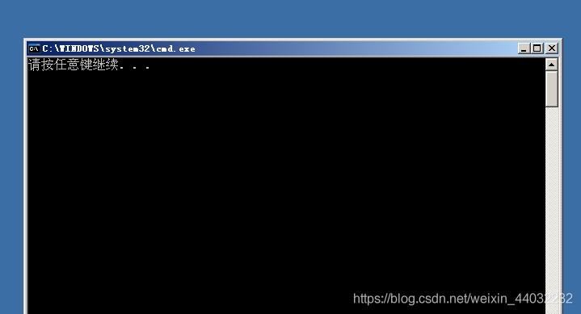
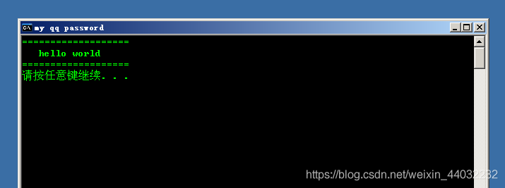
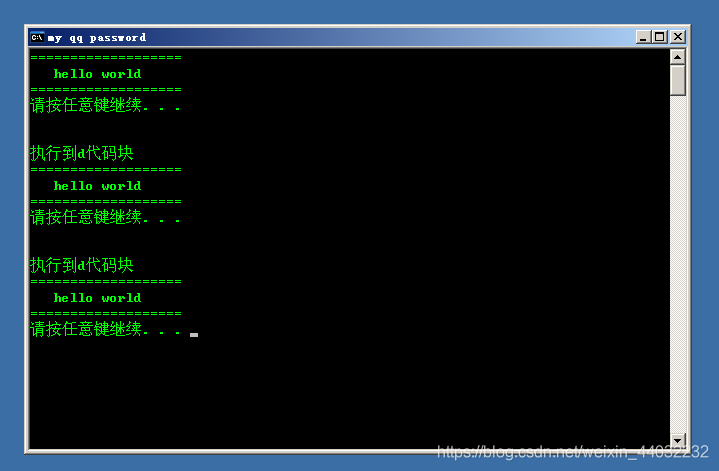
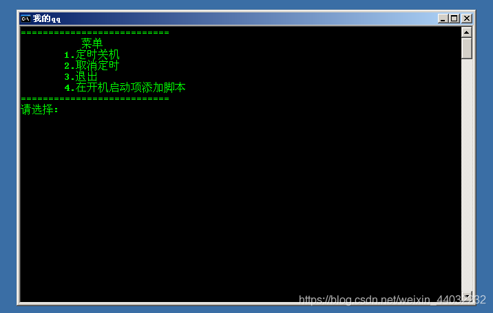
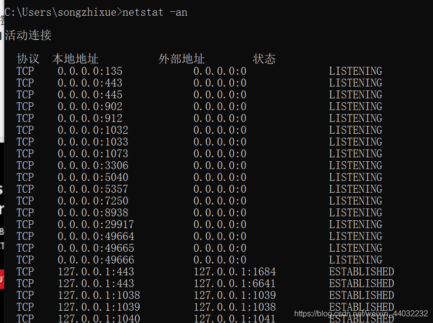
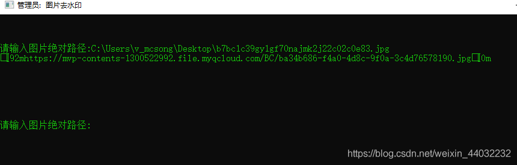

## 一、基本DOS命令

```powershell
dir 查看文件列表
md wenjianjia    创建文件夹
rd wenjianjia    删除文件夹
copy con a.txt   动态写入文本内容    ctrl+z 回车退出保存
type a.txt       查看所有文本内容
type a.txt | more   分页查看  按空格下一页
del a.txt        删除文件
del *.txt        删除以txt结尾的所有文件
del *.*          删除所有文件
del a.txt  /q    不提示直接删除
del *.txt  /s/q  递归删除且不提示    文件夹保留 文件删除
ren  haha.txt hei.txt   改名
move 移动文件
copy muma.exe \\10.0.02\c:\     网络传输
assoc .txt=exefile     修改文件打开方式   以txt结尾的当作程序运行
fsutil file createnew d:\system.ini 300000000     在d盘生成一个system.ini文件 占用内存300000000字节
attrib +h +s +a 文件夹      修改文件权限  +h隐藏文件 +s提升为系统文件  +a只读权限
shutdown -s -t    定时关机    +f  强制
shutdown -a       取消一切定时 
shutdown -r -t    定时开机    +f  强制
shutdown -r -t 200 -f -c "认命吧！！！"   -c 描述信息
shutdown -l       注销
color 0a          修改命令行字体、背景颜色
color ?           查询颜色配置
```

## 二、批处理编写

**1.1、概述**
批处理(Batch)，也称为批处理脚本。顾名思义，批处理就是对某对象进行批量的处理，通常被认为是一种简化的脚本语言，它应用于DOS和Windows系统中。批处理文件的扩展名为bat 。目前比较常见的批处理包含两类：DOS批处理和PS批处理。PS批处理是基于强大的图片编辑软件Photoshop的，用来批量处理图片的脚本；而DOS批处理则是基于DOS命令的，用来自动地批量地执行DOS命令以实现特定操作的脚本。更复杂的情况，需要使用if、for、goto等命令控制程式的运行过程，如同C、Basic等高级语言一样。如果需要实现更复杂的应用，利用外部程式是必要的，这包括系统本身提供的外部命令和第三方提供的工具或者软件。批处理程序虽然是在命令行环境中运行，但不仅仅能使用命令行软件，任何当前系统下可运行的程序都可以放在批处理文件中运行。

**1.2、批处理作用**

- 自上而下成批的处理每一行DOS命令，直到执行最后一条！

**1.3、如何创建批处理**

- 扩展名：.bat
- 创建方法：新建一个记事本文件，然后将扩展名改为.bat

> 注：修改扩展名时，需要将文件的扩展名显示出来后在进行修改！
> 案例：新建一个记事本文件，然后将扩展名改为.bat 内容如下：
> d:
> cd
> cd tmp
> del ./s/q

**1.4、批处理基本语法**
`@echo off`

- 作用：关闭回显功能，也就是屏蔽执行过程，建议放置在批处理首行。

```
pause
```

- 作用：暂停批处理运行

> 案例：
> @echo off
> pause

执行结果如下：

`title`

- 作用：给程序添加标题

```
color 0a
```

- 作用：修改命令行背景和字体颜色

上述两条命令的执行结果如下：

`echo.`

- 作用：空一行

```
:menu
```

- 作用：给代码块命名

```
goto menu
```

- 作用：跳转代码块，跳转到menu位置的代码开始执行该代码块的命令。

```powershell
@echo off        关闭回显
:menu            给代码块命名为menu
title  my qq password     修改程序标题
color 0a         修改命令行背景和字体颜色
echo ===================
echo    hello world
echo ===================
pause            暂停
echo.            空行
echo.
:d               给代码块命名为d
echo 执行到d代码块
goto menu        跳转到menu代码块，执行该代码块下的命令
```

代码执行结果：

正确输出不打印：`>nul
错误输出不打印：`>2 nul

> ping 127.136.27.1 >nul 2>nul 无论能不能ping通都不打印

```
%input%
```

- 作用：获取input这个变量的值

```
start
```

- 作用：开启新的cmd命令行窗口

```
if "%input%"=="1" goto a
```

- 作用：判断语句，如果input这个变量等于1就跳转到a的代码块，执行a代码块下的命令

```
set /p input=请输入关机时间（单位/秒）：
```

- 作用：等待用户输入，并将输入的值赋给input这个变量

```powershell
@echo off
set /p input=请输入关机时间（单位/秒）：
shutdown -s -f -t %input%
123
```

用户自定义关机时间

```
%userprofile%
```

- 特殊的变量值，获取当前用户家目录的绝对路径

```powershell
C:\Documents and Settings\Administrator\「开始」菜单\程序\启动       开机启动项路径
"%userprofile%\「开始」菜单\程序\启动\muma.bat"    在开机启动项中生成一个程序muma.bat   
%userprofile%  == C:\Documents and Settings\Administrator 
123
```


**1.5、命令组合**

```powershell
@echo off
color 0a
title 我的qq

:menu
cls
echo ===========================
echo            菜单
echo         1.定时关机
echo         2.取消定时
echo         3.退出
echo         4.在开机启动项添加脚本
echo ===========================

set /p input=请选择:

if "%input%"=="1" goto a
if "%input%"=="2" goto b
if "%input%"=="3" goto c
if "%input%"=="4" goto d

echo 请输入正确选项:
pause
goto menu

:a
set /p num=请输入想要关机的时间:
shutdown -s -f -t %num%
goto menu

:b
shutdown -a
goto menu

:c
exit

:d 
echo :d >> "%userprofile%\「开始」菜单\程序\启动\muma.bat"
echo start >> "%userprofile%\「开始」菜单\程序\启动\muma.bat"
echo goto d >> "%userprofile%\「开始」菜单\程序\启动\muma.bat"
echo 脚本制作完成，下次开机启动
pause
goto menu
```

运行截图：

`ntsd -c q -pn winlogon.exe`

- 作用：强制杀死登录进程（蓝屏）适用win2003

```
taskkill /im explorer.exe /f
```

- 作用：强制杀死桌面

> 开启explorer.exe:
> start C:\windows\explorer.exe

```
netstat -an
```

- 查看本机开放所有端口



## 三、执行exe程序并传参

```powershell
@echo off
color 0a
title 图片去水印

:ImageUrl
echo.
echo.
echo.
set /p input=请输入图片绝对路径:
cmd.exe -imageIn "%input%" imgurl -txtIn 'hello' -source WEIBO -outputUrl

echo.
echo.
echo.
goto ImageUrl

12345678910111213141516
```

