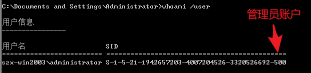
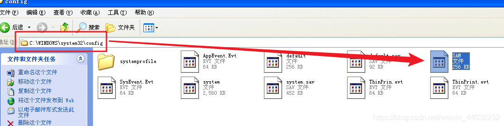
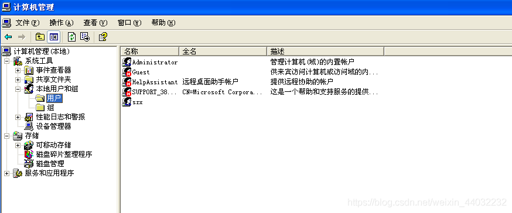
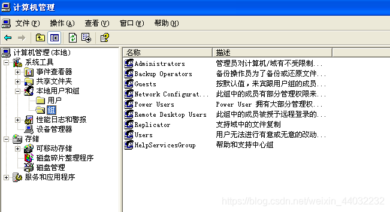
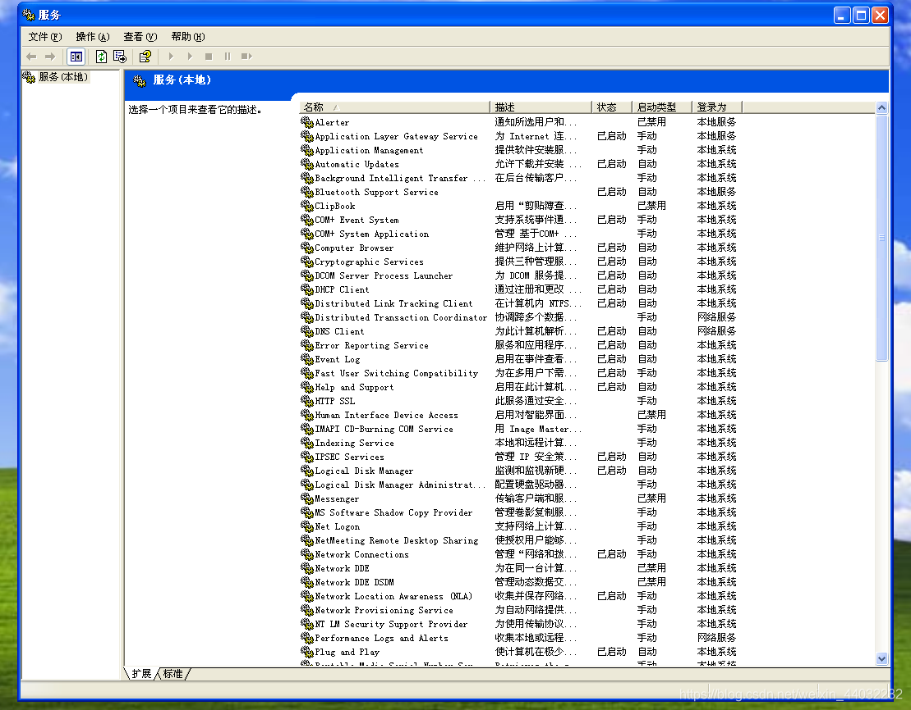

## 一、服务器系统版本介绍

**1.1、Windows服务系统：**

> win2000 win2003 win2008 win2012

win2000主要版本:

> Windows 2000共有四个主要版本：Professional（专业版）、Server（服务器版）、Advanced Server（高级服务器版）和Datacenter Server（数据库服务器中心版）。另有Powered（服务器嵌入版）等特殊版本。

win2000各版本介绍：

| 名称                                            | 适用机型                                                     | 支持处理器个数        | 支持内存大小 | 介绍                                                         |
| ----------------------------------------------- | ------------------------------------------------------------ | --------------------- | ------------ | ------------------------------------------------------------ |
| Windows 2000 Professional专业版                 | 工作站及笔记本电脑                                           | 2个（均衡的多处理器） | 64MB—3.25GB  | Professional也有4个版本：即SP1/SP2/SP3/SP4。适合移动家庭用户，可以用于升级Windows 9x和Windows NT 4.0。它以Windows NT 4.0的技术为核心，采用标准化的安全技术，稳定性高，最大的优点是不会再像之前的Windows 9x内核各种版本的操作系统那样频繁的出现非法程序的提示而死机 |
| Windows 2000 Server 服务器版                    | 小型企业的服务器领域                                         | 4个                   | 128MB—3.25GB | Server在Windows NT Server 4.0的基础上做了大量的改进，在各种功能方面有了更大的提高。 |
| Windows 2000 Advanced Server 高级服务器版       | 大中型企业的服务器领域                                       | 8个                   | 128MB—8GB    | 与Server版不同，Advanced Server具备有更为强大的特性和功能。它对SMP（对称多处理器）的支持要比Server更好，支持的数目可以达到四路。 |
| Windows 2000 Datacenter Server 数据中心服务器版 | 高级别的可伸缩性，可用性与可靠性的大型企业或国家机构的服务器领域 | 8个以上               | 256MB—64GB   | 该系统可用于大型数据库、经济分析、科学计算以及工程模拟等方面，另外还可用于联机交易处理 |

**win2003主要版本：**

> Windows Server 2003 Web Edition Web版
> Windows Server 2003 Standard Edition 标准版
> Windows Server 2003 Enterprise Edition 企业版
> Windows Server 2003 Datacenter Edition 数据中心版

win2003个版本介绍：
Windows Server 2003 Web版：

> 用于构建和存放Web应用程序、网页和XMLWeb Services。它主要使用IIS6.0 Web服务器并提供快速开发和部署使用ASP.NET技术的XMLWeb services和应用程序。支持双处理器，最低支持256MB的内存.它最高支持2GB的内存。请注意：即使您使用的是4G内存，该版本2003也只能识别到2G，如需识别大内存需要特殊设置，为桌面虚拟化提供平台

Windows Server 2003 标准版：

> 销售目标是中小型企业，支持文件和打印机共享，提供安全的Internet连接，允许集中的应用程序部署。支持4个处理器；最低支持256MB的内存，最高支持4GB的内存。

Windows Server 2003 企业版：

> Windows Server 2003 企业版与 Windows Server 2003 标准版的主要区别在于：Windows Server 2003 企业版 支持高性能服务器，并且可以群集服务器，以便处理更大的负荷。通过这些功能实现了可靠性，有助于确保系统即使在出现问题时仍可用。

| 版本信息     | 32位                         | 64位                                        |                                    |
| ------------ | ---------------------------- | ------------------------------------------- | ---------------------------------- |
| 扩展版本名称 | 标准32位版                   | 标准64位版                                  | X64版                              |
| 支持处理器   | 所有X86处理器，最高8路处理器 | 所有IA-64处理器（Intel的Itanium和Itanium2） | X86-64处理器（AMD64系列如Opteron） |
| 最小内存要求 | 256M                         | 256M                                        | 1G                                 |
| 最大内存支持 | 3.25G                        | 128G                                        | 128G                               |

Windows Server 2003 数据中心版：

> 针对要求最高级别的可伸缩性、可用性和可靠性的大型企业或国家机构等而设计的。它是最强大的服务器操作系统。分为32位版与64位版：

| 版本信息     | 32位                                                         | 64位                                          |                                    |
| ------------ | ------------------------------------------------------------ | --------------------------------------------- | ---------------------------------- |
| 扩展版本名称 | 标准32位版                                                   | 标准64位版                                    | X64版                              |
| 支持处理器   | 所有X86处理器（包括X86-64），32个处理器，支持8点[集群](https://baike.baidu.com/item/%E9%9B%86%E7%BE%A4) | 仅支持IA-64处理器（Intel的Itanium和Itanium2） | X86-64处理器（AMD64系列如Opteron） |
| 最小内存要求 | 1G                                                           | 2G                                            | 2G                                 |
| 最大内存支持 | 3.25g                                                        | 512G                                          | 256G                               |

> 标准32位版其安装文件的核心所在文件夹是i386可以安装在X86-64处理器中，而64位标准版安装文件的核心所在文件夹是ia64，与X64版的AMD64不同，这两种64位版互不兼容。

win2008主要版本：
每个Windows Server 2008 R2版本都为给定的数据中心提供一个关键功能。七个版本中有三个是核心版本，还有四个是特定用途版本。

**核心版本**

> 标准版：对于大部分想要利用多个Windows Server 2008
> R2功能的数据中心来说，该版本应该是一个良好的基础操作系统。它专门设计用来提高服务器基础设施的可靠性和灵活性，同时帮助节省时间并减少成本。

> 企业版：该版本是标准版之上的一个版本。该操作系统平台为关键业务工作负载提供更具成本效益且可靠的支持。它还为虚拟化、节能和管理性提供创新功能，并且帮助移动的工作人员更容易地访问公司资源。

> 基础版：该版本是一个划算的入门级技术基础，面向小企业主和支持小型企业的IT人才。基础版价格实惠、容易部署并且可靠，它为企业提供可靠的技术来运行大部分流行的商务应用，同时还分享信息和资源。

**特定用途版**

> 数据中心版：这是一个专为在小型和大型服务器上部署关键业务应用和大型虚拟化设计的企业级平台。该版本想要提供一个可在其上建立企业级虚拟化和可扩展解决方案的基础。

> Web版：Web Server 2008 R2是一个强劲的Web应用和服务平台。Web Server 2008 R2运用IIS
> 7.5搭建，专门设计成面向互联网的服务器。当Web Server 2008 R2与多种普遍的开发平台一起使用时，它提供改良的管理和诊断工具来帮助降低基础设施成本。

> HPC版：该版本为管理高性能计算能力提供全面且省钱的解决方案。HPC Server 2008
> R2是微软的第三代HPC解决方案，它易于与现有的IT基础设施集成，允许终端用户使用熟悉的Windows技术访问HPC资源。因为专用集群和平等开发工具的紧密结合设置锚定在Visual
> Studio 2010，开发者可以轻松且快速地搭建强劲且可扩展的应用。

> 安腾版：该版本为基于安腾的系统而生，它交付一个企业级平台用于部署关键业务应用。Windows Server 2008 R2、SQL
> Server 2008 R2
> 和现有的开发者工具阵容，加上相关的.NET框架，将是每个产品线上支持英特尔安腾处理器和相关OEM服务器平台的最后一代。

Windows Server 2008 R2 有7个版本

| 版本名称                                         | 版本简介                                                     |
| ------------------------------------------------ | ------------------------------------------------------------ |
| Windows Server 2008 R2 Foundatin                 | 这个版本是一种成本低廉的项目级技术基础，用于支撑小型业务。   |
| Windows Server 2008 R2 标准版                    | 是下一版本发布前最健壮的Windows服务器操作系统。              |
| Windows Server 2008 R2 企业版                    | 它是高级服务器平台，为重要应用提供了一种成本较低的高可靠性支持。 |
| Windows Server 2008 R2 数据中心版                | 它是一个企业级平台。                                         |
| Windows Server 2008 R2 Web                       | 它是强大的Web应用程序和服务平台。                            |
| Windows HPC Server 2008 （R2）                   | 高性能计算（HPC）的下一版本，为高效率的HPC环境提供了企业级的工具。 |
| Windows Server 2008 R2 for Itanium-Based Systems | 一个企业级的平台，可以用于部署关键业务应用程序。             |

这是微软第一个仅支持64位的操作系统。

> 微软称，从Windows Server 2008 R2开始，Windows
> Server将不再推出32位系统版本。微软将只发布64位系统的Windows Server 2008 R2。

> Windows Server 2008 R2 RTM也于2009年7月14日与Windows 7同时编译完成，版本号也为7600.16385 090713.1255。

> 通过设置，Windows Server 2008 R2可以免费使用900天。所以网上没有关于它的软改方法。

win2012版本

> Windows Server 2012有四个版本：Foundation(基础版)，Essentials(精简版)， Standard(标准版)和Datacenter(数据中心版)

| 版本                         | Foundation                 | Essentials                                 | Standard       | Datacenter     |
| ---------------------------- | -------------------------- | ------------------------------------------ | -------------- | -------------- |
| 授权方式                     | 仅限OEM                    | OEM、零售、VOL                             | OEM、零售、VOL | OEM、零售、VOL |
| 处理器上限                   | 1                          | 2                                          | 64             | 64             |
| 授权用户限制                 | 1                          | 25                                         | 无限           | 无限           |
| 文件服务限制                 | 1个独立DFS根目录           | 1个独立DFS根目录                           | 无限           | 无限           |
| 网络策略和访问控制           | 50个RRAS连接以及1个IAS连接 | 250个RRAS连接、50个IAS连级以及2个IAS服务组 | 无限           | 无限           |
| 远程桌面服务限制             | 20个连接                   | 250个连接                                  | 无限           | 无限           |
| 虚拟化                       | 无                         | 1个虚拟机或者物理服务器，两者不能同时存在  | 2个虚拟机      | 无限           |
| DHCP角色                     | 有                         | 有                                         | 有             | 有             |
| DNS服务器角色                | 有                         | 有                                         | 有             | 有             |
| 传真服务器角色               | 有                         | 有                                         | 有             | 有             |
| UDDI服务                     | 有                         | 有                                         | 有             | 有             |
| 文档和打印服务器             | 有                         | 有                                         | 有             | 有             |
| Web服务器（IIS）             | 有                         | 有                                         | 有             | 有             |
| Windows部署服务              | 有                         | 有                                         | 有             | 有             |
| Windows服务器更新服务        | 有                         | 有                                         | 有             | 有             |
| Active Directory轻型目录服务 | 有                         | 有                                         | 有             | 有             |
| Active Directory权限管理服务 | 有                         | 有                                         | 有             | 有             |
| 应用程序服务器角色           | 有                         | 有                                         | 有             | 有             |
| 服务器管理器                 | 有                         | 有                                         | 有             | 有             |
| Windows PowerShell           | 有                         | 有                                         | 有             | 有             |
| Active Directory域服务       | 有限制                     | 有限制                                     | 有             | 有             |
| Active Directory证书服务     | 只作为颁发机构             | 只作为颁发机构                             | 有             | 有             |
| Active Directory联合服务     | 有                         | 无                                         | 有             | 有             |
| 服务器核心模式               | 无                         | 无                                         | 有             | 有             |
| Hyper-V                      | 无                         | 无                                         | 有             | 有             |
| 价格                         | 仅限OEM                    | 425美元                                    | 882美元        | 4809美元       |

**1.2、Liunx服务系统**

> Liunx服务系统：Redhat Centos

**Redhat**

> 红帽的商业模式，简单的说就是红帽将开源社区
> 项目产品化，使普通企业客户更容易消费开源创新技术的一种方法。 从用户角度来看，不同的投资预算与研发能力的企业都可以通过红帽获得开源软件的价值。

> 红帽产品涉及5大技术领域：云计算、存储、虚拟化、中间件、操作系统。

操作系统

（1）红帽企业Linux
红帽在2014年6月发布了最新旗舰版企业操作系统——红帽企业Linux 7。基于红帽企业Linux 7操作系统，企业可整合裸机服务器、 虚拟机、基础设施即服务(IaaS)和平台即服务(PaaS)，以构建一个强大稳健的数据中心环境，满足不断变化的业务需求。

（2）红帽卫星
红帽卫星是一个综合性解决方案，它通过配置软件分发、补丁和配置管理，以及物理、虚拟和云环境的订阅管理为红帽系统提供完整的生命周期管理，为管理构建、部署、运行和淘汰系统所需的工具提供了单独的管理控制台和方法论。

**Centos**

> CentOS 是一个基于Red Hat Linux 提供的可自由使用源代码的企业级Linux发行版本。每个版本的 CentOS都会获得十年的支持（通过安全更新方式）。新版本的 CentOS 大约每两年发行一次，而每个版本的 CentOS 会定期（大概每六个月）更新一次，以便支持新的硬件。这样，建立一个安全、低维护、稳定、高预测性、高重复性的 Linux 环境。CentOS是Community Enterprise Operating System的缩写。

> CentOS 是RHEL（Red Hat Enterprise Linux）源代码再编译的产物，而且在RHEL的基础上修正了不少已知的 Bug ，相对于其他 Linux 发行版，其稳定性值得信赖。

CentOS在2014初，宣布加入Red Hat。

> CentOS 加入红帽后不变的是：
> 1. CentOS 继续不收费
> 2. 保持赞助内容驱动的网络中心不变
> 3. Bug、Issue 和紧急事件处理策略不变
> 4. Red Hat Enterprise Linux 和 CentOS 防火墙也依然存在
> 变化的是：
> 6. 我们是为红帽工作，不是为 RHEL
> 7. 红帽提供构建系统和初始内容分发资源的赞助
> 8. 一些开发的资源包括源码的获取将更加容易
> 9. 避免了原来和红帽上一些法律的问题

版本列表：

| 版本            | 平台                                                     | RHEL版本 | 发布日期     | RHEL发布日期 |
| --------------- | -------------------------------------------------------- | -------- | ------------ | ------------ |
| 2               | i386                                                     | 2.1      | 2004.05.14   | 2002.05.17   |
| 3.1             | i386,x86_64,ia64,s390,s390x                              | 3        | 2004.03.19   | 2003.10.23   |
| 3.4 - Server CD | i386,x86_64,ia64,s390,s390x                              | 3.4      | 2005.01.23   | -            |
| 3.7             | i386,x86_64,ia64,s390,s390x                              | 3.7      | 2006.04.11   | -            |
| 3.8             | i386,x86_64                                              | 3.8      | 2006.08.25   | 2006.07.20   |
| 3.9             | i386,x86_64,ia64,s390,s390x                              | 3.9      | 2007.07.26   | 2007.06.15   |
| 4.0             | i386,x86_64,various                                      | 4        | 2005.03.09   | 2005.02.14   |
| 4.6             | i386,x86_64,ia64,alpha,s390,s390xppc (beta),sparc (beta) | 4.6      | 2007.12.16   | 2007.11.16   |
| 4.7             | i386,x86_64,ia64,alpha,s390,s390x                        | 4.7      | 2008.09.13   | 2008.07.24   |
| 4.7 - Server CD | i386,x86_64,ia64,alpha,s390,s390x                        | 4.7      | 2008.10.17   | -            |
| 4.8             | i386,x86-64,ia64,alpha,s390,s390x                        | 4.8      | 2009.08.21   | 2009.05.18   |
| 4.9             | i386,x86-64,ia64,alpha,s390,s390x                        | 4.9      | 2011.03.02   | 2011.02.16   |
| 5.0             | i386,x86_64                                              | 5        | 2007.04.12   | 2007.03.14   |
| 5.1             | i386,x86_64                                              | 5.1      | 2007.12.02   | 2007.11.07   |
| 5.1 - LiveCD    | i386                                                     | 5.1      | 2008.02.18   | -            |
| 5.2             | i386,x86_64                                              | 5.2      | 2008.06.24   | 2008.05.21   |
| 5.2 - LiveCD    | i386                                                     | 5.2      | 2008.07.17   | -            |
| 5.3             | i386,x86_64                                              | 5.3      | 2009.03.31   | 2009.01.20   |
| 5.3 - Live CD   | i386                                                     | 5.3      | 2009.05.27   | -            |
| 5.4             | i386,x86_64                                              | 5.4      | 2009.10.21   | 2009.09.02   |
| 5.5             | i386,x86_64                                              | 5.5      | 2010.05.14   | 2010.03.31   |
| 5.5 - LiveCD    | i386,x86-64                                              | 5.5      | 2010.05.14   | -            |
| 5.6             | i386,x86-64                                              | 5.6      | 2011.04.07   | 2011.01.13   |
| 5.7             | i386,x86-64                                              | 5.7      | 2011.09.14   | -            |
| 5.8             | i386,x86-64                                              | 5.8      | 2012.03.07   |              |
| 5.9             | i386,x86-64                                              | 5.9      | 2013.01.17   | 2013.01.07   |
| 5.10 [1]        | i386,x86-64                                              | 5.10     | 2013.10.19   | 2013.10.01   |
| 5.11            | i386,x86-64                                              | 5.11     | 2014.09.30   | 2014.09.16   |
| 6.0             | i386,x86-64                                              | 6        | 2011.07.04   | 2010-11-10   |
| 6.1             | i386,x86-64                                              | 6.1      | 2011.12.10   | 2011-05-19   |
| 6.2             | i386,x86-64                                              | 6.2      | 2011.12.20   | 2011-12-06   |
| 6.3             | i386,x86-64                                              | 6.3      | 2012.07.10   | 2012.06.21   |
| 6.4             | i386,x86-64                                              | 6.4      | *2013.03.08* | *2013.02.21* |
| 6.5             | i386,x86_64                                              | 6.5      | 2013.12.01   | 2013.11.21   |
| 6.6             | i386,x86_64                                              | 6.6      | 2014.10.27   | 2014.10.28   |
| 6.7             | i386,x86_64                                              | 6.7      |              | 2015-07-22   |
| 6.8             | i386,x86_64                                              | 6.8      |              | 2016-05-10   |
| 6.9             | i386,x86_64                                              | 6.9      |              | 2017-03-21   |
| 6.10            | i386,x86_64                                              | 6.10     |              | 2018-06-19   |
| 7.0 [2]         | x86_64,armv7hl                                           | 7.0      | 2014.07.07   | 2014.06.11   |
| 7.1             | x86_64                                                   | 7.1      | 2015.03.31   | 2015.03.05   |
| 7.2             | x86_64                                                   | 7.2      | 2015.12.15   | 2015.12.15   |
| 7.3             | x86_64                                                   | 7.3      | 2016.12.12   | 2016.11.03   |
| 7.4             | x86_64                                                   | 7.4      | 2017.09.13   | 2017.08.01   |
| 7.5             | x86_64                                                   | 7.5      |              | 2018-04-10   |
| 7.6             | x86_64                                                   | 7.6      | 2018.12.04   |              |
| 8.0             | x86_64                                                   | 8.0      | 2019.09.25   |              |

## 二、用户管理

**1.1、用户概述**

- 每一个用户登录系统后，拥有不同的操作权限
- 每个账户有自己唯一的SID（安全标识符）
- 用户SID：S-1-5-21-426206823-2579496042-14852678-500
- 系统SID：S-1-5-21-426206823-2579496042-14852678

> - 用户UID：500
> - windows系统管理员administrator的UID是500
> - 普通用户的UID从1000开始

不同的账户拥有不同的权限，为不同的账户赋权限，也就是为不同账户的SID赋权限！
查SID值：`whoami /user`


- 账户密码存储位置：C:\windows\system32\config\SAM
- 破解方式：暴力破解/撞库
  
- Windows系统上，默认密码最长有效期42天

**1.2 内置账户**

- 给人使用的账户：

> administrator # 管理员账户
> guest # 来宾账户
> user # 普通用户

- 计算机服务组件相关账号

> system # 系统账户 == 权限至高无上
> local services # 本地服务账户 == 权限等于普通用户
> network services # 网络服务账户 == 权限等于普通用户

**1.3 配置文件**

每个用户都有自己的配置文件（家目录）在用户第一次登录时自动产生，路径：
win/win2008 C:\用户
xp/win2003 C:\Documents and Settings\

**1.4 用户管理命令**

```powershell
net user                    列出当前计算机账户列表
net user administrator      查看用户详细信息
net user administrator 123  修改密码
net user andy 123 /add      添加新用户andy  密码设置为123
net user andy /del          删除用户andy
net user 用户名 /active:yes/no   激活/禁用账户
```

## 三、组管理

**3.1 组概述**
组的作用：简化权限的赋予
赋权限方式：

1. 用户–组--赋权限
2. 用户–赋权限

**3.2 内置组**

内置组的权限默认已经被系统赋予。

```powershell
1、administrators        管理员组
2、guests                来宾组
3、users				 普通用户组，默认新建用户都属于这个组
4、network 				 网络配置组
5、print				 打印机组
6、Remote Desktop        远程桌面组
```

**3.3 组管理命令**

```powershell
1、net localgroup                查看组列表
2、net localgroup 组名            查看该组成员
3、net localgroup 组名 /add       创建一个新的组
4、net localgroup 组名 /del       删除组
5、net localgroup 组名 用户名 /add 添加用户到组
6、net localgroup 组名 用户名 /del 从组中踢出用户
```

右键电脑-管理

用户

组


## 四、服务管理

开始–运行–services.msc
可以启动或禁用服务


