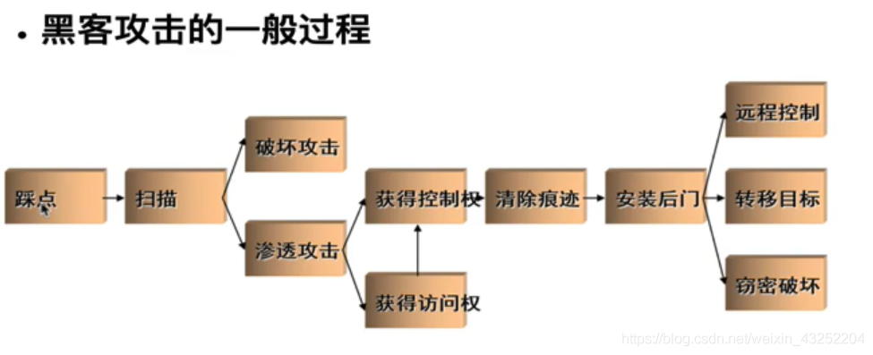

# 渗透测试方法论

## 渗透测试（penetration testing，pentest）

是实施安全评估（即审计）的具体手段。

方法论是在制定、实施信息安全审计方案时，需要遵循的规则、惯例和过程。

人们在评估网络、应用、系统或者三者组合的安全状况时，不断摸索各种务实的理念和成熟的做法，并总结了一套理论——渗透测试方法论。

 

## 渗透测试种类

### *黑盒测试

在进行黑盒测试时，安全审计员在不清楚被测单位的内部技术构造的情况下，从外部评估网络基础设施的安全性。

在绳渗透测试的各个阶段，黑盒测试借助真实世界的黑客技术，暴露出目标的安全问题，甚至可以揭露尚未被他人利用的安全弱点。

渗透测试人员应能理解安全弱点，将之分类并按照风险等级（高危、中危、低危、信息泄露）对其排序。通常来说，风险级别取决于相关弱点可能形成危害的大小。老练的渗透测试专家应能够确定可引发安全事故的所有攻击模式。

当测试人员完成黑盒测试的所有测试工作之后，他们会把与测试对象安全状况有关的必要信息进行整理，并使用业务的语言描述这些被识别出来的风险，继而将之汇总为书面报告。黑盒测试的市场报价通常高于白盒测试。

### *白盒测试

白盒测试的审计员可以获取被测单位的各种内部资料甚至不公开的资料，所以渗透测试人员的视野更为开阔。

若以白盒测试的方法评估安全漏洞，测试人员可以以自小的工作量达到最高的评估精确度。

白盒测试从被测系统环境自身出发，全面消除内部安全问题。从而增加了从单位外部渗透系统的难度。黑盒测试起不到这样的作用。白盒测试所需要的步骤数目与黑盒测试不相上下。

另外，若能够将白盒测试与常规的研发生命周期相结合，就可以在入侵者发现甚至利用安全弱点之前，尽可能最早地消除全部安全隐患，这使得白盒测试的事件、成本，以及发现、解决安全弱点的技术门槛都全面低于黑盒测试。

### *脆弱性评估与渗透测试

脆弱性评估通过分析企业资产面临安全威胁的情况和程度，评估内部和外部的安全控制的安全性。

这种技术上的信息系统评估，不仅揭露现有防范措施里存在的风险，而且要提出多重备选的补救策略，并将这些策略进行比较。

内部脆弱性评估可保证内部系统的安全性，而外部的脆弱性评估则是验证边界防护(perimeter defenses)的有效性。

无论内部脆弱性评估还是进行外部脆弱性评估，评估人员都会采用各种攻击模式来严格测试网络资产的安全性，从而验证信息系统处理安全威胁的能力，进而确定应对措施的有效性。

不同类别的脆弱性评估需要的测试流程、测试工具和自动化测试技术也不相同。这可通过一体化的安全弱点管控（vulnerability management）平台来实现。

现在的安全弱点管理平台带有可自动更新的漏洞数据库，能够测试不同类型的网络设备，而且不会影响配置管理和变更管理的完整性。

脆弱性评估和渗透测试两者最大的区别就是：渗透测试不仅要识别目标的弱点，它还设计在目标系统上进行漏洞利用、权限提升和访问维护。

换句话说，脆弱性评估虽然可以充分发现系统里的缺陷，但不会考虑去衡量这些缺陷对系统造成的危害。

另外，相比脆弱性评估，渗透测试更倾向于入侵，会刻意使用各种技术手段利用安全漏洞；所以渗透测试可能对生产环境带来实际的破坏性影响。而脆弱性评估以非入侵的方式，定性、定量得识别已知安全弱点。

 

## 安全测试方法论

###   *开放式web 应用程序安全项目（Open Web Aplication Security Project ，OWASP）

[https://www.owasp.org.cn/]

测试指南

[https://www.owasp.org/index.php/OWASP_Testing_Project]

开发人员指南

[https://www.owasp.org/index.php/Gategory:OWASP_Top_Ten_Project]

代码审查

### OWASP top 10

Web十大安全漏洞

> 十大Web应用程序安全风险
> 1、注射剂。当将不受信任的数据作为命令或查询的一部分发送到解释器时，会出现诸如SQL，NoSQL，OS和LDAP注入之类的注入漏洞。攻击者的敌对数据可能会诱使解释器执行未经预期的命令或未经适当授权而访问数据。
> 2、身份验证失败。与身份验证和会话管理相关的应用程序功能通常会错误地实现，从而使攻击者可以破坏密码，密钥或会话令牌，或者利用其他实现缺陷来临时或永久地假定其他用户的身份。
> 3、敏感数据暴露。许多Web应用程序和API无法正确保护敏感数据，例如金融，医疗保健和PII。攻击者可能会窃取或修改这些受保护程度不高的数据，以进行信用卡欺诈，身份盗用或其他犯罪。敏感数据可能会在没有额外保护的情况下受到损害，例如静态加密或传输中加密，并且与浏览器进行交换时需要采取特殊的预防措施。
> 4、XML外部实体（XXE）。许多较旧的或配置不当的XML处理器都会评估XML文档中的外部实体引用。外部实体可以使用文件URI处理程序，内部文件共享，内部端口扫描，远程代码执行和拒绝服务攻击来公开内部文件。
> 5、访问控制损坏。通常，对身份验证用户允许执行的操作的限制通常未得到正确执行。攻击者可以利用这些缺陷来访问未经授权的功能和/或数据，例如访问其他用户的帐户，查看敏感文件，修改其他用户的数据，更改访问权限等。
> 6、安全配置错误。安全配置错误是最常见的问题。这通常是由于不安全的默认配置，不完整或临时的配置，开放的云存储，错误配置的HTTP标头以及包含敏感信息的详细错误消息所导致的。不仅必须安全地配置所有操作系统，框架，库和应用程序，而且还必须及时对其进行修补/升级。
> 7、跨站点脚本XSS。每当应用程序在未经适当验证或转义的情况下在新网页中包含不受信任的数据，或者使用可以创建HTML或JavaScript的浏览器API用用户提供的数据更新现有网页时，都会发生XSS漏洞。XSS允许攻击者在受害者的浏览器中执行脚本，这些脚本可以劫持用户会话，破坏网站或将用户重定向到恶意网站。
> 8、不安全的反序列化。不安全的反序列化通常会导致远程执行代码。即使反序列化缺陷不会导致远程执行代码，也可以将它们用于执行攻击，包括重播攻击，注入攻击和特权升级攻击。
> 9、使用已知漏洞的组件。诸如库，框架和其他软件模块之类的组件以与应用程序相同的特权运行。如果利用了易受攻击的组件，则此类攻击可能会导致严重的数据丢失或服务器接管。使用具有已知漏洞的组件的应用程序和API可能破坏应用程序防御，并造成各种攻击和影响。
> 10、日志和监控不足。日志和监视的不足，再加上事件响应的缺失或无效集成，使攻击者可以进一步攻击系统，保持持久性，转向更多系统以及篡改，提取或破坏数据。大多数违规研究表明，检测到违规的时间超过200天，通常由外部各方而不是内部流程或监视来检测。

### *通用缺陷列表（CWE）

CWE-79：XSS漏洞

[http://cwe.mitre.org/data/definitions/79.html]

CWE-89：SQLi

[http://cwe.mitre.org/data/definitions/89.html]

### *通用漏洞与披露（CVE）

[http://cve.scap.org.cn/]

具体的某一个漏洞

[http://cve.mitre.org/]

> MS17-010（微软安全公告）
>
> 一个公告对应一个漏洞
>
> KB 开头
>
> S2-053
>
> strtus2
>
> APACHE 开源开发java的框架

### *其他方法论

开源安全测试方法论（OSSTMM）

http://www.isecom.org/research/osstmm.html

信息系统安全评估框架 （ISSAF）

http://www.oissg.org/issaf

Web 应用安全联合威胁分类（WASC-TC）

http://projects.webappsec.org

 

# 渗透测试流程

## *渗透测试执行标准

渗透测试执行标准（PTES）的先驱都是渗透测试行业的精英，有七个阶段组成，

可以在任意环境中进行富有成功的渗透测试。

[http://www.pentest-standard.org/index.php/Main_Page]

 

7个阶段

> 1. 事前互动
> 2. 情报搜集
> 3. 威胁建模
> 4. 漏洞分析
> 5. 漏洞利用
> 6. 深度利用
> 7. 书面报告

 主要特点优势

PTES的主要特性和优势如下

1、他是非常全面的渗透测试框架涵盖了绳渗透测试的技术方面和其他重要方面，如范围蔓延、报告、以及渗透人员保护自身的方法

2、他介绍了多数测试任务的具体方法，可指导你准确测试目标系统的安全状态

3、他汇聚了多名日行一”渗“的渗透测试专家的丰富经验

4、它包含最常用的以及很罕见的相关技术

5、他浅显易懂，你可根据测试工作的需要对相应的测试步骤进行调整

 

## *通用渗透测试框架

从技术管理的角度，遵循正规的测试框架对安全测试极为重要，通用渗透测试框架涵盖了典型的审计测试工作和渗透测试工作会涉及到的各个阶段。

相关阶段：

> 1. 范围界定
> 2. 信息搜集
> 3. 目标识别
> 4. 服务枚举
> 5. 漏洞映射
> 6. 社会工程学
> 7. 漏洞利用
> 8. 权限提升
> 9. 访问维护
> 10. 文档报告

无论是进行白盒测试还是黑盒测试，选择和使用测试步骤都是一个渗透测试人员的责任。

在测试开始前，测试人员需要根据目标系统的实际环境和已掌握的相关目标系统的情况，指定最佳的测试策略。

 

### 范围界定

1、测试对象是什么？

2、应当采用何种测试方法？

3、有哪些在渗透测试中需要满足的条件？

4、哪些因素可能会限制测试执行的过程？

5、需要多久才能完成测试？

6、此次测试应该达到什么样的任务目标？

 

### 信息搜集

渗透测试人员需要使用各种公开的资源尽可能的获取测试目标的相关消信息。

从互联网上搜集信息的主要渠道有：

论坛|公告板|新闻组|媒体文件|博客|社交网络|其他商业或非商业的网站

此外还可以通过各种搜索引擎获取相关数据。

如谷歌、雅虎、MSN必应、百度等

收集信息主要包括DNS、服务器、路由关系、whois、数据库、电子邮件地址、电话号码、个人信息以及用户账户。

收集的信息越多，渗透测试成功的概率越高。

 

### 目标识别

识别目标网络的状态，操作系统和网络架构。

 

### 服务枚举

这一阶段根据前面各个阶段的成果，进一步找出目标系统所有开放的断开。

一旦找到了所有开放端口，就可以通过这些端口列出目标系统上运行的服务。

主机上开放的端口都有相应的服务程序，对这些信息进行深度分析之后，可进一步发掘目标网络基础设施中可能存在的漏洞。

 

### 漏洞映射（漏洞扫描）

根据已发现的的开放端口和服务程序，查找已知和未知的漏洞

 

### 社会工程学

如果目标网络没有直接的入口，欺骗艺术将起到抛砖引玉的重要作用。

对目标组织的人员进行定向攻击，很可能帮助我们找到渗透目标系统的入口。

例如，诱使用户安装后门的恶意程序，就可能对审计人员的的渗透工作形成突破。

社会工程学渗透分为多种不同的实现形式。

伪装成网络管理员，通过电话要求用户提高自己的账户信息；发送钓鱼邮件来劫持用户的银行账户；甚至诱使某人出现在某地，这些都是社会工程学攻击

需要注意的是在对目标进行欺骗以达到渗透目标之前，多数情况下需要长时间研究目标人员的心理

另外，需要研究当地的法律是否允许

 

### 漏洞利用

发现漏洞之后，就可以使用已有漏洞利用程序对目标系统进行渗透

这个阶段的主要任务就是控制目标系统

这个流程可分为三步，涉及攻击前、攻击、攻击后的相关行动

 

### 权限提升

渗透测试人员根据其拥有的访问权限，在目标系统任意发挥，

提权，就是将普通用户权限提升至管理员权限

 

### 访问维护

多数情况下，审计人员需要一段时间内维护他们对目标系统的访问权限。

也就是埋藏后门（离开时清除后门）

 

### 文档报告

审计人员要记录、报告并现场演示那些已经识别、验证和利用了的安全漏洞。

并根据这些文档修补所有存在的安全漏洞

 

## *简化的渗透测试流程

> 明确目标
>
> 确定范围|确定规则|确定需求
>
> 信息收集
>
> 基础信息|系统信息|应用信息|人员信息|防护信息
>
> 漏洞探测
>
> 系统漏洞|Web服务漏洞|Web应用漏洞|其他端口|通信安全
>
> 漏洞验证
>
> 手工验证|工具验证|实验验证
>
> 漏洞利用
>
> 定制EXP|防御绕过|进一步渗透|清理痕迹
>
> 形成报告
>
> 整理结果|补充介绍|修复建议

## *黑客攻击的一般过程

