## 一、远程管理类型

Windows远程管理有两种类型：

- 远程桌面（图形）
- telnet （命令行）

## 二、远程桌面

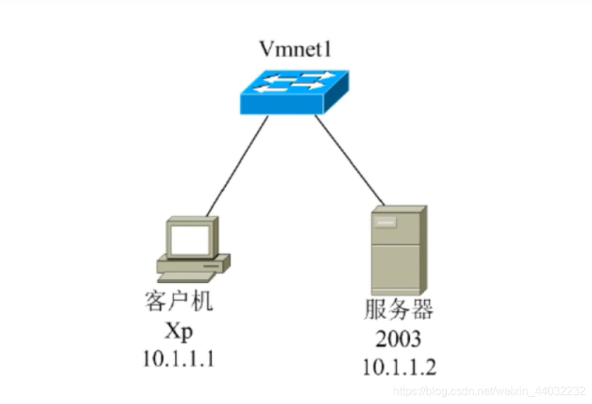
步骤：

- 首先配置网络，客户机和服务机可以互通
- 服务器开启允许被远程控制：桌面右键属性 – 远程设置 – 选择允许 – 确定

**xp配置**
（1）域配置

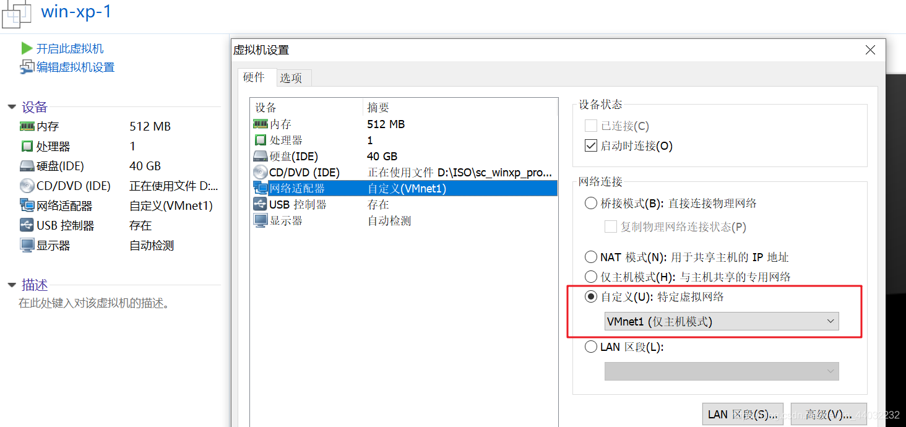
（2）IP配置
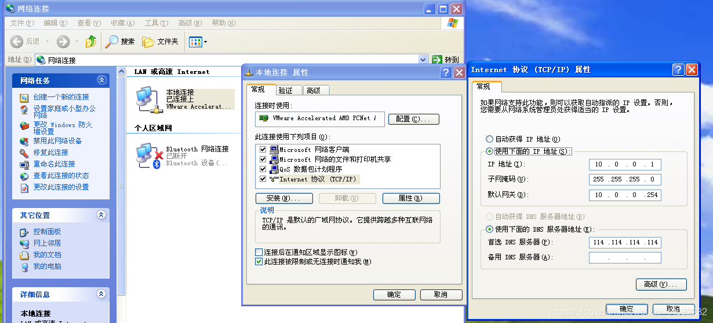
**2003配置**
（1）域配置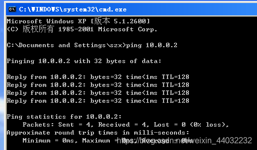
（2）IP配置
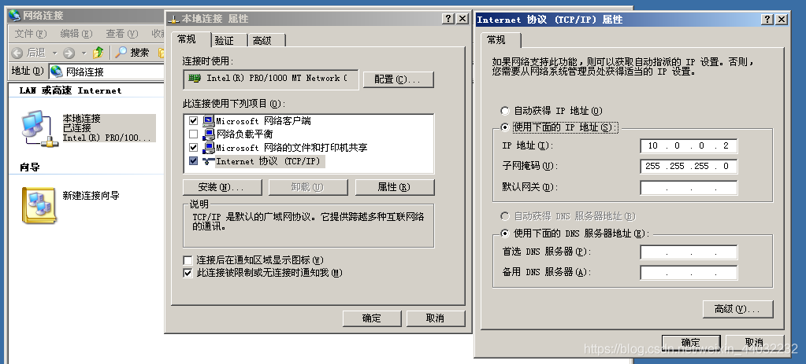
xp ping 2003 证明可以通信

在XP机器上打开远程桌面连接程序
win+R 输入 `mstsc`输入目标IP 连接
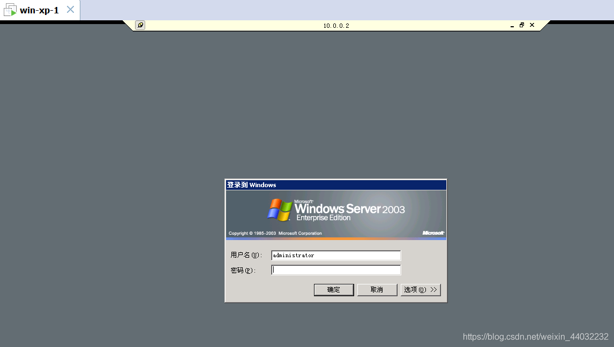
输入win2003的账户密码进行登录
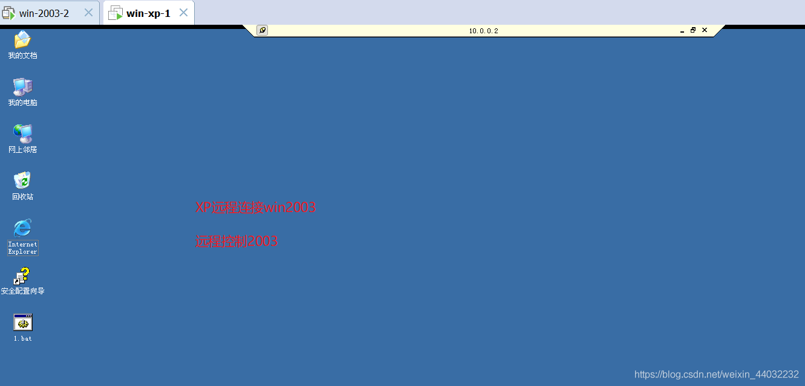
注意通常我们在远程连接时登录的不是管理员账号可能是普通用户的账号 在登录普通账户时如下：
1、在2003创建一个普通用户的账号

```powershell
net user andy 123 /add
1
```

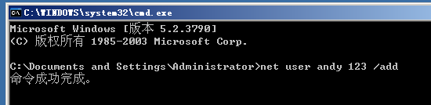
2、远程登录时用新创建的普通用户登录
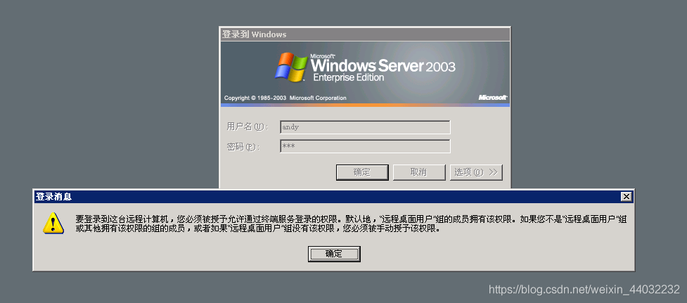
说明该普通账户没有远程登录的权限
这时需要2003的管理员在创建新账户后并赋予远程登录的权限
右键电脑管理 或通过命令行的方式进行添加
`net localgroup "Remote Desktop Users" andy /add`
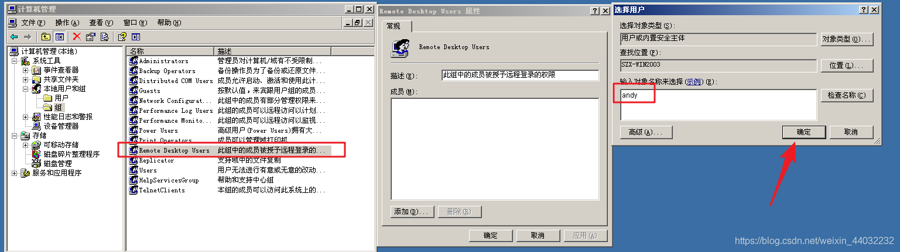
给新账户赋予权限后在用新的账户进行远程连接
连接成功如下图所示：
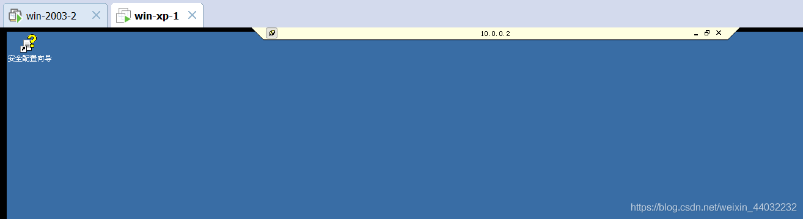

## 三、Telnet

1、win+R 开始 输入services.msc 打开服务管理 开启telnet服务
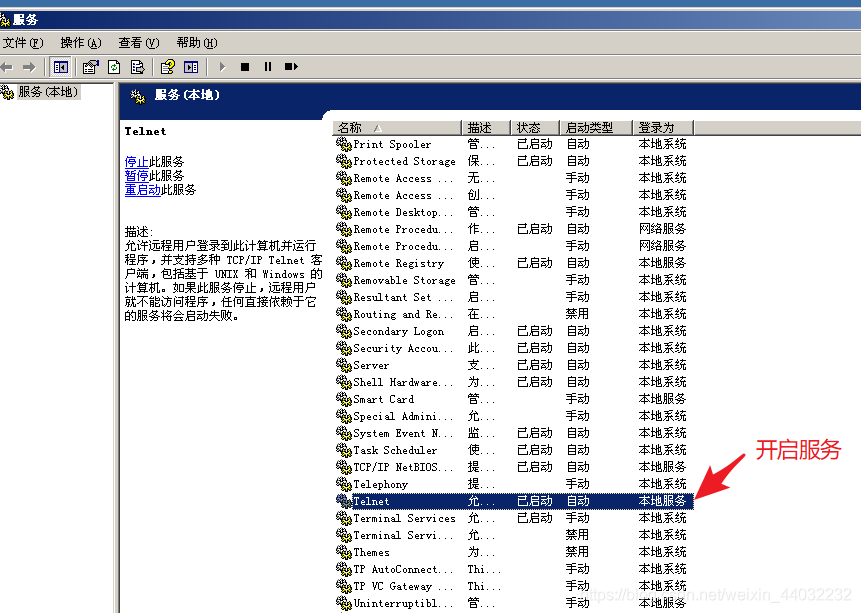
2、将普通用户添加到Telnet组
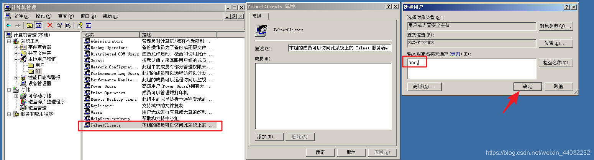
3、远程连接
在XP命令行窗口输入`telnet 10.0.0.2`连接
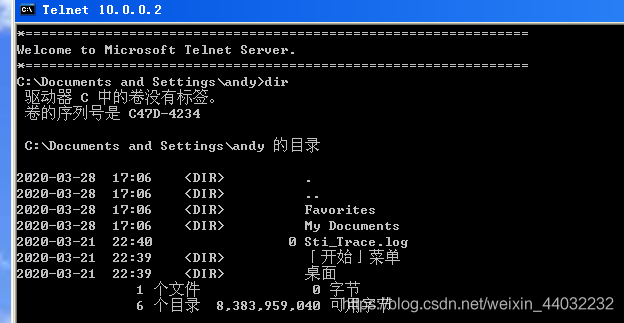

