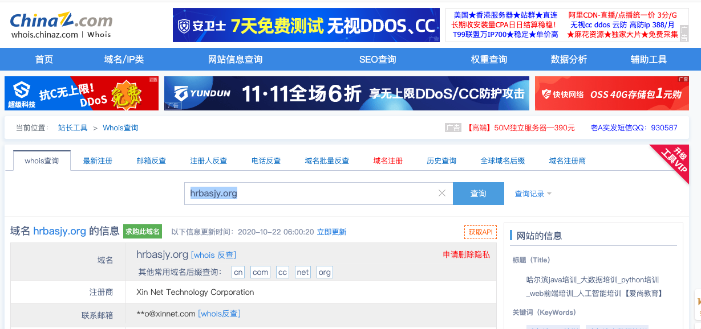
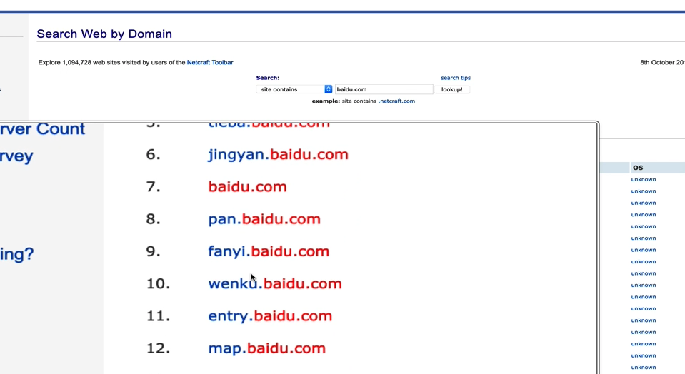
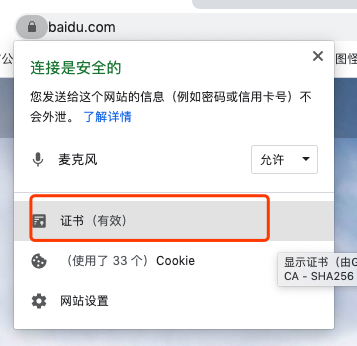
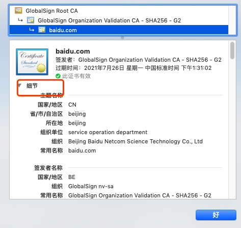
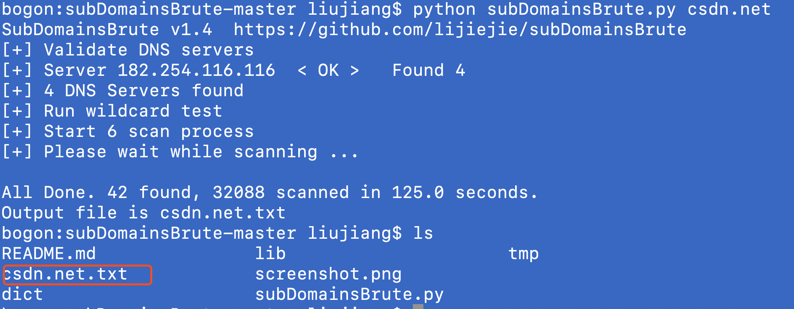

# 信息收集

# 信息收集

为什么学习这节课程

在划定了测试范围之后，就需要进入信息收集阶段。在这个阶段，渗透人员需要使用各种公共资源尽可能地获取测试目标的相关信息。他们从互联网上搜集信息的渠道主要有：

| @    | 论坛                   |
| ---- | ---------------------- |
| @    | 公告板                 |
| @    | 新闻组                 |
| @    | 媒体文章               |
| @    | 博客                   |
| @    | 社交网络               |
| @    | 其他商业或非商业性网站 |
| @    | GitHub                 |

….

 

此外，他们也可以借助各种搜索引擎中获取相关数据，如谷歌、雅虎、MSN必应、百度等。收集信息主要包括DNS 服务器、路由关系、whois 数据库、电子邮件地址、电话号码、个人信息以及用户账户。收集信息越多，渗透测试成功的概率越高

[<http://testfire.net>]

本课程以[testfire.net]为目标，testfire.net 是IBM 公司为了演示旗下比较有名的Web 漏洞扫描器AppScan 的强大功能所搭建的模拟银行网站，所以上面会有很多常见的Web 安全漏洞

类似的测试网站

[<http://vulnweb.com/>]

 

## DNS 信息

在收集DNS 信息的时候，主要关注域名或注册商，管理员联系方式，电话和邮箱，子域名等信息。

 

- ### whois查询

whois是一个集成在kali 虚拟机中的小工具

whois工具可以用来查询域名注册信息。

 

[whois domain]

[whois testfire.net]

也可以通过站长之家进行whois 查询[http://whois.chinaz.com]

 ```sh
liujiang@kali:~$ whois testfire.net
   Domain Name: TESTFIRE.NET
   Registry Domain ID: 8363973_DOMAIN_NET-VRSN
   Registrar WHOIS Server: whois.corporatedomains.com
   Registrar URL: http://www.cscglobal.com/global/web/csc/digital-brand-services.html
   Updated Date: 2020-07-19T05:07:07Z
   Creation Date: 1999-07-23T13:52:32Z
   Registry Expiry Date: 2021-07-23T13:52:32Z
   Registrar: CSC Corporate Domains, Inc.
   Registrar IANA ID: 299
   Registrar Abuse Contact Email: domainabuse@cscglobal.com
   Registrar Abuse Contact Phone: 8887802723
   Domain Status: clientTransferProhibited https://icann.org/epp#clientTransferProhibited
   Name Server: ASIA3.AKAM.NET
   Name Server: EUR2.AKAM.NET
   Name Server: EUR5.AKAM.NET
   Name Server: NS1-206.AKAM.NET
   Name Server: NS1-99.AKAM.NET
   Name Server: USC2.AKAM.NET
   Name Server: USC3.AKAM.NET
   Name Server: USW2.AKAM.NET
   DNSSEC: unsigned
   URL of the ICANN Whois Inaccuracy Complaint Form: https://www.icann.org/wicf/
>>> Last update of whois database: 2020-12-01T08:42:08Z <<<

For more information on Whois status codes, please visit https://icann.org/epp

NOTICE: The expiration date displayed in this record is the date the
registrar's sponsorship of the domain name registration in the registry is
currently set to expire. This date does not necessarily reflect the expiration
date of the domain name registrant's agreement with the sponsoring
registrar.  Users may consult the sponsoring registrar's Whois database to
view the registrar's reported date of expiration for this registration.

TERMS OF USE: You are not authorized to access or query our Whois
database through the use of electronic processes that are high-volume and
automated except as reasonably necessary to register domain names or
modify existing registrations; the Data in VeriSign Global Registry
Services' ("VeriSign") Whois database is provided by VeriSign for
information purposes only, and to assist persons in obtaining information
about or related to a domain name registration record. VeriSign does not                                                                               
guarantee its accuracy. By submitting a Whois query, you agree to abide                                                                                
by the following terms of use: You agree that you may use this Data only                                                                               
for lawful purposes and that under no circumstances will you use this Data                                                                             
to: (1) allow, enable, or otherwise support the transmission of mass                                                                                   
unsolicited, commercial advertising or solicitations via e-mail, telephone,                                                                            
or facsimile; or (2) enable high volume, automated, electronic processes                                                                               
that apply to VeriSign (or its computer systems). The compilation,                                                                                     
repackaging, dissemination or other use of this Data is expressly                                                                                      
prohibited without the prior written consent of VeriSign. You agree not to                                                                             
use electronic processes that are automated and high-volume to access or                                                                               
query the Whois database except as reasonably necessary to register
domain names or modify existing registrations. VeriSign reserves the right
to restrict your access to the Whois database in its sole discretion to ensure
operational stability.  VeriSign may restrict or terminate your access to the
Whois database for failure to abide by these terms of use. VeriSign
reserves the right to modify these terms at any time.

The Registry database contains ONLY .COM, .NET, .EDU domains and
Registrars.

Domain Name: testfire.net
Registry Domain ID: 8363973_DOMAIN_NET-VRSN
Registrar WHOIS Server: whois.corporatedomains.com
Registrar URL: www.cscprotectsbrands.com
Updated Date: 2020-10-02T11:59:50Z
Creation Date: 1999-07-23T09:52:32.000-04:00
Registrar Registration Expiration Date: 2021-07-23T13:52:32.000-04:00
Registrar: CSC CORPORATE DOMAINS, INC.
Registrar IANA ID: 299
Registrar Abuse Contact Email: domainabuse@cscglobal.com
Registrar Abuse Contact Phone: +1.8887802723
Domain Status: clientTransferProhibited http://www.icann.org/epp#clientTransferProhibited
Registry Registrant ID: 
Registrant Name: Not Disclosed
Registrant Organization: Not Disclosed
Registrant Street: Not Disclosed
Registrant City: Sunnyvale
Registrant State/Province: CA
Registrant Postal Code: 94085
Registrant Country: US
Registrant Phone: +Not Disclosed
Registrant Phone Ext: 
Registrant Fax: +Not Disclosed
Registrant Fax Ext: 
Registrant Email: Not Disclosed
Registry Admin ID: 
Admin Name: Not Disclosed
Admin Organization: Not Disclosed
Admin Street: Not Disclosed
Admin City: Sunnyvale
Admin State/Province: CA
Admin Postal Code: 94085
Admin Country: US
Admin Phone: +Not Disclosed
Admin Phone Ext: 
Admin Fax: +Not Disclosed
Admin Fax Ext: 
Admin Email: Not Disclosed
Registry Tech ID: 
Tech Name: Not Disclosed
Tech Organization: Not Disclosed
Tech Street: Not Disclosed
Tech City: Sunnyvale
Tech State/Province: CA
Tech Postal Code: 94085
Tech Country: US
Tech Phone: +Not Disclosed
Tech Phone Ext: 
Tech Fax: +Not Disclosed
Tech Fax Ext: 
Tech Email: Not Disclosed
Name Server: usw2.akam.net
Name Server: usc2.akam.net
Name Server: eur2.akam.net
Name Server: ns1-99.akam.net
Name Server: ns1-206.akam.net
Name Server: asia3.akam.net
Name Server: usc3.akam.net
Name Server: eur5.akam.net
DNSSEC: unsigned

For more information on Whois status codes, please visit https://icann.org/epp

Corporation Service Company(c) (CSC)  The Trusted Partner of More than 50% of the 100 Best Global Brands.

Contact us to learn more about our enterprise solutions for Global Domain Name Registration and Management, Trademark Research and Watching, Brand, Logo and Auction Monitoring, as well SSL Certificate Services and DNS Hosting.

NOTICE: You are not authorized to access or query our WHOIS database through the use of high-volume, automated, electronic processes or for the purpose or purposes of using the data in any manner that violates these terms of use. The Data in the CSC WHOIS database is provided by CSC for information purposes only, and to assist persons in obtaining information about or related to a domain name registration record. CSC does not guarantee its accuracy. By submitting a WHOIS query, you agree to abide by the following terms of use: you agree that you may use this Data only for lawful purposes and that under no circumstances will you use this Data to: (1) allow, enable, or otherwise support the transmission of mass unsolicited, commercial advertising or solicitations via direct mail, e-mail, telephone, or facsimile; or (2) enable high volume, automated, electronic processes that apply to CSC (or its computer systems). CSC reserves the right to terminate your access to the WHOIS database in its sole discretion for any violations by you of these terms of use. CSC reserves the right to modify these terms at any time.

Register your domain name at http://www.cscglobal.com

 ```

whois hrbasjy.org

```sh
Domain Name: HRBASJY.ORG
Registry Domain ID: D402200000003931891-LROR
Registrar WHOIS Server: whois.xinnet.com
Registrar URL: http://whois.xinnet.com/domain/whois_login.jsp
Updated Date: 2020-08-21T07:51:42Z
Creation Date: 2017-10-16T01:17:56Z
Registry Expiry Date: 2021-10-16T01:17:56Z
Registrar Registration Expiration Date:
Registrar: Xin Net Technology Corporation
Registrar IANA ID: 120
Registrar Abuse Contact Email: jubao@xinnet.com
Registrar Abuse Contact Phone: +86.104008182233
Reseller:
Domain Status: ok https://icann.org/epp#ok
Registrant Organization: HaErBin ai shang zhiye jineng peixun xuexiao
Registrant State/Province: beijingshi
Registrant Country: CN
Name Server: NS11.XINCACHE.COM
Name Server: NS12.XINCACHE.COM
DNSSEC: unsigned
URL of the ICANN Whois Inaccuracy Complaint Form https://www.icann.org/wicf/)
>>> Last update of WHOIS database: 2020-12-01T08:46:09Z <<<

For more information on Whois status codes, please visit https://icann.org/epp

Access to Public Interest Registry WHOIS information is provided to assist persons in determining the contents of a domain name registration record in the Public Interest Registry registry database. The data in this record is provided by Public Interest Registry for informational purposes only, and Public Interest Registry does not guarantee its accuracy. This service is intended only for query-based access. You agree that you will use this data only for lawful purposes and that, under no circumstances will you use this data to (a) allow, enable, or otherwise support the transmission by e-mail, telephone, or facsimile of mass unsolicited, commercial advertising or solicitations to entities other than the data recipient's own existing customers; or (b) enable high volume, automated, electronic processes that send queries or data to the systems of Registry Operator, a Registrar, or Afilias except as reasonably necessary to register domain names or modify existing registrations. All rights reserved. Public Interest Registry reserves the right to modify these terms at any time. By submitting this query, you agree to abide by this policy.

The Registrar of Record identified in this output may have an RDDS service that can be queried for additional information on how to contact the Registrant, Admin, or Tech contact of the queried domain name.

```



除了whois 查询以外，还可以进行反查。 

| @    | 邮箱反查   |
| ---- | ---------- |
| @    | 注册人反查 |
| @    | 电话反查   |
|      |            |

 

- ### 子域名查询

可以查询子域名的网站[https://searchdns.netcraft.com/]，这种方法查询大型网站比较有优势



| @    | Netcraft.com |
| ---- | ------------ |
| @    | 证书         |

 



- ### 域传送漏洞

DNS区域传送指的是一台备用服务器使用来自主服务器的数据刷新自己的域数据库。这为运行中的DNS 服务提供了一定的冗余度，其目的是为了防止主域名服务器因为意外故障变得不可用时影响到整个域名的解析。一般来说，DNS区域传送操作只在网络中真的有备用域名服务器的时候才有必要用到，但是许多DNS服务器却被错误的配置成只要有client 发出请求，就会像对方提供一个zone 的数据库的详细信息，所以说允许不受信任的英特网用户执行DNS区域传送操作是后果最为严重的错误配置之一。

可以使用dig 工具来检测域传送漏洞，命令如下

[dig axfr @dns.example.com example.com]

 

通过域传送漏洞

子域名信息

子域名对应的IP地址

 

## 实验：子域名爆破

- 工具：子域名挖掘机
- dnsrecon

[dnsrecon -d vulnweb.co -D /root/dic/dns.dic -t brt]

 

准备一个字典写上所有的域名（4个字母左右别超过10个）。字典中的每个单词，依次去尝试

工具不重要，重要的是字典

#  mac版

https://github.com/lijiejie/subDomainsBrute

# subDomainsBrute 1.4

A fast sub domain brute tool for pentesters.

It works with Python3.5+ or Python2.7 while Python3 users can get better performance.

高并发的DNS暴力枚举工具。支持Python3.5+和Python2.7，使用Python3.5+ 效率更高。

## Install

Python3.5+ users:

- pip install aiodns

Python2 users

- pip install dnspython gevent

## Screenshot

使用大字典，扫描qq.com

## Usage

```
Usage: subDomainsBrute.py [options] target.com
Options:
  --version             show program's version number and exit
  -h, --help            show this help message and exit
  -f FILE               File contains new line delimited subs, default is
                        subnames.txt.
  --full                Full scan, NAMES FILE subnames_full.txt will be used
                        to brute
  -i, --ignore-intranet
                        Ignore domains pointed to private IPs
  -w, --wildcard        Force scan after wildcard test fail
  -t THREADS, --threads=THREADS
                        Num of scan threads, 256 by default
  -p PROCESS, --process=PROCESS
                        Num of scan Process, 6 by default
  -o OUTPUT, --output=OUTPUT
                        Output file name. default is {target}.txt
```




### 工具：

1、layer(子域名挖掘机)

2、dnsrecon

dnsrecon -d vulnweb.com -D /root/tmp/dic/dns.dic -t brt

-d 指定域名 -D 指定字典 -t 指定模式

 ```sh
输入 dnsrecon
 ```


 

## DNS2IP

通过DNS 解析找到IP地址

- ### ping

非权威解答

ping testfire.net

65.61.137.117

 

ping baidu.com

39.156.69.79

 

ping [www.baidu.com](http://www.baidu.com/)

39.156.66.18

 

- ### nslookup

testfire.net      65.61.137.117

> \------------
>
> \> testfire.net
>
> Server:                192.168.1.2
>
> Address:        192.168.1.2#53
>
>  
>
> Non-authoritative answer:
>
> Name:        testfire.net
>
> Address: 65.61.137.117
>
> \------

> \------------
>
> \> baidu.com
>
> Server:                192.168.1.2
>
> Address:        192.168.1.2#53
>
>  
>
> Non-authoritative answer:
>
> Name:        baidu.com
>
> Address: 39.156.69.79
>
> Name:        baidu.com
>
> Address: 220.181.38.148
>
> \------

> \------------
>
> \> [www.baidu.com](http://www.baidu.com/)
>
> Server:                192.168.1.2
>
> Address:        192.168.1.2#53
>
>  
>
> Non-authoritative answer:
>
> [www.baidu.com](http://www.baidu.com/)        canonical name = [www.a.shifen.com](http://www.a.shifen.com/).
>
> Name:        [www.a.shifen.com](http://www.a.shifen.com/)
>
> Address: 39.156.66.14
>
> Name:        [www.a.shifen.com](http://www.a.shifen.com/)
>
> Address: 39.156.66.18
>
> \--------

 

- ### dig

dig testfire.net

 

dig @8.8.8.8 testfire.net    指定dns服务器

dig +trace testfire.net     获取域名的详细解析过程

 

- ### dnsenum

dnsenum testfire.net

 

此处推荐dnsenum，此工具在解析域名的时候

会自动检测域传送漏洞

 

- ### 利用站长工具

<http://tool.chinaz.com/dns/>

 

路由追踪

 

- ### CDN 加速问题

CDN 是内容分发网络

本意是进行节点缓存，是网站访问速度加快。一般情况下是没办法得到目标的网站的真实IP 的。关于CDN 加速可以作为一个课题。

参考资料如下：

 

<https://www.t00ls.net/>

<http://www.91ri.org/6233.html>

<http://www.91ri.org/3563.html>

 

## IP 查询

 

- ### IP 查询

<http://ip.chinaz.com/65.61.137.117>

 

- ### 同IP 网站查询

同一个IP 上的网站

1.1.1.1

A     B

旁站（同一个服务器上的两个网站）

 

1.1.1.*        C 段查询

 

- ### IP whois 查询

 

- ### IP2Location

65.61.137.117

 

- ### 查询IP 地址经纬度

<https://www.maxmind.com/zh/home>

 

得到IP地址的大致经纬度（40.9476, -73.8624）

 

- ### 通过GPS 查询物理位置

<http://www.gpsspg.com/maps.htm>

 

## 利用搜索引擎搜集信息

- ### Google hacking

 

Google 机器人，爬行全世界所有网站的内容。Google hacker 就是利用搜索引擎语法，获取有关网站的信息。

 

| site     | 指定网站             |
| -------- | -------------------- |
| ""       | 包含关键字           |
| inurl    | 在url 中出现的关键字 |
| filetype |                      |

 

- ### 探索网站目录结构

"parent directory" site:testfire.net

 

- ### 搜索容易存在sql 注入的页面

site:testfire.net inurl:login

 

- ### 搜索指定的文件类型

filetype pdf

 

- ### 搜索phpinfo()

intext:"PHP Version" exit:php intest:"disabled" intext:"BuildDate" intext:"Syatem" intext:"allow_url_fopen"

 

- ### 搜索phpstudy

- ### 搜索php 探针

intitle:"php中文网 探针2014"

 

- ## 钟馗之眼

<https://www.zoomeye.org/>

ZoomEye 支持公网设备指纹检索和Web 指纹检索。网站指纹包括应用名、版本、前端框架、后端框架、服务端语言、服务器操作系统、网站容器、内容管理系统和数据等。

 

- ### 搜索iis6.0 组件

app:"Microsoft IIS httpd" ver:"6.0"

 

- ### 搜索开启3389 端口的windows 主机

port:3389 OS:windows

 

- ## shodan

<https://www.shodan.io/>

 

## 网站信息收集

收集指纹信息

Web 服务器信息

 

火狐插件

Netcraft Extension

Wappalyzer

## 一、域名信息收集

### 1、子域名

```
www.baidu.com
```

- bbs.baidu.com
- blog.baidu.com

有可能子域名和主域名在同网段或 同IP

工具：

- 子域名挖掘机
- [站长工具](http://tool.chinaz.com/subdomain/)
- 谷歌语法


### 


## 二、WEB信息收集

### 1、网站源码脚本

- 伪静态：不是真正意义上的静态格式文件
  
- 多构造请求抓包获取脚本格式
  

### 2、web指纹识别

1）CMS在线识别

- [在线识别平台](http://whatweb.bugscaner.com/look/)
- [云悉互联网在线资产](http://www.yunsee.cn/)

2）识别工具

- [CMSmap](https://github.com/Dionach/CMSmap)
- [CMSeek](https://github.com/Tuhinshubhra/CMSeeK)
- [Webfinger](https://github.com/se55i0n/Webfinger)

### 3、网站对应数据库

1）常用组合匹配：

- php—>mysql
- aspx—>mssql
- asp—>access
- jsp—>mssql或oracle

2）端口扫描判断
内网服务器方法失效
**数据库常用端口**

```md
access      无端口
mysql       3306
mssql       1433
oracle      1521 
mongodb     27017
redis       6379
123456
```

获取目标网站IP地址

利用工具nmap进行扫描目标网站开放端口


### 4、网站搭建平台

从数据包中获取搭建平台信息


### 5、服务器操作系统

1）大小写判断

- Windows路径大小写不敏感
- Linux大小写敏感

```
http://www.hnsjjt.com/index.php    可以正常访问
http://www.hnsjjt.com/index.phP    访问异常，区分大小写，判断系统为Linux
12
```

### 6、robots协议

robots协议也叫robots.txt（统一小写）是一种存放于网站根目录下的ASCII编码的文本文件，它通常告诉网络搜索引擎的漫游器（又称网络蜘蛛），此网站中的哪些内容是不应被搜索引擎的漫游器获取的，哪些是可以被漫游器获取的。因为一些系统中的URL是大小写敏感的，所以robots.txt的文件名应统一为小写。robots.txt应放置于网站的根目录下。如果想单独定义搜索引擎的漫游器访问子目录时的行为，那么可以将自定的设置合并到根目录下的robots.txt，或者使用robots元数据（Metadata，又称元数据）。


## 三、端口信息收集

### 1、服务协议对应

端口对应服务及攻击方式：https://www.cnblogs.com/zane-s/p/12435873.html

### 2、web端口对应

- www.xxx.com zblog搭建 端口默认80
- www.xxx.com:8080 discuz搭建

相当于两个目标

### 3、扫描工具

- ScanPort
- Nmap


```sh
nmap -version

```


- Masscan
- [更多。。。](https://www.freebuf.com/column/162565.html)

## 四、目录信息收集

### 1、敏感文件

1）备份文件

- 数据库备份文件
- 源码备份文件

2）说明文件

- 源码说明

3）扫描工具

- [7kbscan](https://github.com/7kbstorm/7kbscan-WebPathBrute)


### 2、目录站点

```
www.xxx.com         zblog搭建
www.xxx.com/bbs/   discuz搭建
12
```

### 3、爬行目录

通过扫描工具爬行整个WEB目录结构，其中可能包括后台地址等

工具

- [AWVS](https://www.freebuf.com/sectool/71091.html)

### 4、扫描目录

通过字典扫描工具得到后台、上传文件地址

## 五、其他信息收集

### 1、有无CDN服务

工具

- [超级ping检测](https://ping.chinaz.com/)

如果只有唯一个IP则无CDN，反之有CDN

### 2、有无WAF防护

工具

- [WAF指纹识别](https://github.com/EnableSecurity/wafw00f)

### 3、有无其他应用

- APP
- 微信小程序
- 微信公众号

### 4、第三方接口信息

查询域名相关的备案信息
工具

- [站长工具](https://tool.chinaz.com/)

### 5、IP网段网络信息

1）**IP**

- IP对应网站
- IP对应目录扫描


通过ping命令获取真实IP地址
通过目录扫描工具，根据IP扫描网站目录。

访问域名对应的是www.gohosts.com文件
访问ip对应的是根目录(WWW)


从而可以通过扫描出来的目录中看到www.zip网站源码备份，通过访问192.168.131.129/www.zip下载网站源码。

2）**C段查询(网段查询)**

192.168.0.1 – 192.168.0.255

- [在线查询](http://www.bug8.me/bing/bing.php)

### 6、黑暗引擎搜索

- [钟馗之眼](https://www.zoomeye.org/)
- [censys证书搜索](https://censys.io/)
- www.shodan.io

```sh
114.114.114.114
```


### 钟馗之眼


