## 前提：利用win7的漏洞才可以，如果修复了，没有此漏洞就无效了

## 一、破解原理

正常情况下在开机后按5次shift会弹出粘滞键的程序，假如我们把该程序换成cmd命令行是否就可以新建用户了呢？
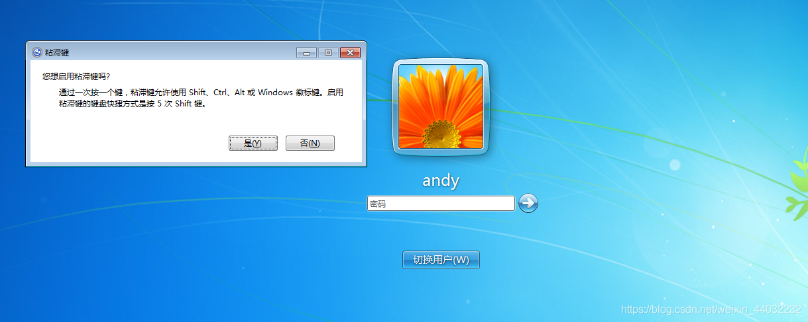

## 二、破解过程

1、在开机进入该界面后 断电
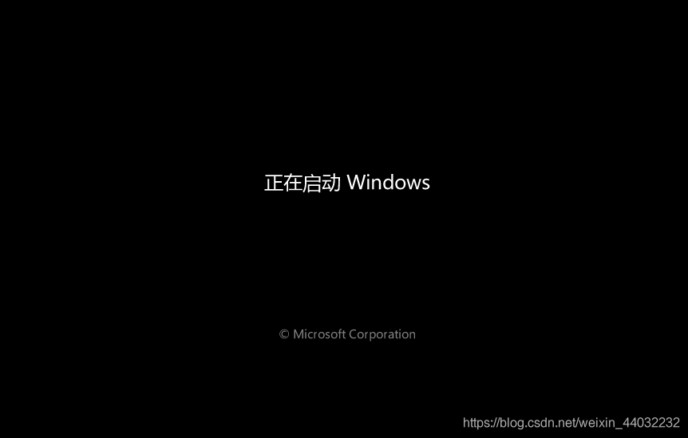
虚拟机中的断电就是关闭客户机
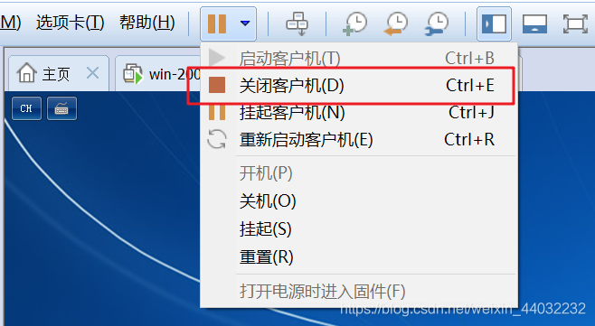
2、重启win7计算机进入如下界面 选择修复
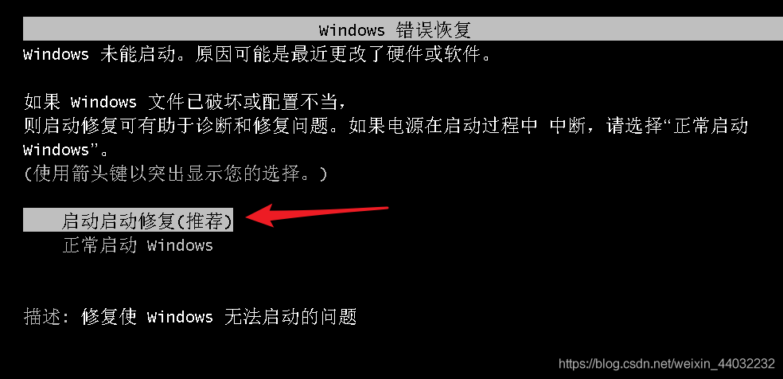
3、取消系统还原
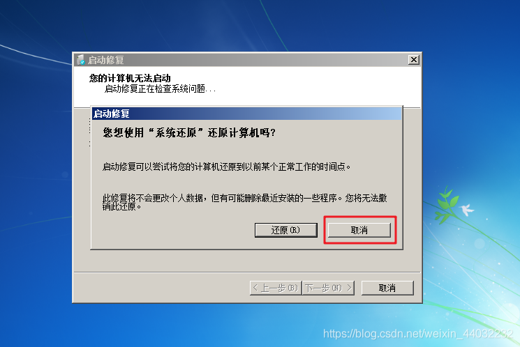
4、点击查看问题详细信息
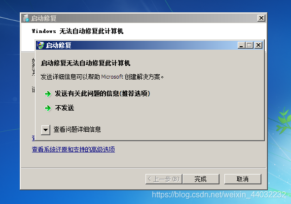
5、点击下方的本地链接
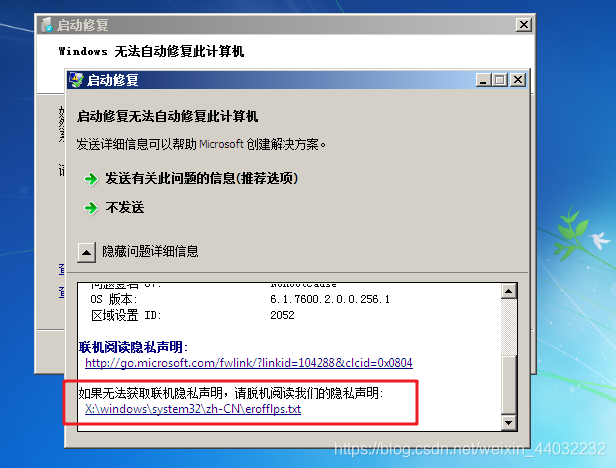
6、点击记事本中的文件 选择打开
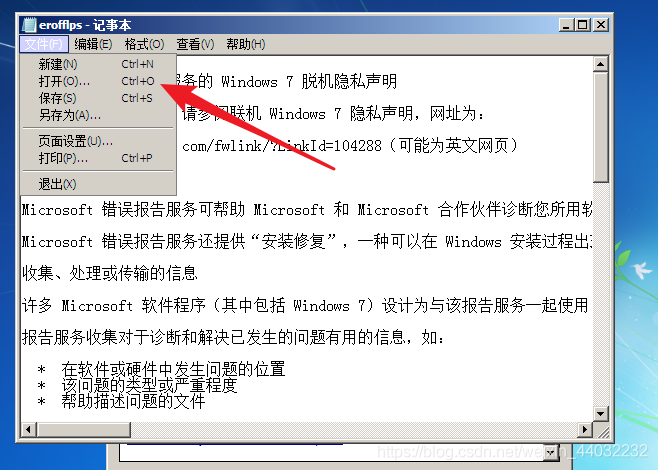
7、进入C:\windows\system32 ,文件类型选择所有文件
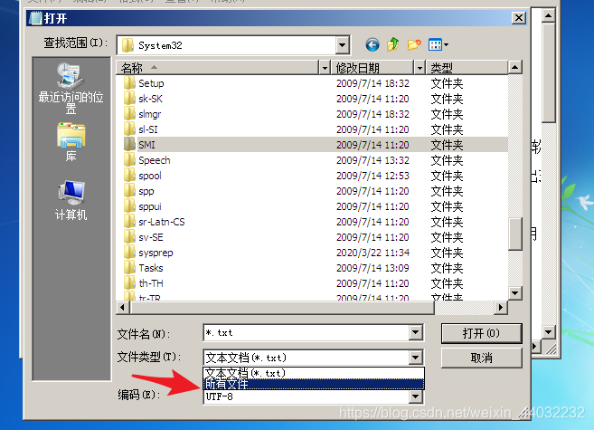
8、找到`sethc.exe`这个程序 进行重命名，名字随便起，目的是为了我们在按5次shift时不运行该程序。
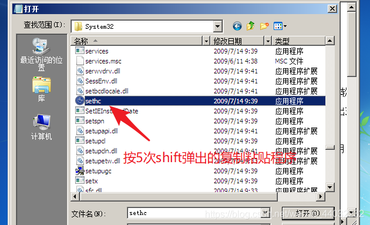
9、将该目录下的`cmd`重命名为`sethc`目的是我们在按5次shift时运行的是改名后的cmd也就是现在的sethc

> 注意：系统默认我们在按5次shift后会去C:\windows\system32 下找sethc这个名字的程序然后运行

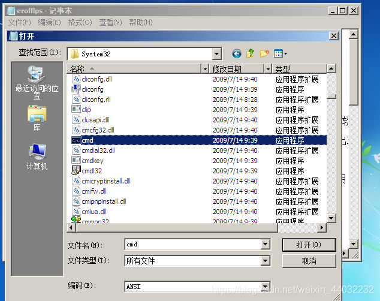
10、重新启动计算机
连续按5次shift进入cmd命令行 修改密码
抹除andy的密码
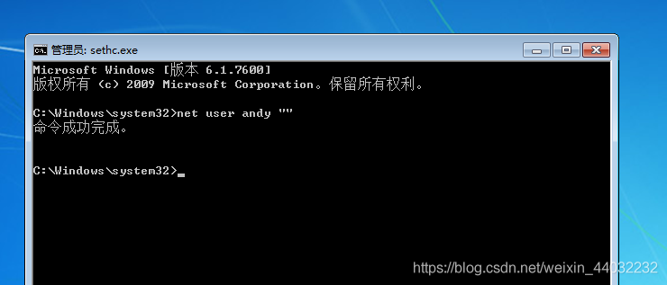