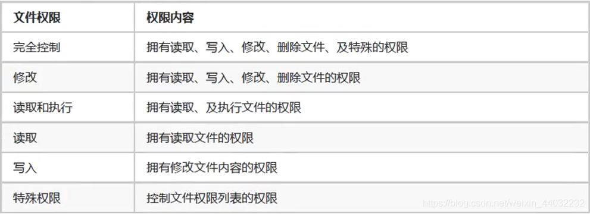
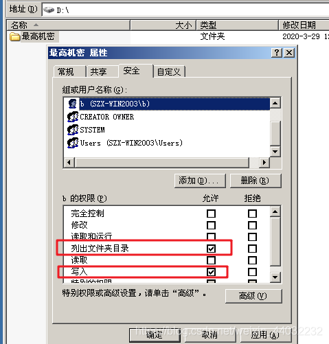

## 一、NTFS权限概述

1、通过设置NTFS权限，实现不同的用户访问不同对象（文件/文件夹）的权限。
2、分配了正确的访问权限后，用户才能访问资源。
3、设置权限防止资源被篡改和删除。


## 二、文件系统概述

文件系统（存储文件的方式）即在外部存储设备上组织文件的方法。
常见的文件系统：
格式化 == 制作文件系统

```powershell
*FAT   windows
*NTFS  windows
*EXT   liunx 常见
```

格式化的过程就是把硬盘的所有数据抹除，然后重新在该硬盘上打格子（存储单元）格子有大有小，默认4096字节/4KB


## 三、NTFS文件系统的特点

1、提高磁盘读写性能
2、可靠性，加密文件系统，访问控制列表-ACL（设置权限）
3、磁盘利用率，压缩，磁盘配额（为不同的用户设置使用空间）
4、支持单个文件大于4个G

## 四、修改NTFS权限

文件权限

文件夹权限

**4.1、取消权限继承**

作用：取消后可以任意修改权限列表
方法：文件夹右键属性 – 安全 – 高级 – 去掉第一个对号 – 选择复制即可

**4.2 文件及文件夹权限**

在D盘创建目录 名为：最高机密的文件夹
文件夹右键属性 – 安全

发现普通用户组的权限有些默认是已经勾选的且无法修改，这是因为该文件夹的权限继承了它的父级权限也是就是D盘的权限

那么我们想要修改D盘下的最高机密文件夹的权限就需要先取消与D盘的继承关系如下图所示把勾选去掉：

取消继承后在查看该文件夹的权限表，发现此时就可以修改了

案例：
在D盘目录下创建文件夹并命名为最高机密，进入最高机密文件夹在创建一个文件夹命名为密码，且在创建一个txt结尾的文件 并写入内容


需求：
管理员创建两个账户a和b，a用户对最高机密文件夹只有打开和读取权限，b用户对最高机密文件夹有读取和写入权限
（1）取消最高机密文件夹和D盘的继承关系

（2）创建a，b两个账户

（3）将a，b账户添加到表中

删除其他用户只留一个管理员，同时添加a，b用户

（4）查看a，b现有的权限并修改

**a账户对最高机密文件夹的权限**

a用户默认能打开和读取该文件，权限不用修改

**b账户对最高机密文件夹的权限**

修改权限：只留写入和列出文件夹目录（打开文件）

**验证权限：**

登录a用户进入D盘的最高机密文件夹，无法对其删除/写入/修改，只能读取


登录b用户进入D盘的最高机密文件夹，无法对其读取/删除/修改，只能创建和打开文件


> 同理子文件夹（密码）的权限继承了他的父级文件夹（最高机密）得权限

## 五、权限累加

当用户同时属于多个组时权限是累加的

b用户权限：

b用户又属于users这个组，users组权限为：

**b用户最终权限 = b用户权限 + users组权限**

多方权限累加

## 六、拒绝最大

相同的权限允许和拒绝发生碰撞拒绝最大

## 七、取得所有权

只有管理员组的用户可以操作

b用户新创建一个文件夹，并删除表中的管理员的权限

登录管理员账户并访问b账户创建的文件夹是无法访问的，没有权限

文件夹右键属性 – 安全


登录b用户查看，安全的选项都没有了


## 八、强制继承

作用：对下强制继承父子关系
方法：文件夹右键属性 – 安全 – 高级 – 勾选第二个对号


## 九、文件复制和移动对权限的影响

文件复制后，文件的权限会被目标文件的权限所覆盖（无论同分区还是跨分区）。
跨分区移动文件权限会被覆盖，同分区移动文件权限会被保留。