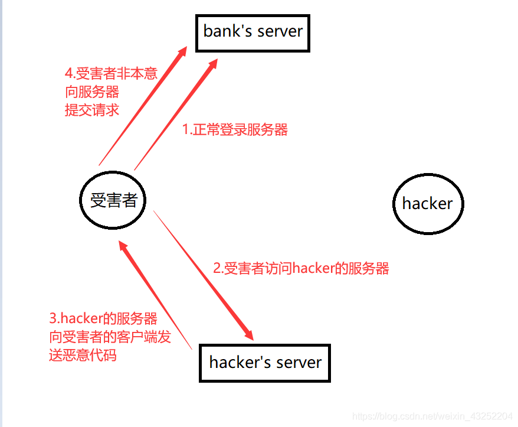

# CSRF

## 概述

跨站请求伪造（Cross-site request forgery,SCRF）是一种攻击，它强制终端用户在当前对其进行身份验证后的Web 应用程序上执行非本意的操作。

CSRF 攻击的重点在伪造更改状态的请求，而不是盗取数据，因为攻击者无法查看对伪造请求的响应。

借助社工的一些帮助（例如通过电子邮件或聊天发送链接），攻击者可以诱骗用户执行攻击者选择的操作。如果受害者是普通用户，则成功的CSRF 攻击可以强制用户执行状态更改的请求，例如转移资金，更改其电子邮件等。如果受害者是管理账户，CSRF 可能危及整个Web 程序。

## 关键点

CSRF 是一种欺骗受害者提交恶意请求的攻击。它继承了受害者的身份和特权，代表受害者执行非本意、恶意的操作。

对于大多数站点，浏览器请求自动发送与站点关联的所有凭据，例如用户的会话cookie,IP 地址，Windows域凭据等。因此，如果用户当前已对该站点进行了身份验证，则该站点将无法区分受害者发送的伪造请求和受害者发送的合法请求。

## 目标

CSRF 攻击目标是能够更改服务器状态或数据的业务或功能，例如更改受害的电子邮件地址、密码或购买商品。强制受害者查询数据，对于供给者来说没什么用，因为无法获得服务器响应。因此，SCRF攻击正对引起状态变化的请求。

有时可以将CSRF 攻击存储在易受攻击的站点上。这些漏洞被称为“存储的CSRF漏洞”。这可以通过简单地接受HTML 的字段中存储IMG 或IFRAME 标记，或通过更复杂的跨站点脚本攻击来实现。如果攻击可以在站点中存储SCRF 攻击，则攻击的严重性会放大。特别是，收到攻击的可能性增加，因为受害者比互联网上的某个随机页面更有可能查看包含攻击的页面。（具备普遍性）

## 场景

Web 应用

为了复现CSRF 攻击的场景，我们搭建了一个银行的模拟网站，其核心业务就是转账