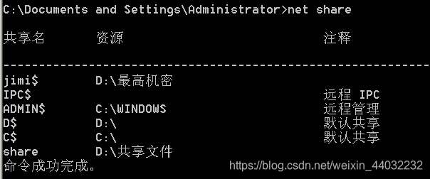

## 一、服务器端设置共享文件

文件夹右键属性 – 共享

给共享文件设置NTFS权限

共享权限影响

> 注意：
> 1）在本地登录时只受NTFS权限影响
> 2）远程登陆时，将受共享和NTFS权限共同影响，且取交集
> 3）所以建议设置共享权限Everyone为完全控制，具体权限在NTFS权限设置即可

添加共享名，并设置该文件夹共享给指定的用户a，赋予完全控制权限

## 二、客户端连接


或指定连接共享名

输入用户名密码

连接成功


## 三、隐藏共享

在共享名称会面加上$

远程连接时必须加上共享名称


## 四、共享命令

```powershell
net share 查看计算机当前共享的所有文件
net share 共享名 /del    取消共享
net share d$=c:\     创建共享 d为共享名，c:\为共享文件路径
123
```



## 五、关闭共享

永久关闭默认共享，通过注册表来修改。使用windows+R键输入`regedit`调出注册表编辑器。
先通过命令删除

修改注册表，不让其开机启动

HKEY_LOCAL_MACHINE\SYSTEM\CurrentControlSet\Services\lanmanserver\parameters右键新建一个DWORD类型的Autoshareserver的键，值为0.

关机重启 查看`net share`


## 六、关闭445服务

**1）打开services.msc 停止并禁用server服务**
关闭IPC$ 远程IPC
Win + R – `services.msc`
禁用server这个服务，关闭了445端口 不提供共享服务

重启计算机 检查 服务已经关闭，不在对外提供共享服务

已经没有共享选项

2）配置高级安全防火墙 – 入站规则（win7/win2008系统以上才有）
