## 一、DHCP作用

> 自动分配IP地址

## 二、DHCP相关概念

> 地址池/作用域：（IP、子网掩码、网关、DNS、租期）DHCP协议端口是 67/68

## 三、DHCP优点

> - 减少工作量
> - 避免IP冲突
> - 提高地址利用率

## 四、DHCP原理

也称为DHCP租约过程，分为4步
1、发送DHCP Discovery广播包

> 客户机广播请求IP地址（携带着自己的MAC地址一起发出）

2、响应DHCP Offer广播包

> 服务器响应提供的IP地址（但无子网掩码、DNS、网关等参数）

3、客户机发送DHCP Request广播包

> 客户机选择IP（确认用哪个服务器响应的IP）

4、发送DHCP ACK广播包

> 服务器确定租约，并提供网卡详细参数IP、子网掩码、网关、DNS、租期等

**注意：如果有多台DHCP服务器，谁先响应就用谁。**

## 五、DHCP续约

> 当租期到50%后，客户机会再次发送DHCP Request广播包，进行续约，若服务器无响应，则继续使用并在87.5%再次请求，若仍然无响应就释放IP地址，重新发送DHCP Discovery广播包来获取IP地址。
> 注：当无任何服务器响应时，给自己分配一个169.254.x.x/16 该地址只能在内网使用，无法访问外网。

## 六、部署DHCP服务器

注意：配置DHCP服务的前提是客户机和服务机在同一个网段内
1、安装DHCP服务
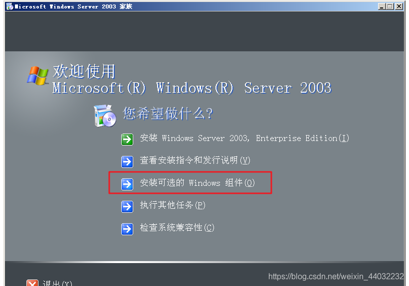
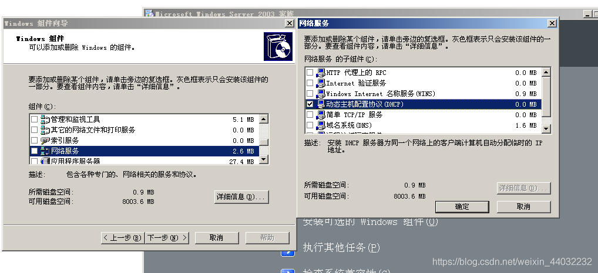
服务器必须使用静态IP
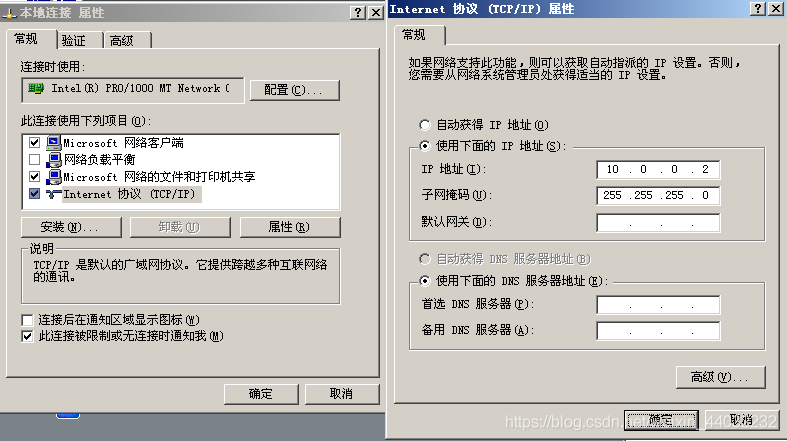
2、配置DHCP服务
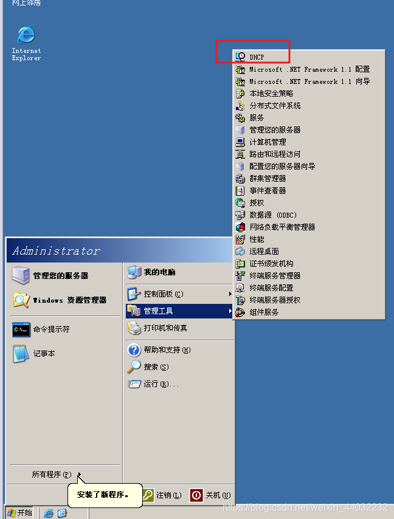
3、新建作用域
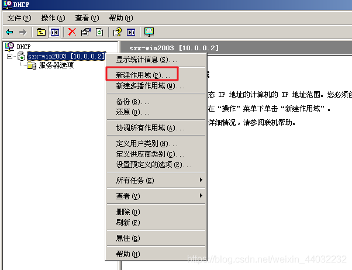
4、配置可用IP及子网掩码

> 分配IP一定要预留一部分IP，备用（添加服务器时用）

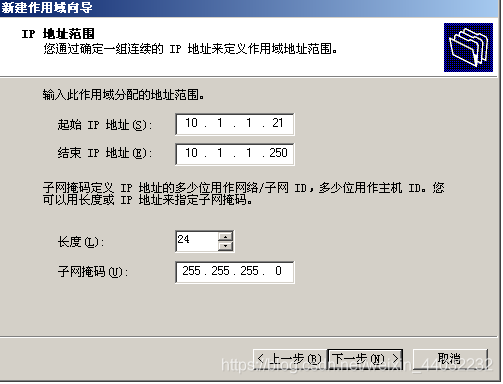
5、添加排除IP（不会分配的IP）
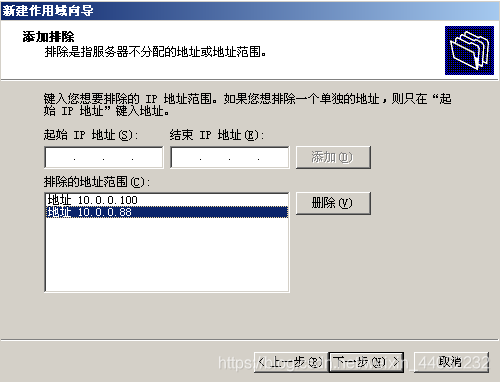
6、设置租期
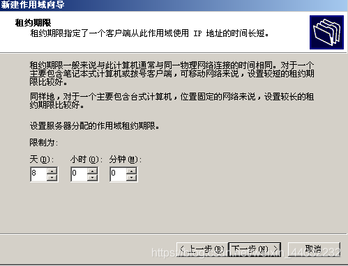
7、添加公司网关（提供外网服务）
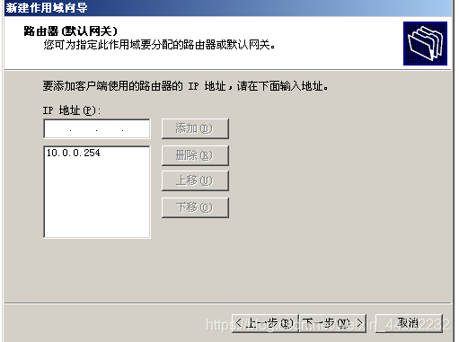
8、添加DNS服务器IP
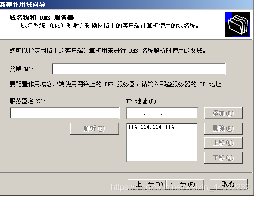
9、检查配置好的DHCP服务

**地址池：**
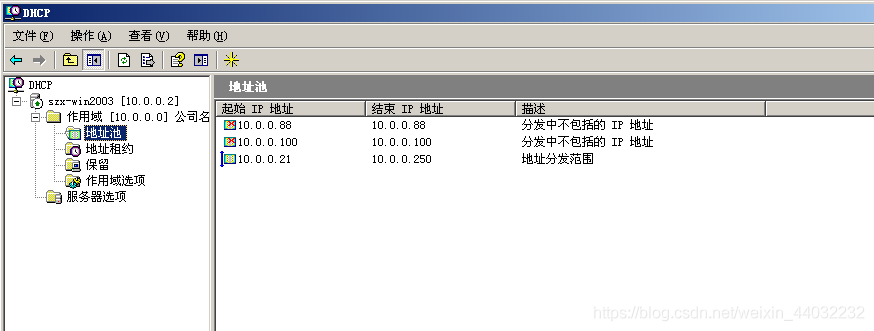
**作用域：**
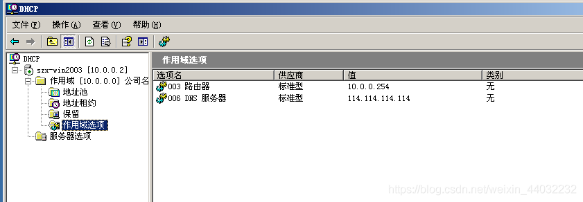
10、登录客户机自动获取IP
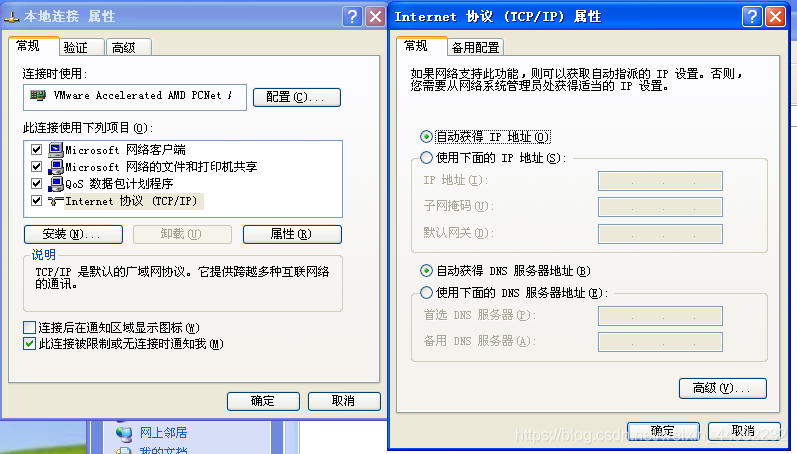
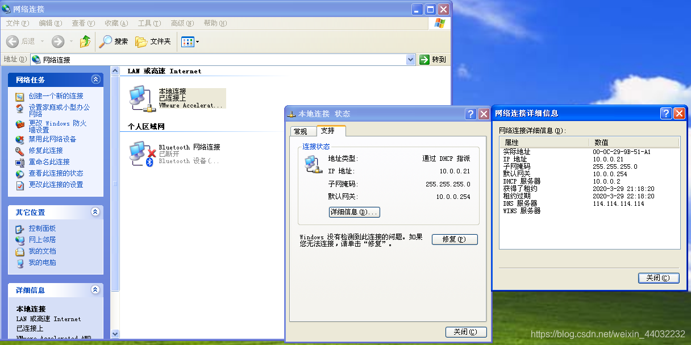
11、查看DHCP服务器的租约表单

唯一 ID：客户机的MAC地址
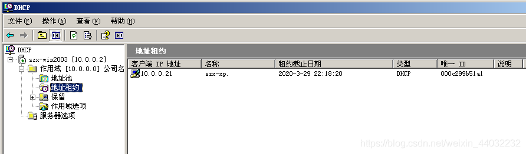
**释放当前IP**
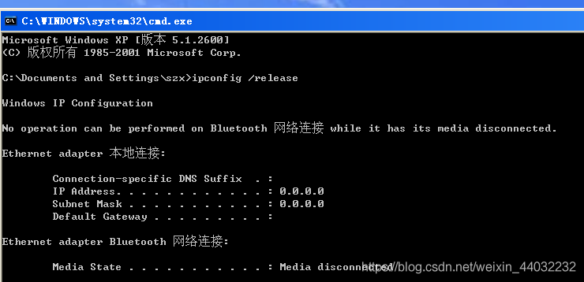
**发送Discovery广播获取新的IP**
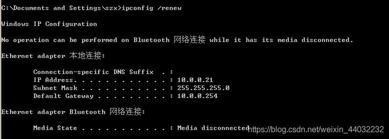

```powershell
ipconfig /release  释放IP（取消租约，或者改为手动配置IP，也可以释放租约）
ipconfig /renew   有IP时，发送Request续约，无IP时发送Discovery重新获取IP
12
```

## 七、地址保留

动态保留，来自同一个客户机请求分配固定的IP地址
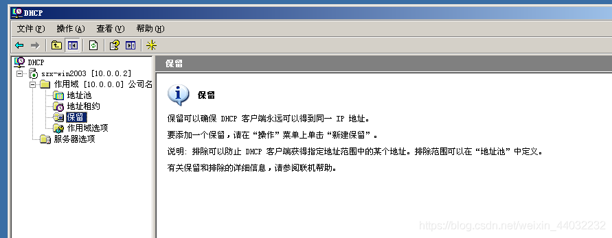
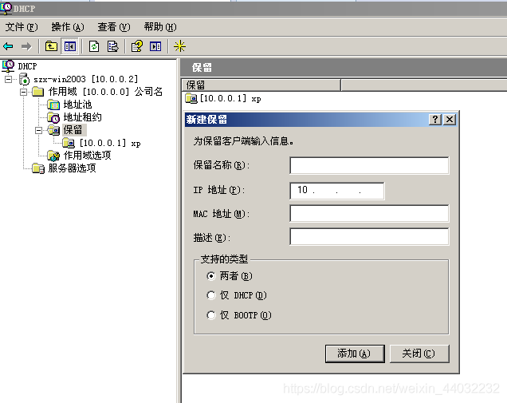
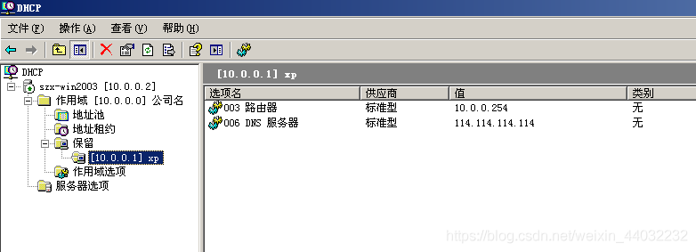
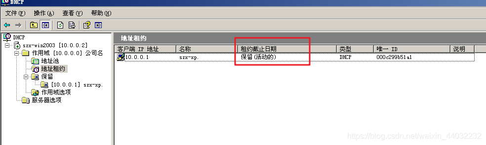

## 八、选项优先级

作用域选项优先级 > 服务器选项优先级
当服务器上有多个作用域时，可以在服务器选项上设置DNS服务器
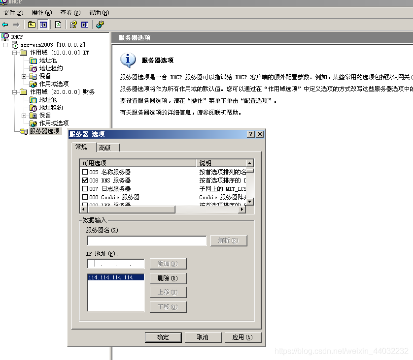
给服务器选项配置DNS服务器，如果作用域选项没有配置DNS服务器，那么会继承服务器选项配置的DNS服务器，如果作用域选项配置了自己的DNS服务器，那么就用自己的
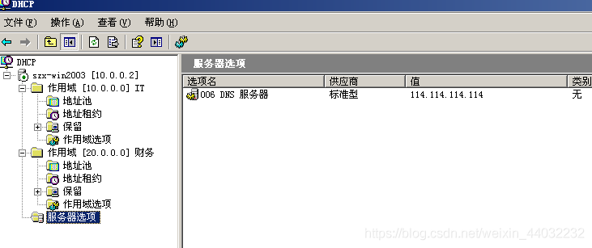
IT自己配置了作用域选项
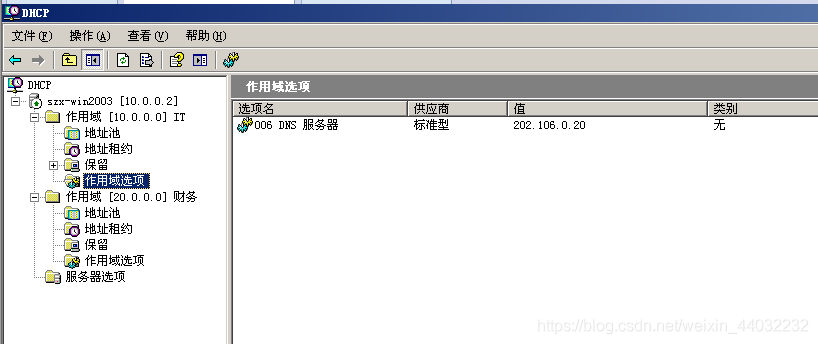
财务没有配置会继承服务器选项配置的DNS
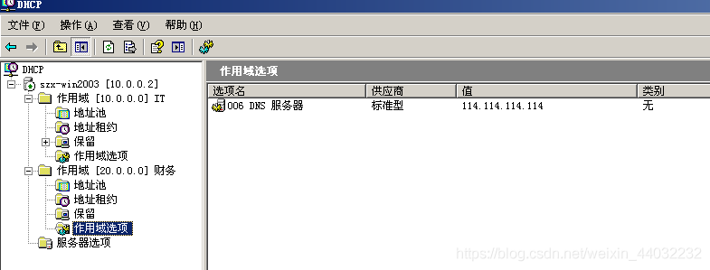
网关只能自己配置自己的

## 九、DHCP备份

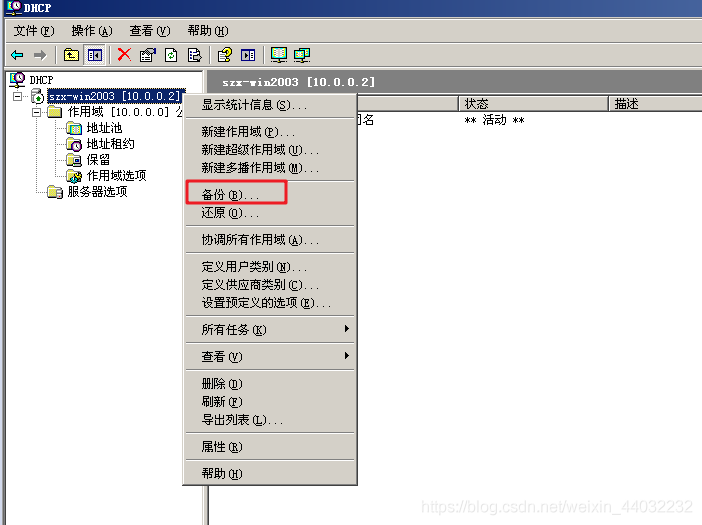

## 十、DHCP攻击与防御

1）攻击DHCP服务器：

- 攻击：频繁的发送伪装DHCP请求，直到将DHCP地址池中的资源耗尽。
- 防御：在交换机（管理型）的端口上做动态MAC地址绑定。

2）伪装DHCP服务器

- 攻击：hack通过将自己部署为DHCP服务器，为客户机提供非法IP地址
- 防御：在交换机上，除合法的DHCP服务器所在接口外，全部设置为禁止发送DHCP Offer广播包。