### 1、什么是DNS？

域名系统（服务）协议 Domain Name Service

域名系统（服务）协议（DNS），主要用于域名与 IP 地址的相互转换。

大多数因特网服务依赖于 DNS 而工作，一旦 DNS 出错，就无法连接 Web 站点。

它作为可以将域名和IP地址相互映射的一个分布式数据库，能够使人更方便的访问互联网，而不用去记住能够被机器直接读取的IP数串。

### 2、域名组成

#### 2.1、域名组成概述

如"www.sina.com.cn"是一个域名，从严格意义上讲，"sina.com.cn"才被称为域名(全球唯一)，而"www"是主机名。

“主机名”.“域名"称为完全限定域名(FQDN)，一个域名下可以有多个主机，域名全球唯一，那么"主机名”."域名"也是全球唯一的。

以"sina.com.cn"域名为例，一般管理员在命名的时候会根据其主机的功能而命名，比如网站的是www，播客的是blog，论坛的是bbs，对应的FQDN为www.sina.com，blog.sina.com.cn，bbs.sina.com.cn 那么多个FQDN，我们只需要申请一个域名"sina.com.cn"即可

#### 2.2、域名组成

如下图
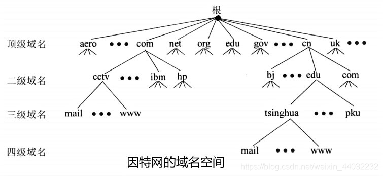
各类顶级域

- 国家顶级域 `cn jp hk uk`
- 商业顶级域
  - com 商业机构
  - gov 政府机构
  - mil 军事机构
  - edu 教育机构
  - org 民间组织架构
  - net 互联网

```
如：www.baidu.com.
.     为根域
.com  为顶级域
baidu 为一级域名
www   为主机名
12345
FQDN = 主机名.DNS后缀
FQDN（完整的域名）
12
```

### 3、监听端口

```
TCP 53
UDP 53
12
```

### 4、DNS解析种类

#### 4.1、按照查询分类

```
1）递归查询：客户机与本地DNS服务器之间
2）迭代查询：本地DNS服务器与根等其他DNS服务器的解析过程
12
```

**DNS解析过程**
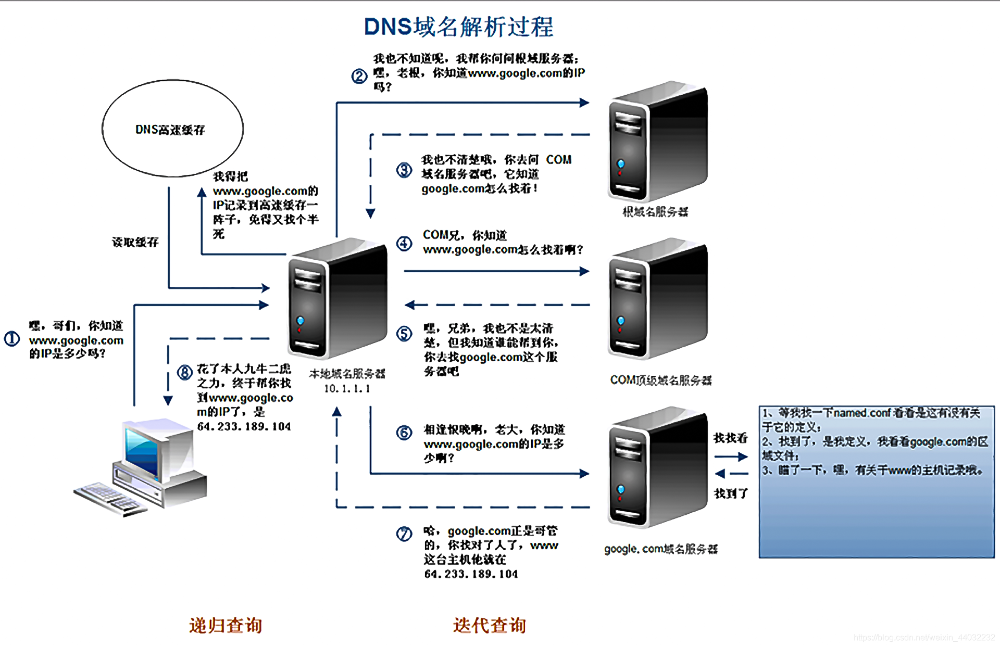
全世界目前一共13个根域名服务器

#### 4.2、按照查询内容分类

- 正向解析：已知域名，解析IP
- 反向解析：已知IP，解析域名

### 5、DNS服务器搭建过程

**注意：配置服务器前一定要配置静态IP**

1、插入光驱双击打开，安装可选的Windows组件
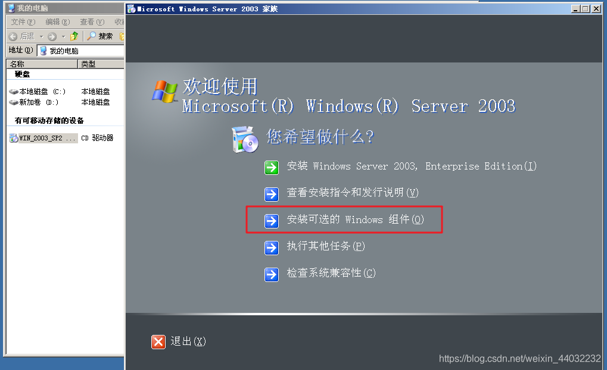
2、网络服务 – 域名系统DNS
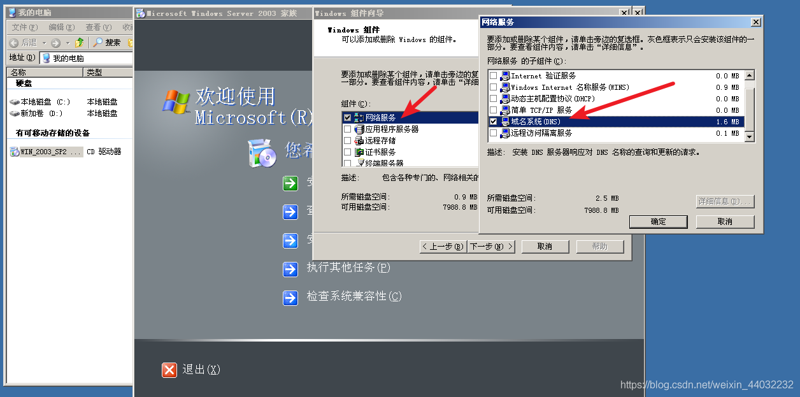
3、开始 – 管理工具 打开DNS服务
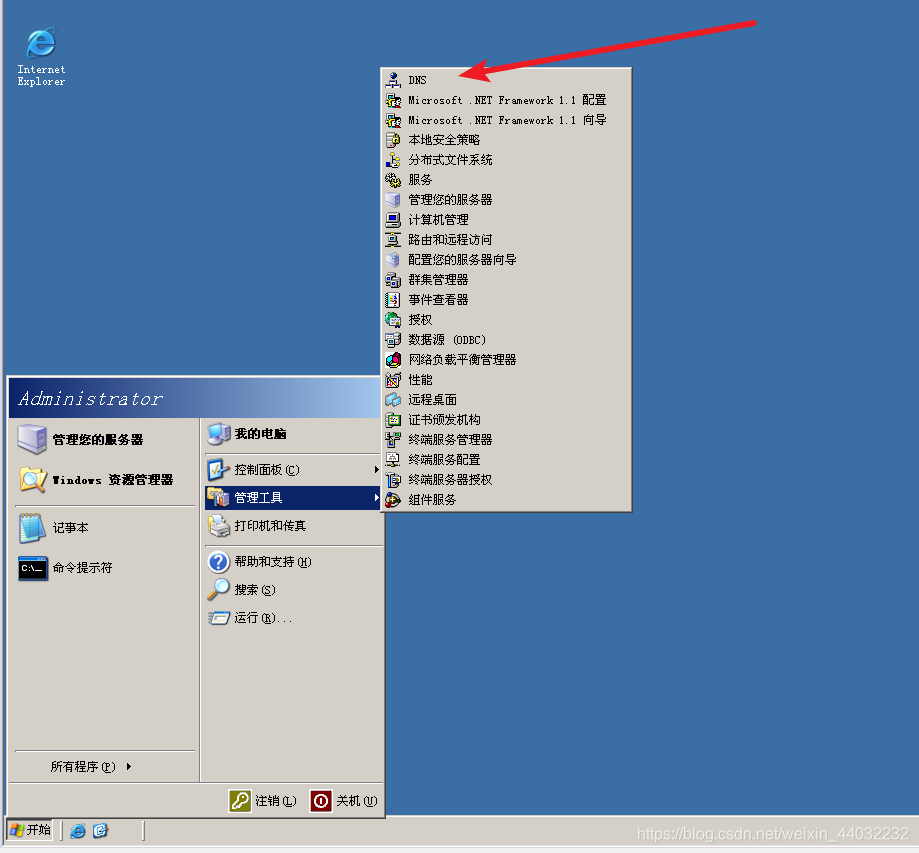
装完DNS服务后端口就已经打开了
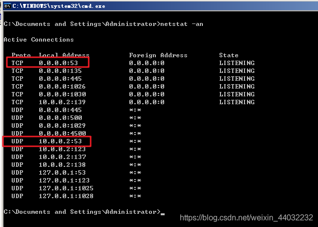
4、正向查询区域 – 新建区域
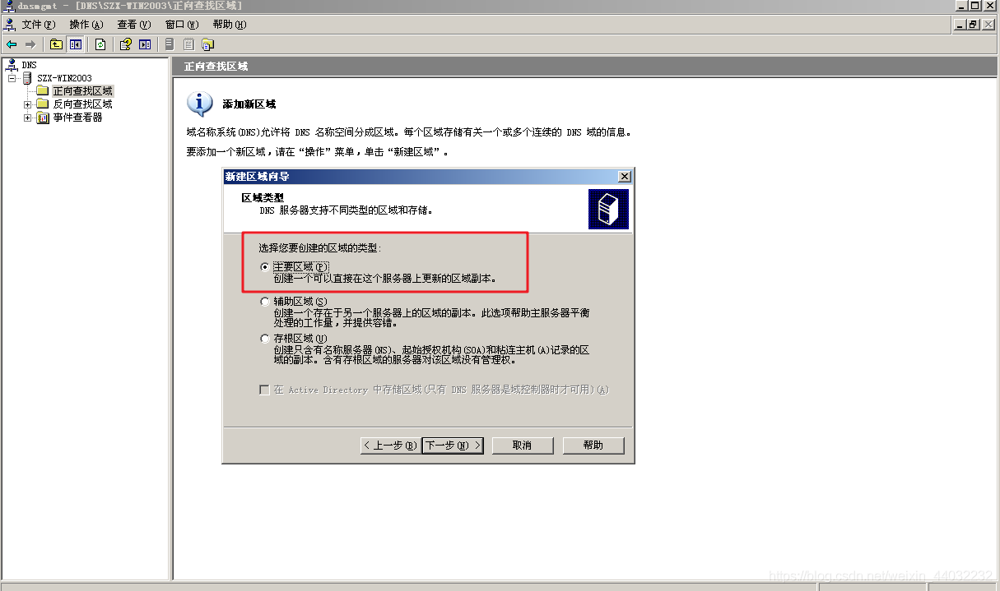

- 主要区域就是主服务器；
- 辅助区域是备份区域，如果公司已经有一台DNS服务器了，想要做一台备份服务器，就选辅助区域；
- 存根区域就是根域，一般由国家级的来创建；
  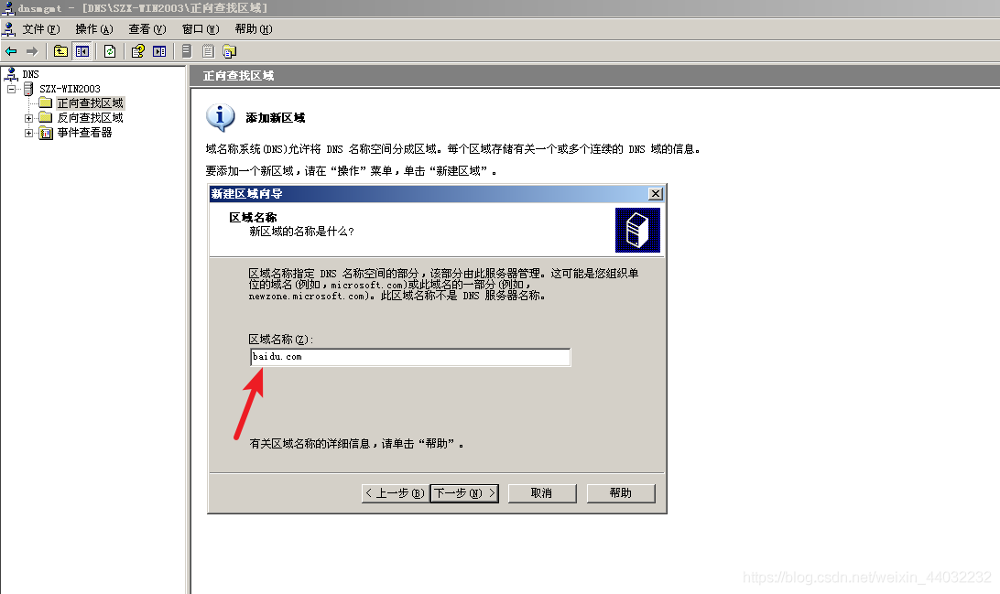
  以后baidu.com这个区域的都有它来解析，它就是这个区域的权威服务器；
  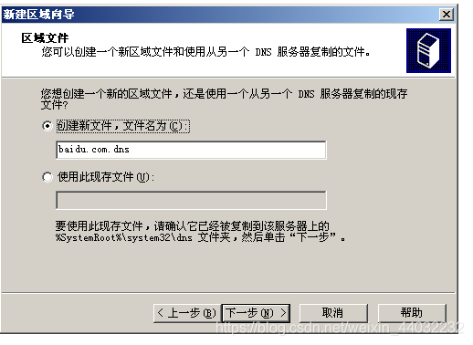
  baidu.com.dns这个文件是区域解析文件，以后www.baidu.com，pan.baidu.com都会写入这个文件；
  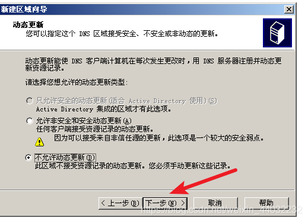
  直接下一步
  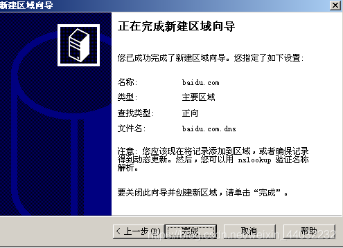
  名称：baidu.com
  类型：主要区域（本服务器是baidu.com的主DNS服务器）
  查找类型：正向（正向解析）
  文件名：baidu.com.dns
  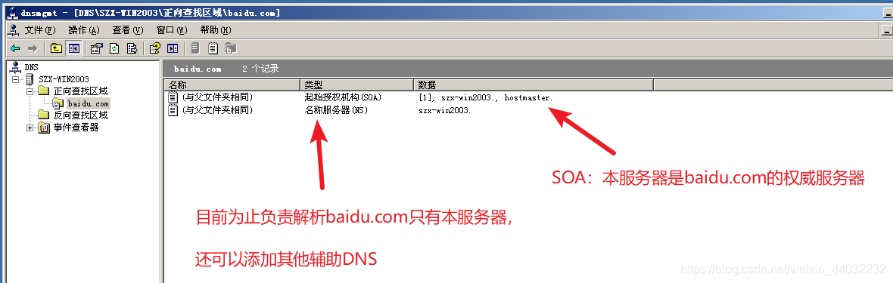
  5、新建主机
  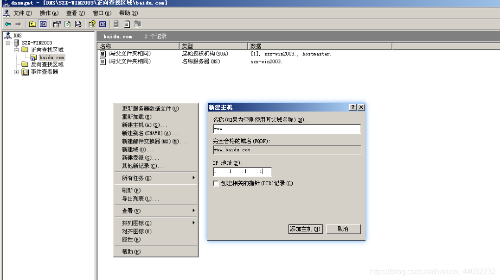
  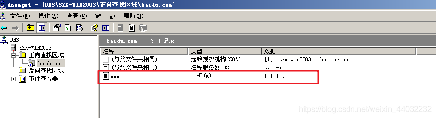
  **www.baidu.com解析后的IP地址为1.1.1.1**
  6、验证解析是否正确
  配置DNS，客户机的DNS地址指向 服务器地址
  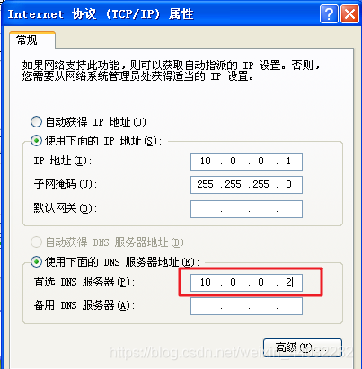
  在客户机终端窗口输入`nslookup www.baidu.com`
  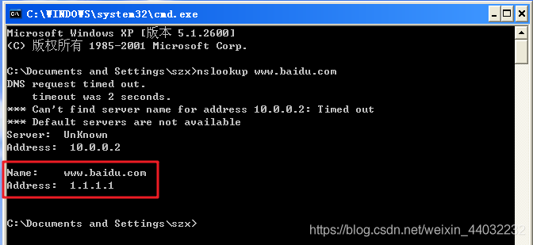

```powershell
ipconfig /flushdns    刷新本地DNS缓存
ipconfig /displaydns  显示DNS缓存
12
```

**反向解析**

给服务器命名为dns.baidu.com
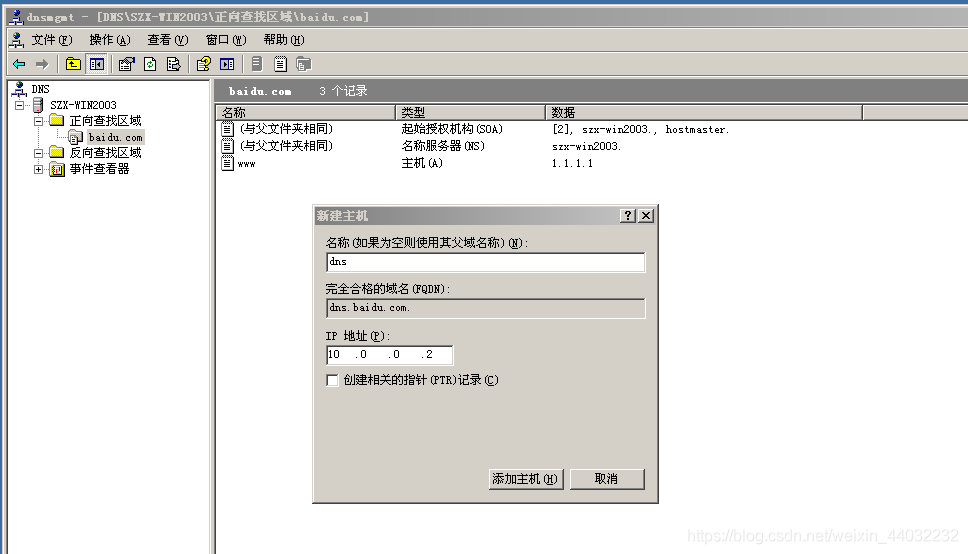
反向区域配置
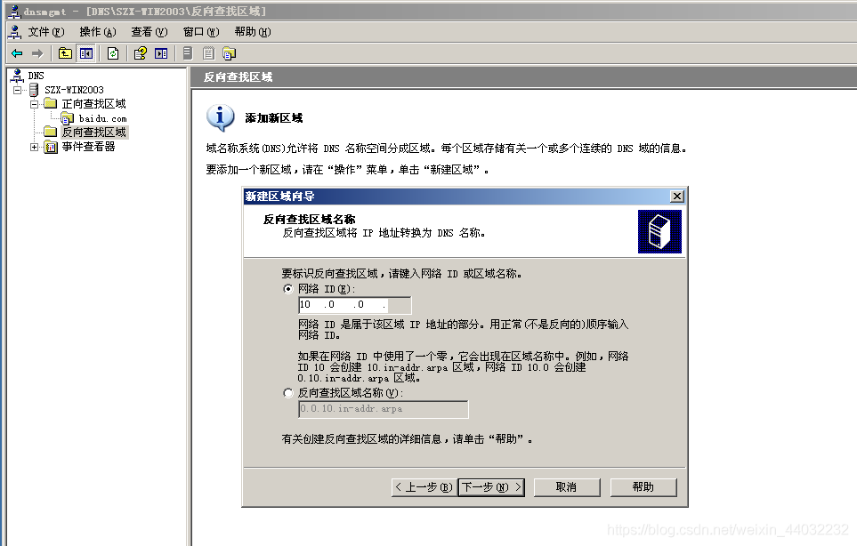
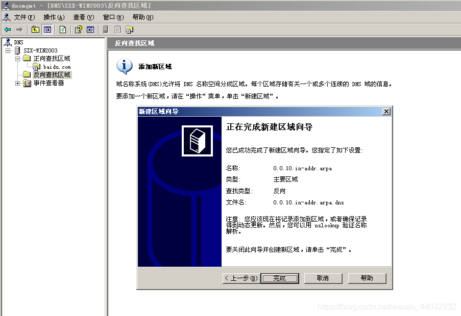
新建指针 – 配置反向解析（通过访问IP可以解析到服务器名）
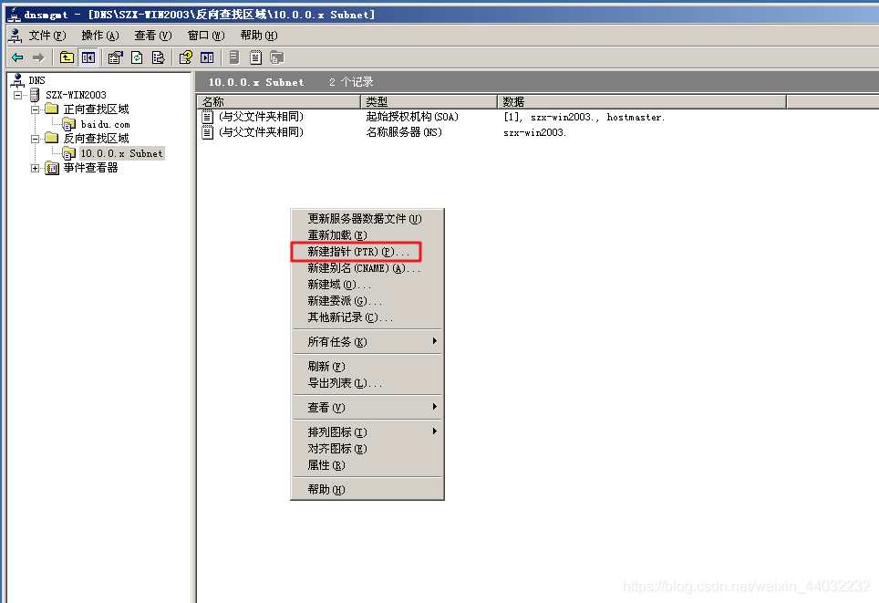
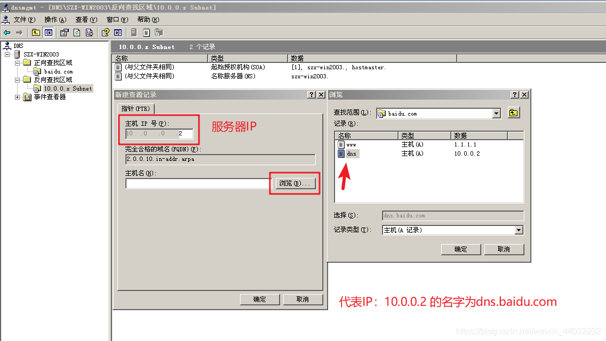
验证
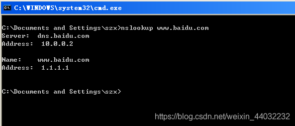

> www.baidu.com 交给IP为10.0.0.2 服务器名为dns.baidu.com 去解析，
> 解析出来www.baidu.com的IP地址为1.1.1.1

## 6、DNS服务器分类

```powershell
主要名称服务器
辅助名称服务器
根名称服务器
高速缓存名称服务器
```

## 7、客户机域名请求解析顺序

> 1、dns缓存
> 2、本地hosts文件
> 3、本地dns服务器

## 8、服务器对域名请求的处理顺序

> 1、dns高速缓存
> 2、本地域名解析文件
> 3、转发器
> 4、根