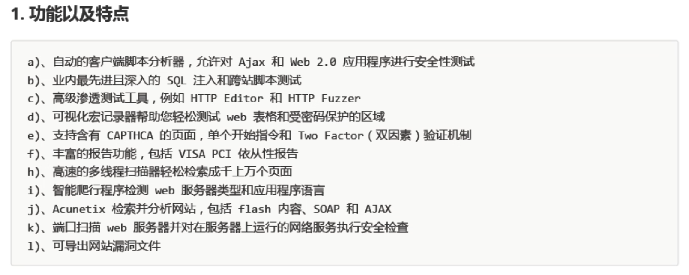
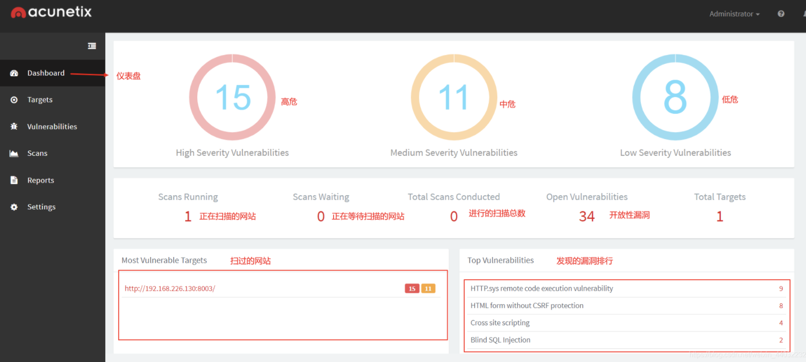
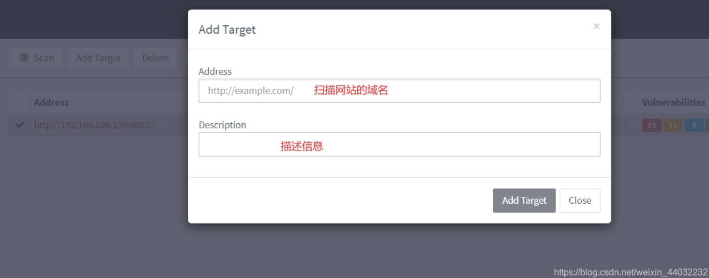
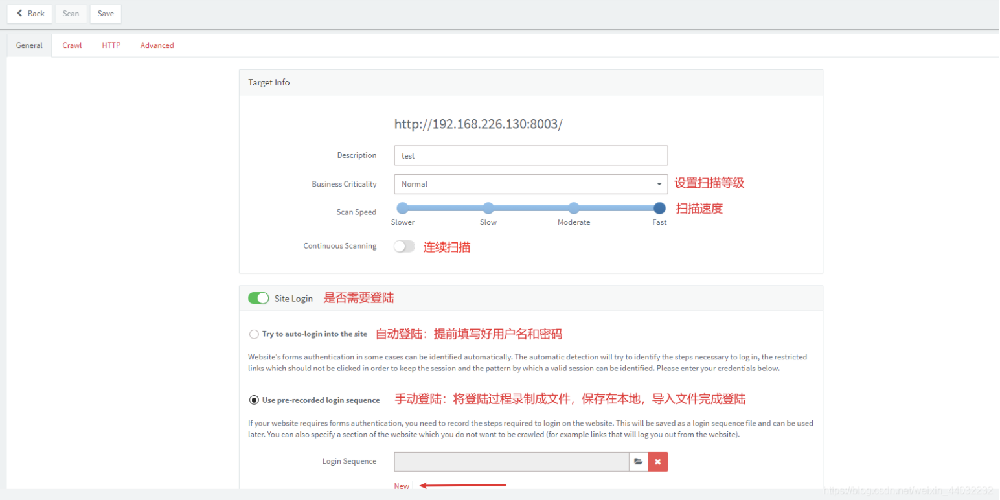
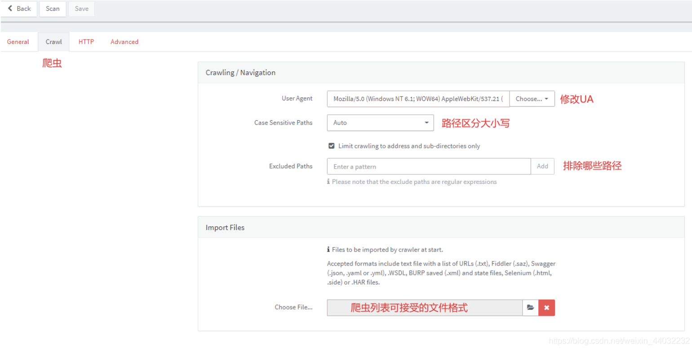
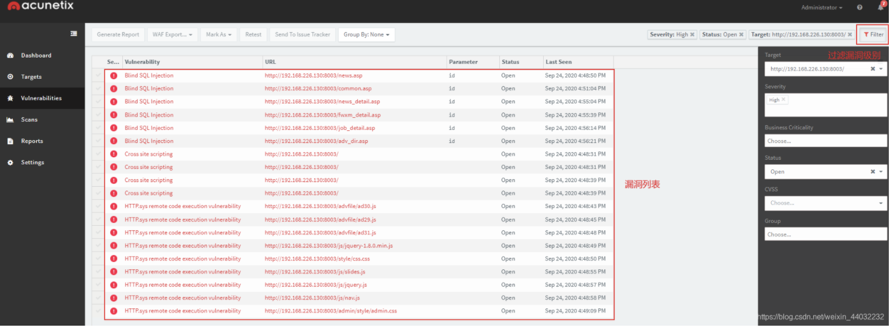
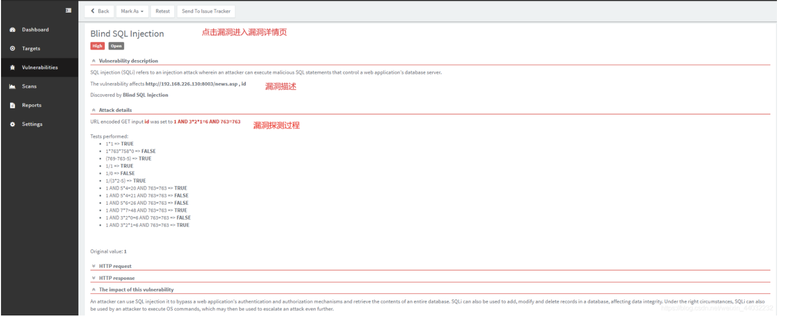
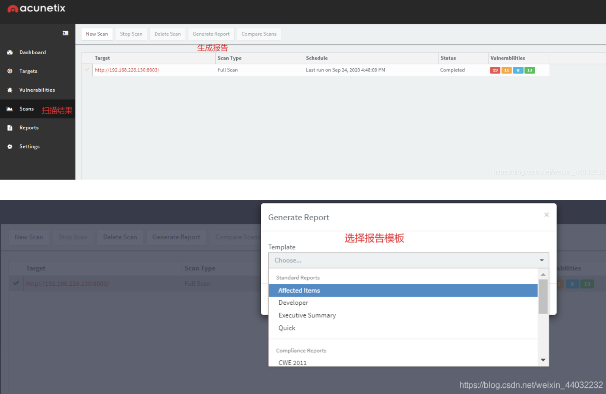
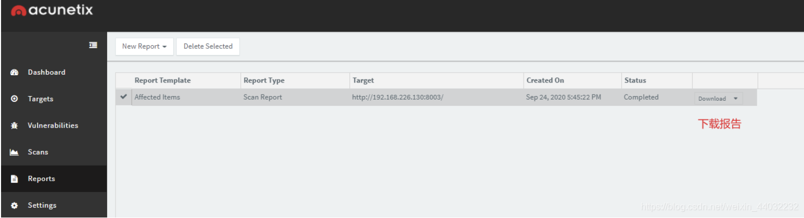
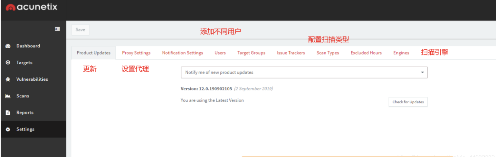

# AWVS使用介绍

### 一、AWVS是什么？

- Acunetix Web Vulnerability Scanner（简称AWVS）是一款知名的网络漏洞扫描工具，它通过网络爬虫测试你的网站安全，检测流行安全漏洞。
- AWVS是一款Web漏洞扫描工具，通过网络爬虫测试网站安全，检测流行的Web应用攻击，如跨站脚本、sql 注入等。

官方网站：<https://www.acunetix.com/>

### 二、AWVS界面介绍

#### 1、仪表盘

#### 2、扫描目标

扫描演示

添加扫描目标

手动登陆

爬虫

#### 3、漏洞列表

查看漏洞详情

#### 4、扫描结果

#### 5、下载报告

#### 6、设置

