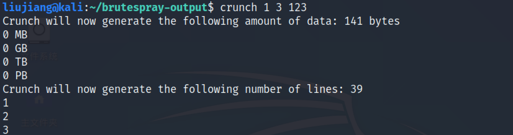
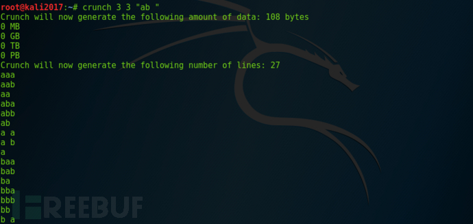
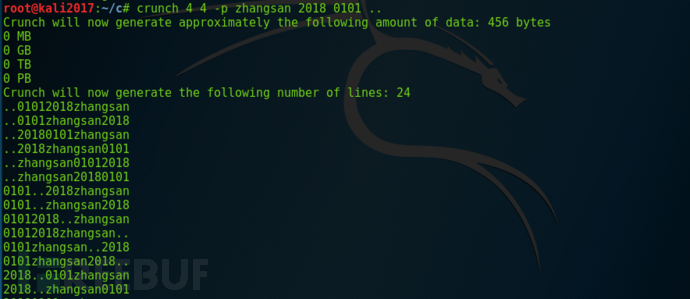
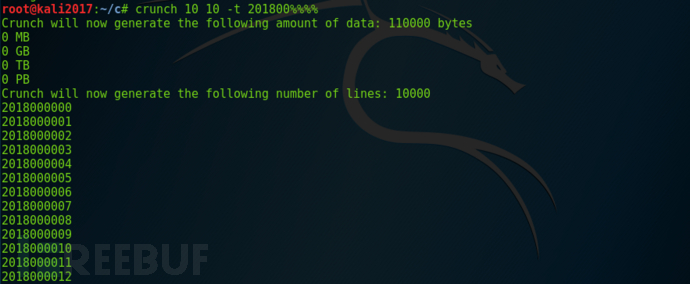
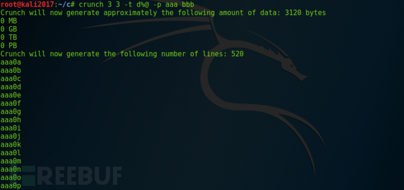
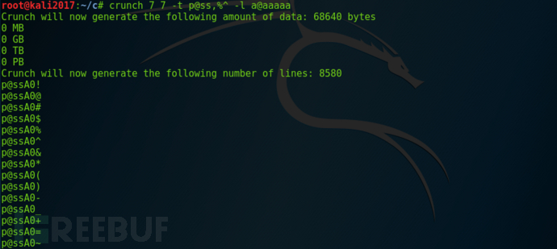
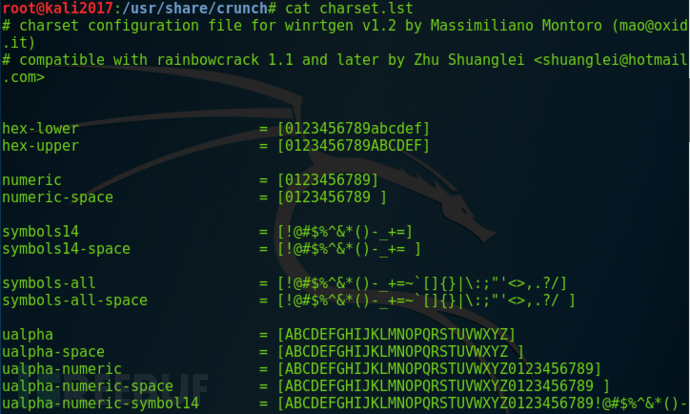

# Crunch

**Crunch是一种创建密码字典工具，按照指定的规则生成密码字典，可以灵活的制定自己的字典文件。使用Crunch工具生成的密码可以输出到屏幕，保存到文件、或另一个程序。由其在渗透测试需要爆破的时候，字典的编排等直接影响到我们的爆破速度，对整个渗透测试流程起着十分重要的作用。**

**Crunch**为**kali**自带工具之一在kali环境下进行，文中提及的所有命令均可以在kali下直接运行。

## 使用语法和参数

```sh
crunch <min> <max> [options]
```

参数详解

```
     min    设定最小字符串长度（必选）
     max    设定最大字符串长度（必选）
     
     oprions
     -b     指定文件输出的大小，避免字典文件过大  
     -c     指定文件输出的行数，即包含密码的个数
     -d     限制相同元素出现的次数
     -e     定义停止字符，即到该字符串就停止生成
     -f     调用库文件（/etc/share/crunch/charset.lst）
     -i     改变输出格式，即aaa,aab -> aaa,baa
     -I     通常与-t联合使用，表明该字符为实义字符
     -m     通常与-p搭配
     -o     将密码保存到指定文件
     -p     指定元素以组合的方式进行
     -q     读取密码文件，即读取pass.txt
     -r     定义重某一字符串重新开始
     -s     指定一个开始的字符，即从自己定义的密码xxxx开始
     -t     指定密码输出的格式
     -u     禁止打印百分比（必须为最后一个选项）
     -z     压缩生成的字典文件，支持gzip,bzip2,lzma,7z  
```

特殊字符

```
     %      代表数字
     ^      代表特殊符号
     @      代表小写字母
     ,      代表大写字符   
```

## 实用案例

（1）生成一个字典文件，用自己指定的字符（默认为26个小写字母为元素的所有组合）

```sh
#crunch 1 6 abcdefg  
#生成最小为1,最大为6，由字符串abcdefg开头，以字符串gggggg为结束的所有字符组合
crunch 1 3 123
```



```sh
crunch 1 6 abcdefg\ 
生成最小为1,最大为6，由abcdefg和空格为元素的所有组合(/代表空格)
若字典中需要空格，;等用双引号来表示
  crunch 3 3 "ab "
```



生成几个元素的组合（可以用于社工中收集的信息）

​    crunch 4 4 -p zhangsan 2018 0101 ..



生成指定的字符串（比如生成编号，手机号等）

 crunch 10 10 -t 201800%%%%



多种组合 生成3个元素的组合，前三位为定义的字符串

crunch 3 3 -t d@% -p aaa bbb 



通过-l参数来使@,%^等特殊字符输出

 crunch 7 7 -t p@ss,%^ -l a@aaaaa



-o参数也可使用>>来简化

crunch 4 4 -d 2@ -t @@@% >> test.txt

## 调用密码库

```
   /usr/share/crunch/charset.lst
```



特殊字符

```
     numeric     表示0123456789
     Lalpha      表示26位小写字母
     Ualpha      表示26位大写字母
```

实例：调用密码库 charset.lst中的 hex-upper项目字符，生成4位密码，其中格式为@ + hex-upper +% +%

```
   crunch 4 4 -f charset.lst hex-upper -t @@%% -l @xdd
```

