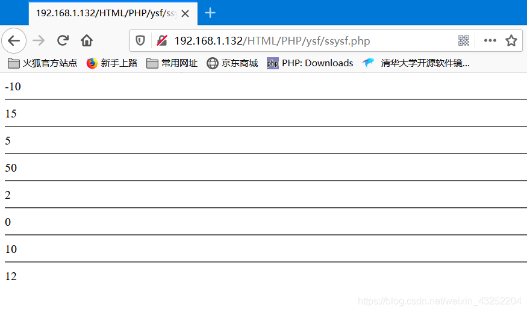
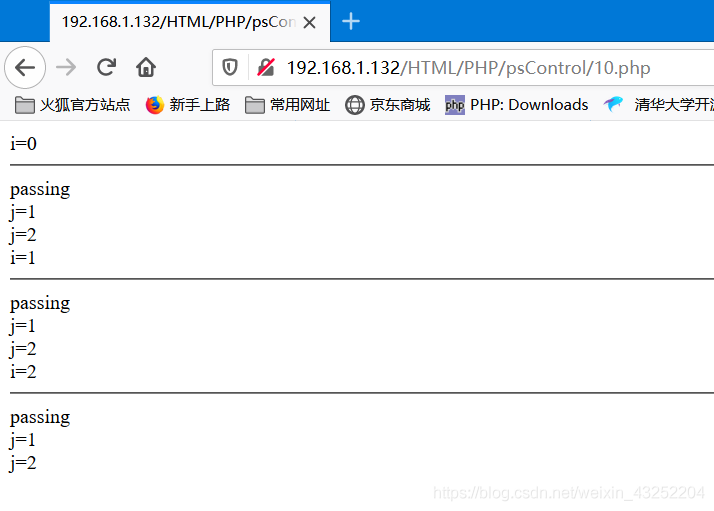

# 1、PHP基础

一门编程语言

运行在服务器端、专门用户开发网站的，脚本后缀名.php。与HTML语言进行混编，脚本后缀依然是.php。解释型语言，不要编译直接运行

PHP运行需要环境：

Windows phpstudy

Linux 单独安装 

## Web 原理简述

   1、打开浏览器

   2、输入url

   3、显示页面

## PHP 基本语法

   PHP 语言标记

​      开始标记 <?php

​      结束标记  ?>

### 测试

在桌面新建一个index.php文件

```php
<?php
echo "hello!!!!!!";
phpinfo();
?>
```

之后使用phpstudy打开，或者mamp


打开浏览器直接访问http://localhost/


### 特点：

1、<?php?>这之间就表示进入PHP模式，在开始和结束处之外的内容都会被PHP解析器忽略

2、可以直接嵌入到html代码中，并且可以嵌入到html代码中的任何地方

3、在一个html文档中可以嵌入任意多个PHP标记

4、文件末尾的PHP代码结束标记可以不要，在一些情况下省略掉更好


## 指令分隔符 [;]

一个php语句必须（建议）要用分号结束

 

## 注释（和C语言类似）

单行注释 //

多行注释 /*  */

注意

php代码中注释，不会显示在浏览器的源代码中

php运行环境是服务器，我们浏览器看到的是PHP 引擎运行PHP代码后的执行结果

 

## 简单的PHP语句

1、phpinfo();

2、echo 用于输出简单的变量

3、var_dump(); 用于输出变量值及其变量类型

 

## 变量

### 变量的声明

   不需要声明变量，但要初始化

### 初始化

   给变量初次赋值，或者变量的默认值

### 赋值

   [=]  

   根据实验说明：PHP脚本是顺序执行的

   引用赋值 $c =&$a

   相当于给$a起了一个别名，$c值的改变，$a也随之改变

变量的释放

   unset()

### 变量的命名

   @以$符号开头

   @严格区分大小写

   @字母|数字|下划线，不能以数字开头

   $name1

   $my_name

   $_my_name

   $1_name 错误

   @尽量不要使用php关键字作为变量名

### 可变变量

```php
<?php


$name="hello";


$$name="world";


echo $name;


echo "<br />";


echo $hello;//$$name;


?>
```

 

### 变量的类型

   布尔类型 两个 true false，其他均会被认为true

> 以下所有内容会被当做false
>
> - 布尔值false
> - 0
> - 浮点型0.0
> - 空白字符串和字符串0
> - 没有成员的数组
> - NULL

   int  存储整数

   float 存储小数 3.14

   字符串 string

> 字符串的定义
>
> ​    @    ’ ‘
>
> ​    @    " "
>
>    @    定界符
>
> 注意：
>
> @单引号定义的字符串中出现单引号要转义[\]
>
> @单引号定义的字符串中，[$] 符号原样输出
>
> @双引号定义的字符串中，[$] 是变量的开始,整体变量名用{}括起来
>
> @单双引号定义的字符串中输入的特殊字符包括[',",$...]需要转义
>
> @定界符开始和结束后面不能有任何字符包括空白字符和注释

   数组

   对象 不讲

 

## 常量

   不变的量

   定义

   define("NAME","GGG");

   直接使用即可

> 预定义常量
>
> - 常量名     常量值
> - __FILE__    当前的文件名
> - __LINE__    当前的行数
> - __FUNCTION__    当前的函数名
> - __CLASS__    当前的类名
> - __METHOD__    当前的对象的方法名
> - PHP_OS    UNIX或WINNT等
> - PHP_VERSION     当前的PHP服务器的版本
> - DIRECTORY_SEPARATOR    \或/  根据操作系统决定目录的分隔符

 

## 运算符

### 算术运算符（见代码）

### 逻辑运算

> 非 ！
>
> 与 and &&
>
> 或  or ||
>
> 异或 xor 不同为真，相同为假
>
> 与运算的优先级高于或运算。

### 比较运算

> 比较参与运算的单元是否相同，相同为真，不同为假
>
> ==
>
> ===
>
> \>
>
> \>=
>
> <
>
> 4<=
>
> !=
>
> !==
>
> <>

### 字符串运算符

. 

### 赋值运算符

> =
>
> +=
>
> -=
>
> *=
>
> /=
>
> %=
>
> .=
>
> .

### 其他运算符

?:    三元运算符

$a = 10 > 20 ? 10 : 20

``    将字符串当作命令执行

@   屏蔽提示，警告

 

## 运算符的优先级


## PHP 的语法错误

   Error    结束脚本执行

   Warr~   只提示，不影响执行

   Notice   只提示，不影响执行

 

## 流程控制

### 顺序执行

   PHP代码执行的时候，一次顺序执行

### 分支执行

   单向分支

   if(判断条件){执行语句块}

   双向分支

​    if(判断条件){执行语句块1}else{语句块2}

   多向分支

​    elseif

​    switch

​       case

​       default

 

### 循环语句

   while

   当满足条件时，执行

   计数器，变量

   判断条件

​    do while

​    先执行再判断

​    for

 

### 特殊流程控制语句

break;  跳出本层循环

break 2;  跳出两层循环

continue; 跳出本次循环

die()

exit()   结束脚本

 

## 源码附执行结果

### info.php

```php
<h1 style="color:red">This is info.php!</h1>


<?php


/*这是一个测试页面


这部分代码是注释*/


phpinfo();//这是php探针


?>


This is the end of info.php!
```


------

### war.php

```php
<?php


echo "This is var.php";


echo "<hr />";


echo "<span style='color:red;background:blue'>123</span>";


?>


<hr />


<?php


echo $name;


$name="ggg";


echo "<hr />";


echo $name;


echo "<br />";


unset($name);//释放变量


echo $name;


?>
```


------

### $$.php

```php
<?php


$name="hello";


$$name="world";


echo $name;


echo "<br />";


echo $hello;//$$name;


?>
```


------

### &$a.php

```php
<?php


$a = 10;


$b = $a;


$b = $b+1;


echo $a;//10


echo "|";


echo $b;//11


echo "<hr />";


$c = &$a;


$c = $c+1;


echo $a;//11


echo "|";


echo $c;//11


?>
```


------

### bool.php

```php
<?php


$man=true;


$woman=false;


echo $man;


echo "<hr />";


echo $woman; //echo 输出false时，输出空白。


echo "<hr />";


var_dump($man);


var_dump($woman);


 


?>
```


------

### string.php

```php
<?php


$name="ggg";


$str='$name,let\'s go ';


var_dump($str);


?>


<hr />


<?php


$str="{$name},let's go\$";


var_dump($str);


?>


<hr />


<?php


$str=<<<HTML


<span style="color:red;background-color:black">This is DJF['"$%]</span>


HTML;


var_dump($str);


?>
```


------

### define.php

```php
<?php


define("NAME","GGG");


var_dump(NAME);


echo "<hr />";


echo __FILE__;


echo "<hr />";


echo __LINE__;


echo "<hr />";


echo PHP_VERSION;


echo "<hr />";


echo DIRECTORY_SEPARATOR;


?>
```


------

### ssysf.php(算数运算符)

```php
<?php


$a = 10;


$b = 5;


$c = -$a;


echo $c;


echo "<hr />";


$c = $a+$b;


echo $c;


echo "<hr />";


$c = $a-$b;


echo $c;


echo "<hr />";


$c = $a*$b;


echo $c;


echo "<hr />";


$c = $a/$b;


echo $c;


echo "<hr />";


$c = $a%$b;


echo $c;


echo "<hr />";


echo $a++;//先输出，再自增


echo "<hr />";


echo ++$a;//先自增，再输出


?>
```



------

### ljysf.php(逻辑运算符)

```php
<?php


$a = true;


$b = false;


//$c = !$a;


//var_dump($c);


//$c = $a and $b;


 


/*


var_dump($c);//true


var_dump($c = $a and $b);//false


var_dump($c = ($a and $b));//false


*/


 


//$c = ($a || $b);


//var_dump($c);


 


$c = ($a xor $b);


var_dump($c);


?>
```


------

### bjysf.php（比较运算符）

```php
<?php


$a = 0;


$b = false;


$c = 0.0;


$d = 1/3;


$e = 2/6;


$f = true;


$g = 2;


echo '$a==$b';


var_dump($a == $b);


echo "<br />";


echo '$a===$b';


var_dump($a === $b);


echo "<br />";


echo '$a!=$b';


var_dump($a != $b);


echo "<br />";


echo '$a!==$b';


var_dump($a !== $b);


echo "<br />";


echo '$a>$g:';


var_dump($a > $g);


echo "<br />";


echo '$a<$g:';


var_dump($a < $g);


?>
```


------

### zfcysf.php(字符串运算符)

```php
<?php


$name = "GGG";


$hello = "Hello";


$num = "3.14";


echo $num.$hello.",".$name.".".";".'123456';


 


?>
```


------

### qtysf.php(其他运算符)

```php
<?php


$a = 10<20?10:20;


echo $a;


echo "<hr />";


echo `whoami`;


echo "<hr />";


echo @$name;


?>
```


------

### 1.php（顺序）

```php
<?php


$name = "GGG";


echo $name;


$name = "HJ";


echo $name;


?>
```


------

### 2.php(单分支)

```php
<?php


$grade = 59.9;


if($grade > 60){


	echo "pase";


}


 


?>
```


------

### 3.php（双分支）

```php
<?php


$grade = 60;


if($grade >= 60){


	echo "pase";


}


else{


	echo "sorry";


}


?>
```


------

### 4.php(多分支elseif)

```php
<?php


$grade = rand(0,100);


echo "Your grade is ".$grade.":";


if($grade >= 90){


	echo 'A';


}


elseif($grade >= 80){


	echo 'B';


}


elseif($grade >= 70){


	echo 'C';


}


elseif($grade >= 60){


	echo 'D';


}


else{


	echo 'sorry';


}


?>
```


------

### 5.php（多分支switch）

```php
<?php


$day = rand(1,7);


switch($day){


	case 1:


		echo 'Monday';


		break;


	case 2:


		echo 'Tuesday';


		break;


	case 3:


		echo 'Wednesday';


		break;


	case 4:


		echo 'Thursday';


		break;


	default:


		echo 'What?';


}


?>
```


------

### 6.php（while）

```php
<?php


$i=0;


while($i<100){


	echo ++$i." ";


}


?>
```


------

### 7.php(do while)

```perl
<?php


$i=0;


do{


	echo ++$i." ";


}while($i<11)


?>
```


------

### 8.php(for)

```php
<?php


for($i=0;$i<=5;$i++){


	echo "The number is {$i}.<br />";


}


?>
```


------

### 9.php(break/break2)

```php
<?php


/*


for($i=0;$i<5;$i++){


	echo "i=".$i."<hr />";


	for($j=0;$j<5;$j++){


		echo "j=".$j."<br />";


		if($j==3)


			break;


	}


}


*/


for($i=0;$i<5;$i++){


	echo "i=".$i."<hr />";


	for($j=0;$j<5;$j++){


		echo "j=".$j."<br />";


		if($j==3)


			break 2;


	}


}


?>
```


------

### 10.php(continue)

```php
<?php


for($i=0;$i<3;$i++){


	echo "i=".$i."<hr />";


	for($j=0;$j<3;$j++){


		if($j==0){


			echo "passing<br />";


			continue;


		}


		echo "j=".$j."<br />";


	}


}


?>
```



------

### 11.php(exit()/die())

```php
<?php


for($i=0;$i<3;$i++){


	echo "i=".$i."<hr />";


	for($j=0;$j<3;$j++){


		if($j==0){


			echo "passing<br />";


			//die();


			exit("The end !");


		}


		echo "j=".$j."<br />";


	}


}


?>
```


### 12.php（乘法口诀）

```php
<?php


for($i=1;$i<=9;$i++){


	for($j=1;$j<=$i;$j++){


		echo "{$i}*{$j}=".$i*$j."  ";


	}


	echo "<br />";


}


?>
```


------